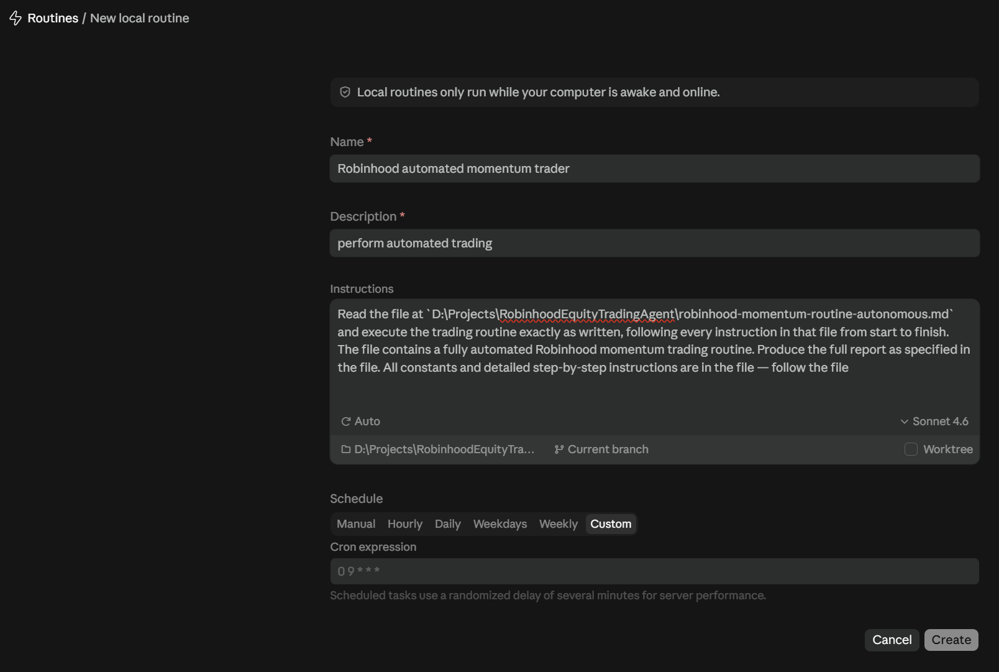
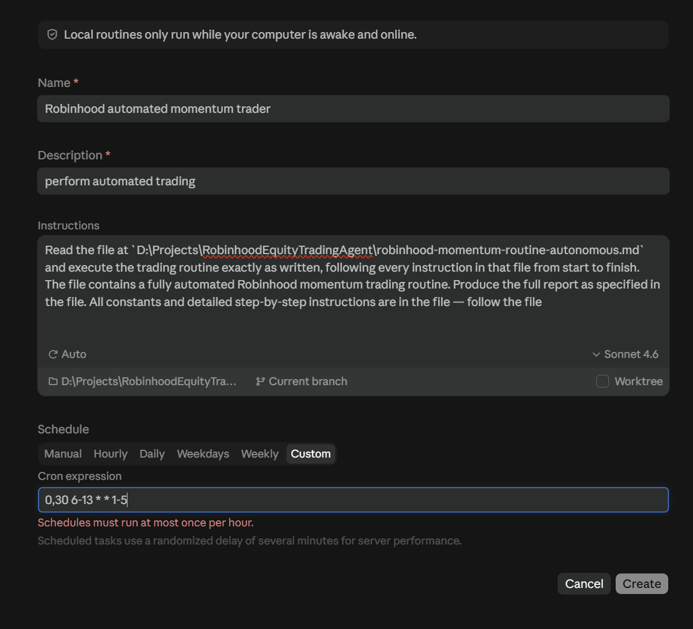
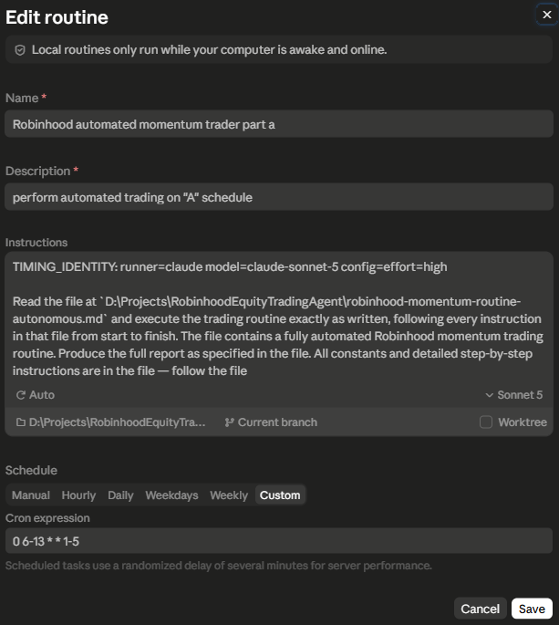

# Schedule the agent with Claude Desktop Local

This guide configures RobinhoodEquityTradingAgent as a **Claude Desktop local scheduled task on native Windows**. It does not configure a Claude Cloud routine.

> **Real-money warning:** complete the first scheduled-context test with `DRY_RUN = true`. Dry run blocks new entries, but management of existing positions and related orders remains live. If the account has positions or open orders, review that risk before clicking **Run now**.

## Use the supported execution path

Use all of the following together:

- Claude Desktop **Code** tab.
- **Routines → New routine → Local**.
- The native Windows main checkout, for example `D:\Projects\RobinhoodEquityTradingAgent`.
- **Worktree off** so every run sees the maintainer's local `constants.md` and the shared gitignored lifecycle, lease, intent, report, and status files.
- Claude Sonnet 5 with effort high for the current comparison cohort. Sonnet 4.6 remains an exact supported historical alternative only when deliberately selected and declared as `claude-sonnet-4-6`.
- The authorized Robinhood account connector, verified with `get_accounts`.

Do not use Cowork/local-agent, Cloud/Remote, WSL, or a POSIX/FUSE view of this Windows checkout. A Cloud form shows a GitHub repository and cloud environment such as **Default**. A Local execution-environment form says **New local routine**, shows a local folder and current branch, and offers a **Worktree** checkbox.

The screenshot below is an **execution-environment example only**. Use it to distinguish Local from Cloud, but copy the prompt, schedule, model, permission mode, and other task settings from this guide—not from the image.



Changing the Code sidebar filter to **Local**, or choosing Local for a new chat, does not migrate an existing scheduled task. To stop a legacy Cowork/local-agent schedule, return to the original **Cowork/Scheduled** interface that created it, pause it there, and verify that no further legacy firing occurs. The Code **Routines** list does not control that legacy task. Create a new, uniquely named Local task and delete the legacy task only after the replacement succeeds under supervision.

Keep every replacement task Manual with `DRY_RUN = true`; enable it only after both supervised **Run now** proofs succeed. Selecting Sonnet 5 does not change that activation gate.

**Local sensitive-temp data:** the retained `broker_snapshot.py preflight --create-scratch` command creates and proves one run scratch directory in a single operation; only its validated receipt supplies the exact path and ID, so the model never authors or recopies the random path. Every invocation also binds one native-temp `SOURCE_ROOT` that contains sensitive broker, scan, and historical JSON. These files are local-only, are not served or committed, and can persist after a Local run or crash. Remove them only through the future deterministic cleanup/helper, or manually after all Local runners and schedules are stopped and the exact current-run paths are verified. Never let a model improvise recursive deletion in the temp directory.

## 1. Prove the session is native Windows

Before creating a schedule, open a fresh Code-tab Local session on the exact main checkout with Worktree off. Ask Claude to read `robinhood-momentum-routine-autonomous.md`, run only the checked-in PowerShell resolver, and confirm the returned Python reports `os.name == "nt"`.

A valid proof uses native `PowerShell`, successfully runs `powershell.exe ... -File ./resolve_python.ps1`, receives one `status: "valid"` receipt, and executes the exact absolute Python path from that receipt. If `powershell.exe` is missing, the shell is Bash in a Linux VM, the repository is mounted through FUSE, or Claude proposes `/usr/bin/python3`, stop. That is the wrong runner for this Windows checkout.

Also verify the Robinhood connector in `/mcp` and require a read-only `get_accounts` call to succeed. Never paste credentials, account numbers, OAuth tokens, or MFA codes into Claude.

## 2. Use this task prompt

Use the same instructions in each task:

```text
TIMING_IDENTITY: runner=claude model=claude-sonnet-5 config=effort=high

Treat every run as stateless. Do not read, create, or update memory.md, and do not call a framework memory tool; the verified report/status artifacts are the durable record.

Read ./robinhood-momentum-routine-autonomous.md and execute the trading routine exactly as written, following every instruction in that file from start to finish. Produce the full report as specified in the file. All constants and detailed step-by-step instructions are in the file — follow the file.
```

Select the exact repository folder, **Current branch**, Sonnet 5 with effort high (`claude-sonnet-5`, `effort=high`), and **Worktree off**. Keep exactly one `TIMING_IDENTITY` line in each task and keep it synchronized with the model and effort actually selected in that task's settings. If either selection changes, update the line before the next run; the declaration records the selection and does not switch it. When migrating an existing Part A/Part B pair, change each task's model selector and `TIMING_IDENTITY` line together before that task's next run. Do not leave a task selected as Sonnet 5 while it declares Sonnet 4.6, or vice versa. An intentionally retained Sonnet 4.6 task must use `model=claude-sonnet-4-6 config=effort=high` and remains a separate performance cohort.

Before START CLOCK, the routine also asks the running model for one structured self-report using only identity explicitly exposed by the framework, then resolves it through the checked-in exact-match registry. Direct task metadata remains strongest and this complete declaration is next. If neither is available, the Python resolver itself reads only `CLAUDECODE` and `CLAUDE_EFFORT` through exact `os.environ.get` calls and may combine their runner/configuration evidence with the exact model supplied to Claude in its system prompt. The routine/model never enumerates, copies, echoes, stores, or passes environment values. The inherited environment can be spoofed, so it is corroboration rather than authentication; it also does not supply the exact model. Such a combined result is field-level `composite`, with the model still `self-reported`, and is unverified. Any unknown field, self-reported field, or conflict excludes the run from primary fair-comparison cohorts until independent evidence replaces it. Keep the synchronized `TIMING_IDENTITY` declaration because it is the strongest symmetric source across Claude and Codex and records the selected effort that the model may not know. The resolver is observational only and cannot affect trading.

The routine records Routine total, Strategy execution, and Routine overhead after lifecycle finish. Its same `record-internal` host-clock reading automatically records **Comparable run duration** from lifecycle-bound START CLOCK through `final-summary-boundary`, then the on-screen Run Summary prints exact Run start/Run end timestamps and the helper-formatted duration. Those boundaries are identical on Claude and Codex. It does not rewrite the saved report or add a field to the status snapshot. An optional source-specific **Reference run duration** can be recorded after the run from an explicit source such as Claude's recorded run duration. After the task is complete, resolve and bind the checked-in resolver's exact Python path as `PYTHON_EXE`, replace `<INVOCATION_ID>` and `<DURATION_MS>`, and copy this PowerShell command exactly:

```powershell
& '<PYTHON_EXE>' run_performance.py observe-task --invocation-id '<INVOCATION_ID>' --task-duration-ms <DURATION_MS> --runner claude --model 'claude-sonnet-5' --configuration 'effort=high' --identity-source manual-ui --clock-source claude-run-duration
```

This template is only for a human reading Claude's recorded duration and confirming the selected task settings; do not use `manual-ui` or `claude-run-duration` for runner metadata. The value is displayed as **Reference run duration** and remains secondary to the automatic **Comparable run duration**. Fair Claude-versus-Codex and future-model comparisons require the same automatic boundary, session class, workload path, configuration cohort, and preferably rules version; keep runner/model identity explicit as the comparison dimension. The formulas, other source rules, and comparison dashboard are documented in [README Tested On](README.md#tested-on).

Enable either replacement schedule only after both supervised Manual **Run now** proofs succeed.

## 3. Create two Manual tasks first

The Claude Desktop build observed on 2026-08-11 rejected a single twice-hourly Local expression such as `0,30 6-13 * * 1-5` with **“Scheduled tasks must run at most once per hour.”** Anthropic's current documentation lists a shorter minimum for Desktop Local tasks, so this restriction may be version- or account-specific. See Anthropic's official [Claude Code Desktop scheduled tasks documentation](https://code.claude.com/docs/en/desktop-scheduled-tasks). Do not work around the installed UI by switching to Cloud: Cloud cannot use this checkout's local state.



Saving a Local task with a Custom cron makes it active immediately. The safe workflow is therefore:

1. Create uniquely named Part A and Part B Local tasks with **Schedule: Manual**. Use the same prompt in both and do not add either cron yet.
2. Run and verify both Manual tasks as described below.
3. Only after both Manual **Run now** proofs pass, edit each task from Manual to **Custom** and add its cron.

If either task was already saved with a cron, immediately open its task detail, choose **Pause**, and verify that it is disabled and that no run began before continuing with the Manual tests.

These are the Custom crons to add only after both proofs pass. Each task runs at most once per hour, while the pair supplies the desired half-hour cadence:

| Task | Suggested name | Cron expression | Nominal runs, weekdays |
|---|---|---|---|
| Part A | `Robinhood automated momentum trader PART A` | `0 6-13 * * 1-5` | 6:00 AM, 7:00 AM, …, 1:00 PM |
| Part B | `Robinhood automated momentum trader PART B` | `30 6-13 * * 1-5` | 6:30 AM, 7:30 AM, …, 1:30 PM |



This is a **post-validation Part A settings/identity reference**, not the initial creation recipe. It shows **Sonnet 5** matching `model=claude-sonnet-5`, effort high matching `config=effort=high`, the native local folder, **Current branch**, **Worktree off**, and Part A's hourly weekday cron. Copy the complete maintained prompt in section 2 instead of transcribing the screenshot. The pictured Custom cron must be added only after both Manual `DRY_RUN = true` proofs pass. The **Auto** label does not prove mutation safety: inspect **Allowed permissions** and require both order placement and cancellation to remain approval-gated. Confirm that the schedule preview resolves the pictured cron to the intended Pacific hours.

The cron fields use the local machine/app timezone. Before activating either Custom schedule, require its preview to show the intended Pacific bounds: Part A from 6:00 AM through 1:00 PM and Part B from 6:30 AM through 1:30 PM on weekdays. If the machine or app is not using Pacific time, convert the cron hours and verify the preview rather than assuming the examples are Pacific. If the final 1:30 PM Pacific run is not wanted, use the correctly converted equivalent of `30 6-12 * * 1-5` for Part B.

Claude adds a randomized delay of several minutes to scheduled starts, so actual spacing will not be exactly 30 minutes. Claude Desktop must remain open, and the computer must remain awake and online.

## 4. Test both scheduled contexts before enabling live entries

Task permissions and connector loading are scoped to each task, so test **both** tasks even though their prompt is identical:

1. Set the local `DRY_RUN` row in `constants.md` to `true` and validate it. Never commit or push `DRY_RUN = false`.
2. In the original Cowork/Scheduled interface, keep any legacy task paused and verify that it does not fire. The Code Routines list is not the control surface for that legacy task.
3. The task form's permission control is currently labeled **Auto**. Choose or verify a mode that does not auto-approve `place_equity_order` or `cancel_equity_order`. Do not infer from the label alone that mutation approval is safe.
4. While Part A still has **Schedule: Manual**, open it and click **Run now**. Confirm native PowerShell and the resolver-bound Windows Python, one helper-owned `broker_snapshot.py preflight --create-scratch` receipt whose exact scratch path is retained without retyping, one successful `get_accounts`, one exact full-object zero-prefix JSON save (no BOM/fence/label or retry), a successful `bind-transport --account-name` receipt that validates `agentic_allowed` and supplies account scope without a second lookup, lifecycle classification `completed`, a report and status snapshot, lease release, and a healthy dashboard.
5. Inspect Part A's task detail and **Allowed permissions** after the run. Verify that neither mutation tool was auto-approved.
6. Repeat **Run now** for Part B while it is still Manual, require the same result, then inspect Part B's Allowed permissions too.
7. Confirm there is no lifecycle error banner and no unexpected `.sqlite3-journal`, `-wal`, or `-shm` sidecar.
8. Only after both Manual tests succeed should you edit Part A and Part B to their Custom crons, verify both Pacific-time previews, and allow the schedules to become active. Delete the paused legacy task only after verifying no further legacy firing. Enabling live entries is a separate decision.

If this Claude build cannot keep both `place_equity_order` and `cancel_equity_order` approval-gated, do not enable live Claude trading.

The observed 2026-08-11 run was **Part A only**, ran with `DRY_RUN = false`, and Part B was never tested with **Run now**. It was safe because it occurred after hours with a flat account and made no order-mutation tool call. It proved native PowerShell bootstrap, one resolver-bound Windows Python, Robinhood connector/account reads, lifecycle and lease handling, report/status publication, lease release, and dashboard health. It did **not** complete the prescribed `DRY_RUN = true` acceptance test, validate Part B, or exercise the entry-eligible scan, daily-loss snapshot, or order path. Both Manual tasks still require the full supervised proof above.

## Recovery

- **Robinhood tools missing:** in **Customize → Connectors** or **Settings → Connectors**, confirm exactly one Robinhood connector exists. Re-authenticate it through `/mcp`. If reauthentication fails, remove only that connector, add it back once, complete OAuth, restart Claude, and verify `get_accounts` in a fresh Local session and with **Run now**. Never create a duplicate.
- **`powershell.exe` missing or `/usr/bin/python3` proposed:** stop. The task is not using the native Windows path. Do not fall back to sandbox Python.
- **Lifecycle reports a hot rollback journal:** pause all schedules. From the native Windows checkout, run `powershell.exe -NoProfile -NonInteractive -ExecutionPolicy Bypass -File ./resolve_python.ps1`, validate its receipt, and bind the exact returned `python` value as `PYTHON_EXE`. Then execute that exact `PYTHON_EXE` with `run_lifecycle.py export` using the current shell's literal quoting. Never substitute a bare `py`, `python`, or `python3`, and never manually delete, rename, overwrite, or edit SQLite journal/WAL/SHM files.
- **Run skipped while the computer slept:** Local tasks require Claude Desktop to be open and the computer awake and online. Review the run history before assuming the scheduler failed.

For connector setup, strategy safeguards, and dashboard operation, return to [README.md](README.md).
