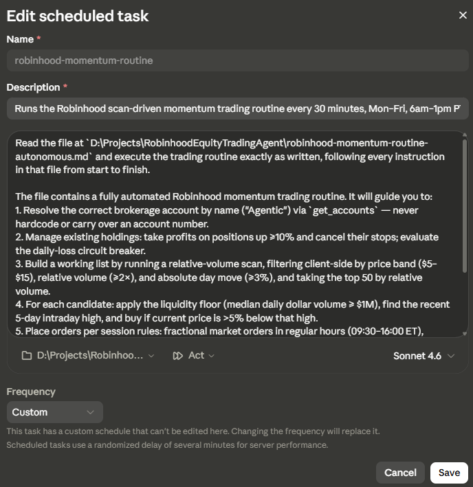
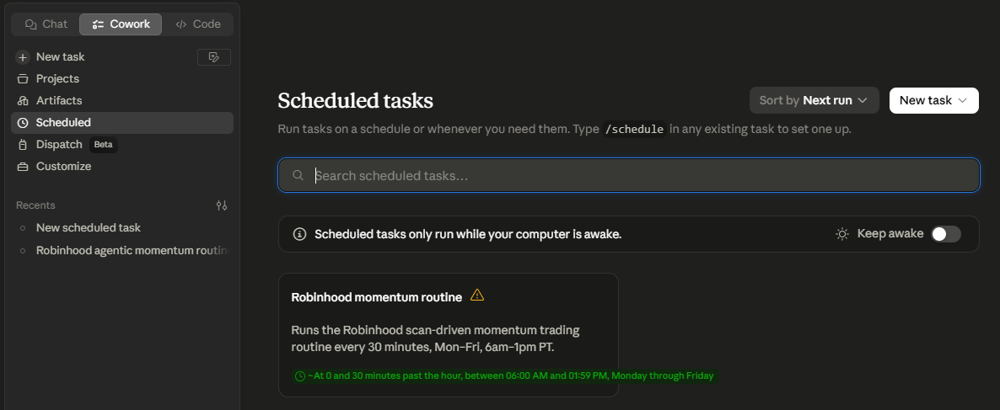

# Robinhood Agentic Momentum Routine

A scan-driven, autonomous equities trading routine for a Robinhood **Agentic** account. It screens for liquid, unusually-active stocks in a set price band, takes profits on winners, buys pullbacks, and sets protective stops — placing orders through the Robinhood agentic-trading MCP tools with per-trade notifications.

> ⚠️ **This project is not production ready. Use it at your own risk.** See the [Disclaimer](#disclaimer).

## What it does

Each run, the agent:

1. Manages existing holdings — sells winners up `TAKE_PROFIT_PCT`+ and cancels their stops.
2. Checks a daily-loss circuit breaker and halts new buys if the account is down past a set threshold for the day.
3. Builds a working list — stocks in the `$PRICE_MIN–$PRICE_MAX` band, trading at elevated **relative volume**, that have **moved** at least a minimum % on the day, ranked by relative volume.
4. Applies a **median dollar-volume liquidity floor** so thin names that can't be exited at size are dropped.
5. Opens new positions — buys names trading more than `DIP_ENTRY_PCT`% below their recent high, then places a stop `STOP_LOSS_PCT`% below the fill.

All trading is scoped to a single account, resolved **by name** at runtime.

## Strategy in one line

*Liquid, in-band, unusually-active movers that have pulled back off their recent high — bought with a stop, trimmed for profit.*

## Configuration

All tunable values live in the **Constants** table at the top of the routine document — edit there, nowhere else. Purpose of each:

| Constant | Purpose |
|---|---|
| `AGENTIC_ACCOUNT_NAME` | Account to trade, matched by name (default `"Agentic"`). |
| `PRICE_MIN` / `PRICE_MAX` | Price band for the screen. |
| `MIN_REL_VOLUME` | Relative-volume floor (also self-disables the routine when the market is closed). |
| `MIN_ABS_PCT_CHANGE` | Minimum daily move — filters out flat names. |
| `SCAN_TITLE` | Saved Robinhood scan the routine runs, resolved by exact title each run. |
| `MIN_MEDIAN_DOLLAR_VOLUME` | Liquidity floor (median $ volume). |
| `HIGH_LOOKBACK_DAYS` / `VOLUME_LOOKBACK_DAYS` | Lookback windows for the recent high and the liquidity median. |
| `TOP_N` | Max candidate list size. (fewer is better) |
| `DIP_ENTRY_PCT` / `TAKE_PROFIT_PCT` / `STOP_LOSS_PCT` | Entry, profit-take, and stop thresholds. |
| `BUY_SIZE_PCT` / `MAX_POSITION_PCT` | Position sizing and cap. |
| `MIN_ORDER_DOLLARS` | Smallest allowed buy when downsizing to available buying power; below it, skip. |
| `DUST_SWEEP_ENABLED` | Daily cleanup of fractional stop-loss residue ("dust") on the first regular-session run. |
| `DAILY_LOSS_HALT_PCT` | Daily-loss circuit breaker. |
| `REGULAR_HOURS_ONLY` | If `true`, no extended-hours entries. |
| `EXT_HOURS_LIMIT_BUFFER_PCT` | Limit buffer for extended-hours buys. |

## Requirements

- A Robinhood account with **agentic trading enabled**, connected via the Robinhood MCP server (`https://agent.robinhood.com/mcp/trading`).
- An agent runner/scheduler that loads the routine and honors per-tool approval settings.
- **Model:** configure the runner to use **Claude Sonnet** (current: `claude-sonnet-4-6`).

## Guardrails

- **Account scope** resolved by name every run; halts if the name matches zero, multiple, or a non-agentic account — never falls back to another account.
- **Daily-loss circuit breaker** halts new buys after a set drawdown.
- **Liquidity floor** (median $ volume) keeps positions exitable.
- **Per-position stop-loss** and a **max position cap**.
- **Broker compliance check** (`review_equity_order`) before every order.
- **Info notification** on every buy and sell.

## Known tradeoffs

- **Does not function when the market is closed** — relative volume reads ~1 off-hours, so the entry list is empty by design.
- **A relative-volume + movement screen structurally surfaces volatile names** (falling knives, momentum spikes). The filters keep them *tradable*, not *safe* — human judgment is the intended backstop during testing.
- **Extended-hours buys are not immediately stop-protected** (stops only trigger in the regular session). Set `REGULAR_HOURS_ONLY = true` to avoid this.

## Testing before going live

1. Keep `place_equity_order` on **"Needs approval"** in the agent's tool permissions.
2. Run for several sessions and confirm: the candidate list looks sane, approvals actually fire on the scheduled runner, notifications land, and fills + stop placement behave.
3. Confirm the market-order and stop-order field names against the tool schema on the first regular-hours run (only the extended-hours limit path is verified so far).
4. Only after the above look right, consider dropping the approval gate.

## Tools

- **PriceBandScanner** (`tools/PriceBandScanner.md` + `tools/price_band_scanner.py`) — a read-only companion agent, scheduled once daily after market close. It runs the same saved scan, buckets the day's most-active stocks into price bands, and reports each band's median/mean % change, breadth, and best/worst names — evidence for choosing the `PRICE_MIN`/`PRICE_MAX` band. It never touches accounts or orders. Logs to `tools/logs/PriceBandScanner-log-YYYY_MM_DD.md` plus a same-named `.png` chart of the band medians (local only, gitignored). **Schedule it after the US close but before Asia starts trading — i.e., before 5:00 PM PT, when Robinhood's overnight (24/5) session opens and its prints would contaminate the day's data; ~1:05 PM PT is ideal.**

## Usage Example

Run the routine as a **scheduled task in Cowork** (Claude desktop app). The task's prompt tells the agent to read `robinhood-momentum-routine-autonomous.md` and execute it exactly as written — so edits to the document take effect on the next run without touching the task. Set the working folder to this repo, pick the model (per the runtime requirement), and choose Act mode:

Schedule it for market hours — this example fires every 30 minutes, Monday–Friday, 6:00 AM–1:59 PM PT (covering the 9:30 AM–4:00 PM ET session):

Note: scheduled tasks only run while the computer is awake — enable **Keep awake** (visible above the task card) so mid-day runs aren't missed.

## Disclaimer

**This project is not production ready — use it entirely at your own risk.** It is a personal execution framework for a self-specified strategy, hardened through live iteration but never formally validated: there is no backtesting, no test suite, and the strategy parameters are untested against historical data. It is **not financial advice** and not a recommendation of any screen, ticker, or parameter. Automated trading of volatile, unusually-active stocks carries real risk of loss, and an autonomous agent acts on your account without asking first. Understand the code, start with the order-approval gate on, and use only money you can afford to lose.
