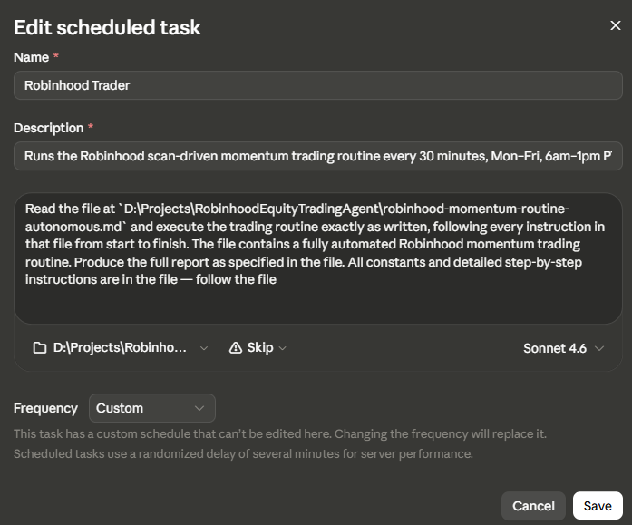

# Robinhood Agentic Momentum Routine

A scan-driven, autonomous equities trading routine for a Robinhood **Agentic** account. It screens for liquid, unusually-active stocks in a set price band, takes profits on winners, buys pullbacks, and sets protective stops — placing orders through the Robinhood agentic-trading MCP tools with per-trade notifications.

> ⚠️ **This project is not production ready. Use it at your own risk.** See the [Disclaimer](#disclaimer).

## What it does

Each run, the agent:

1. Manages existing holdings — on a winner up `TAKE_PROFIT_PCT`+ it **cancels the stop first, then sells** (a resting stop reserves the shares, so selling first is rejected); re-places any stop that has silently gone missing; and sweeps the sub-share residue a whole-share stop leaves behind.
2. Decides whether a new entry could be placed at all — after position safety is complete, the run short-circuits entry work outside an eligible exchange session, when regular-hours-only policy blocks the current session, inside the opening blackout, while buying power is too thin, or while SPY is red/unavailable. A definitive skip completes normally instead of looking like a risk halt.
3. For an entry-eligible run, checks the guards — a true Eastern-broker-day equity-loss breaker that blocks entries whenever the configured drawdown is reached, plus a stop-count guard that halts new buys for the rest of the day.
4. Builds a working list — stocks in the `$PRICE_MIN–$PRICE_MAX` band, trading at elevated **relative volume**, that have **moved** at least a minimum % on the day, ranked by relative volume.
5. Screens for exitability — a **median dollar-volume liquidity floor** and a **bid/ask spread ceiling**, dropping names that can't be got out of cleanly.
6. Opens new positions — buys names trading more than `DIP_ENTRY_PCT`% below their recent high **whose RSI was oversold and has just turned back up** (reversal confirmation: depth alone is a falling knife, and a bounce that has already run is not chased), then places a stop `STOP_LOSS_PCT`% below the fill **and verifies it survived with enough whole-share coverage** — placement is not protection.

All trading is scoped to a single account, resolved **by name** at runtime.

## Strategy in one line

*Liquid, in-band, unusually-active movers that have pulled back off their recent high and just begun to turn back up — bought only when they can be exited cleanly, held with a stop, and trimmed for profit.*

## Configuration

**Live trading is off unless you turn it on.** `DRY_RUN` is `true` in the committed `constants.md`, so a fresh clone runs in **dry run** — logging every would-be buy and stop instead of placing it. To trade live, set `DRY_RUN` to `false` as a **local, uncommitted edit**; never commit `false`. After a successful configuration preflight, protection of existing positions — profit-taking, stop repairs, dust sweeps — is always live in both modes. A configuration-read failure is not dry run: it halts the entire run.

All tunable values live in **`constants.md`** next to the routine document — edit there, nowhere else. Before the clock, account lookup, or any broker action, the routine runs `validate_constants.py --json` and uses its 31-value JSON object as the sole configuration authority. The checked-in validator reports the exact constant and reason on failure; the agent never invents a PowerShell/regex substitute or re-parses the table itself. A missing, unreadable, malformed, incomplete, duplicated, or ambiguous value causes a full-run configuration halt: no broker calls or orders, including protective sells/repairs; no defaults, cached values, or guesses. Purpose of each:

| Constant | Purpose |
|---|---|
| `DRY_RUN` | If `true` (the committed default), log would-be entries instead of placing them; set `false` locally (uncommitted) to trade live. |
| `AGENTIC_ACCOUNT_NAME` | Account to trade, matched by name (default `"Agentic"`). |
| `PRICE_MIN` / `PRICE_MAX` | Price band for the screen. See [PriceBandScanner](#tools) for evidence on choosing it. |
| `MIN_REL_VOLUME` | Relative-volume floor (also self-disables the routine when the market is closed). |
| `MIN_ABS_PCT_CHANGE` | Minimum daily move — filters out flat names. |
| `SCAN_TITLE` | Saved Robinhood scan the routine runs, resolved by exact title each run. |
| `MIN_MEDIAN_DOLLAR_VOLUME` | Liquidity floor (median $ volume). |
| `HIGH_LOOKBACK_DAYS` / `VOLUME_LOOKBACK_DAYS` | Lookback windows for the recent high and the liquidity median. |
| `TOP_N` | Max candidate list size. (fewer is better) |
| `DIP_ENTRY_PCT` / `TAKE_PROFIT_PCT` / `STOP_LOSS_PCT` | Entry, profit-take, and stop thresholds. |
| `RSI_PERIOD` / `RSI_INTERVAL` / `RSI_OVERSOLD` / `RSI_LOOKBACK_BARS` / `RSI_CONFIRM_BARS` / `RSI_MAX_ENTRY` | RSI curl-up entry gate: a dip is only buyable once it was oversold and has turned up — and only while it has not already run (`RSI_MAX_ENTRY` caps the current RSI, so a bounce that is already spent is not chased). `RSI_PERIOD` is passed to both the broker indicator request and the local Wilder-closes fallback. |
| `MAX_SPREAD_BUY_PCT` | Max quoted bid/ask spread for an entry — a buy crosses the spread, so a wide book starts the position underwater and can put the stop at the bid on arrival. |
| `REENTRY_COOLDOWN_DAYS` | No re-entry for this many days after a symbol stops out. |
| `BUY_SIZE_PCT` / `MAX_POSITION_PCT` | Position sizing and cap. |
| `MIN_ORDER_DOLLARS` | Smallest allowed buy when downsizing to available buying power; below it, skip. |
| `DAILY_LOSS_HALT_PCT` | True broker-day equity-loss circuit breaker, measured from split-adjusted prior closes and today's executions rather than lifetime cost basis. |
| `STOP_COUNT_HALT` | Halt new buys for the day after this many stop fills. |
| `SKIP_BUY_IF_SPY_RED` | Skip scanning/buying for the current run while SPY trades below its previous close. |
| `NO_BUY_FIRST_MINUTES` | Opening blackout: no buys during the session's first N minutes (selling/protection unaffected). |
| `REGULAR_HOURS_BUY_ONLY` | If `true` (the default), no extended-hours entries; selling and stop protection still run in every session. If `false`, ordinary pre-/after-hours entries remain possible only when the exchange-calendar gate permits them; it never overrides a holiday, an early-close session restriction, or an unknown-calendar block. Raising `MAX_SPREAD_BUY_PCT` is also required because extended-hours spreads are far wider. |
| `EXT_HOURS_LIMIT_BUFFER_PCT` | Limit buffer for extended-hours buys. |

## Requirements

- A Robinhood account with **agentic trading enabled**, connected via the Robinhood MCP server (`https://agent.robinhood.com/mcp/trading`).
- An agent runner/scheduler that loads the routine and honors per-tool approval settings.

## Tested On

The preferred models are **Claude Sonnet 4.6** and **Codex Luna 5.6 (high)**. If neither is available, let the framework select a **medium-strength** general-purpose model.

| AI | Model / configuration |
|---|---|
| Claude | Sonnet 4.6 |
| Codex | Luna 5.6 (high) |

## Guardrails

- **Account scope** resolved by name every run; halts if the name matches zero, multiple, or a non-agentic account — never falls back to another account.
- **Configuration preflight**: an unreadable, malformed, incomplete, duplicated, or ambiguous `constants.md` is a full-run halt, not dry run. It prevents every broker action, including profit-taking, stop repairs, and dust sweeps; the routine never uses a default, cached value, or guess.
- **Daily-loss circuit breaker** reconstructs true Eastern-broker-day equity P&L from complete broker executions, current positions, and split-adjusted prior closes. On an entry-eligible run, it blocks new buys whenever the configured drawdown is reached and fails closed if pagination, prices, quantities, timestamps, or reconciliation are incomplete. Robinhood's lifetime cost-basis realized P&L is telemetry, never the breaker input.
- **Stop-count guard**: on an entry-eligible run, several stop fills in one day halt new buys until the next session — catches the slow bleed the P&L breaker can miss.
- **SPY red-day gate**: no dip-buying while the broad market itself is selling; per-run and self-clearing, so a green afternoon resumes trading the same day.
- **Opening blackout**: no buys in the session's first `NO_BUY_FIRST_MINUTES` — indicators can't see violence inside the first forming bars; profit-taking and stops stay active.
- **Exchange-calendar gate**: no new entries on a full NYSE closure, outside an eligible session window, after a published 1:00 p.m. ET early close, or when the reviewed calendar has no coverage for the date. Existing-position profit-taking, stop audits/repairs, and dust sweeps stay active.
- **Entry-impossibility short-circuit**: after existing-position safety work, the calendar/session, regular-hours policy, buying-power, opening-blackout, and SPY gates run before the entry-only daily-loss and stop-count guards. A definitive skip publishes `entry_phase: "skipped"`, `circuit_breaker: "not-evaluated"`, and `stop_fills_today: null`, completes the lifecycle without a HALT, and still performs the final refresh/report. It never masks a configuration, order-state, lease, protection, or final-refresh failure.
- **Fenced single-run lease**: overlapping scheduled runs cannot both touch the broker. Atomic SQLite acquisition admits one owner; phase renewals keep a live run current, expired leases let a later schedule recover from a crash, and a per-run fencing token prevents a stalled old owner from cancelling or placing after takeover.
- **Durable order-intent journal**: before any placement, `order_intents.py` stores the exact reviewed payload and one broker idempotency key in a local SQLite journal. A lost response is reconciled against fresh, fully paginated orders and positions before any replay; only a proven same-run no-match may reuse that same key once. Prior-run intents, explicit rejections, ambiguous matches, corrupt state, partial fills, and failed stop replacements all fail closed instead of creating a duplicate order.
- **Immediate pre-buy clock check**: every buy re-runs the deterministic market clock before review and again immediately before placement. A closed/changed session, opening blackout, malformed clock result, or lost lease blocks all remaining entries instead of using the run-start session.
- **RSI reversal gate**: a dip is only buyable once it was oversold, has turned back up for `RSI_CONFIRM_BARS` consecutive bars, and has not already run past `RSI_MAX_ENTRY`. Depth alone is a falling knife; a bounce that already happened is a chase. Both thresholds were tightened after live losses.
- **Liquidity floor** (median $ volume) keeps positions exitable. It requires the complete configured history window; abbreviated histories block instead of becoming smaller substitute samples.
- **Spread gate**: no entry when the quoted bid/ask spread is wider than `MAX_SPREAD_BUY_PCT`. A buy crosses the spread, so a wide book starts the position underwater — and a spread approaching `STOP_LOSS_PCT` puts the protective stop at the bid the moment it is placed, stopping the position out on arrival.
- **Per-position stop-loss** and a **max position cap** — every stop is verified after placement, and broker-cancelled stops are re-placed immediately at a fresh level. A double failure halts new entries for that run and raises a line in the local `ALERTS.md` for human attention.
- **Stop-coverage audit**, run against every held position every run: stops vanish silently — a `gfd` stop expires at that day's close — so a position without enough valid active-stop quantity to cover every whole share gets only the missing quantity placed at a fresh level. Malformed or over-covered stop data halts new entries for the run. This exists because a position once rode to −49% while believed protected.
- **Re-entry cooldown**: a symbol whose stop filled is untouchable for `REENTRY_COOLDOWN_DAYS`, blocking revenge re-entries.
- **Connector-failure discipline**: a failed broker read/review is retried exactly once and is never treated as an empty result; placements and cancellations use their stricter reconciliation protocols instead of blind retries. If positions can't be fetched and the portfolio shows nonzero equity, the run places no orders at all. Every failure is reported even when recovery succeeded.
- **Validated broker-snapshot staging**: each entry-eligible breaker generation first uses `broker_snapshot.py source-preflight` to prove that a fresh external response-source probe is writable, readable, strict JSON, and outside the marked scratch directory. An explicit harness result resource is preferred; otherwise the runner's file-change facility must carry one complete unchanged response. The run never guesses or searches for tool-result paths. Every staged response is envelope-checked, semantically validated, atomically persisted, read back, and hash-checked; portfolio/quote staging rejects pagination flags, while position/order sets are sealed with their complete cursor chain. A failed generation is discarded wholesale and rebuilt once from fresh broker calls. The probe proves the response-source path, not a later full-response transfer, so the release checklist still requires an end-to-end scheduled-run smoke test on the target runner.
- **Broker compliance check** (`review_equity_order`) before every order.
- **Info notification** on every buy and sell.
- **Append-only invocation lifecycle** (`run_lifecycle.py`, local/gitignored state): every scheduler attempt is recorded before configuration or broker access, including overlap, configuration/coordination halt, snapshot failure, real risk halt, lease loss, and final-status failure. Its bounded, validated JSON projection gives the dashboard specific labels without storing account numbers, credentials, lease tokens, or broker responses.
- **Per-run status snapshot** (`run-reports/rhmra-status-*.json`, local/gitignored): raw account state after each successful final refresh — positions with purchase price, current price, and stop coverage; buying power; realized P&L; which gate decided the entry phase. A definitive pre-SECOND skip records the entry-only breaker as `not-evaluated` and the stop count as `null`, rather than claiming that either guard passed. Raw facts only; consumers (see `dashboard/`) do their own arithmetic. Pre-broker exits, lease loss, and failed final refresh deliberately leave the prior truthful account snapshot untouched; their lifecycle record closes the former telemetry gap.
- **Per-run gate record** (`run-reports/rhmra-gates-*.json`, local/gitignored): every candidate's measured values at every gate — median dollar volume, % below high, quoted spread, RSI verdict — for names that passed as well as names that were blocked, alongside the thresholds in force that run. A blocked name explains itself in the report; this exists so a name that cleared every gate and *then* lost money can still be investigated from the readings it cleared them with.
- **Append-only trade ledger** (`trade-ledger.csv`, local/gitignored): every fill recorded with order id, price, reason, realized P&L, and the rules version (git hash of the routine doc) that produced it — the raw data for win-rate and expectancy review per rule era.
- **Cent-exact strategy P&L** (`ledger_pnl.py`): reconstructs the strategy's matched acquisition pool from exact execution prices and quantities, calculates with exact base-10 values, and rounds each realized fill half away from zero at the cent boundary. The dashboard keeps Robinhood's account-wide broker figure authoritative, shows a warning for a real difference or incomplete strategy basis, and never turns missing P&L into zero.

## Why the rules look like this

Nearly every guardrail above was written after something broke in live trading. [**`INCIDENTS.md`**](INCIDENTS.md) is the record: what happened, what it cost, and the rule it produced. A broker cancelling a freshly placed stop **77 ms** after creation and leaving a position naked for 23 minutes. A timezone lookup that returns the wrong hour with **no error at all** on hosts without tzdata. A run that reported ledger rows which never reached disk. A one-bar RSI "curl" that bought three falling knives in 46 minutes. Three recurring lessons ended up as slogans in the code: *placement is not protection*, *issued is not persisted*, *available is not correct*.

It is a separate file for a practical reason. The routine document is executed by an LLM on every run, so its prose is a fixed cost paid ~16 times a day — writing a spec for an agent is closer to API design than to documentation. The rules live in the routine; the history lives in `INCIDENTS.md`, which the runtime never loads.

## Known tradeoffs

- **Opens no positions outside a known entry window** — full NYSE closures, weekends, closed hours, the period after a published early close, and calendar years not covered by the reviewed table skip scanning and entry evaluation outright. With `REGULAR_HOURS_BUY_ONLY` on, ordinary pre-/after-hours do too; turning it off permits them only on an otherwise eligible normal day. Holdings management, stop repairs and dust sweeps run in every session regardless.
- **A relative-volume + movement screen structurally surfaces volatile names** (falling knives, momentum spikes). The RSI reversal gate and the spread ceiling exist specifically to refuse the worst of them, and both were tightened after live losses — but they lower the rate, not to zero. Expect stop-outs; the position cap, daily-loss breaker and stop-count guard are what bound them.
- **Cash-account settlement starves next-day buying power** — sale proceeds settle T+1, so the day after exits, buying power can sit well below `BUY_SIZE_PCT` × total value. The routine downsizes rather than skipping — orders are capped at available buying power and never fall below `MIN_ORDER_DOLLARS` — so starved days typically buy one name instead of several.
- **Extended-hours buys are not immediately stop-protected** (stops only trigger in the regular session), so `REGULAR_HOURS_BUY_ONLY` defaults to `true` and no position is opened outside the session. Selling and protection are never gated by session. Turning extended-hours entries back on also means retuning `MAX_SPREAD_BUY_PCT` — off-session books are several times wider.

## Testing before going live

1. Leave `DRY_RUN = true` and let a few scheduled runs log the entries they *would* have placed — no capital at risk. Do the same after any strategy-constant change.
2. Keep `place_equity_order` on **"Needs approval"** in the agent's tool permissions.
3. Run for several sessions and confirm: the candidate list looks sane, approvals actually fire on the scheduled runner, notifications land, and fills + stop placement behave.
4. In dry run, confirm the broker accepts the documented order flows. The current connector's canonical stop-market payload uses `type: "stop_market"` plus `stop_price`, with no `trigger` input — so do not rediscover or improvise stop fields during a live run; a review alert is a safety failure to report, not a reason to try another schema.
5. Only after the above look right, consider dropping the approval gate and going live by locally setting `DRY_RUN = false` in `constants.md` (an uncommitted edit).
6. For a release candidate, run one eligible scheduled invocation through the complete daily-loss snapshot path, then run one closed-session invocation and confirm it completes as `market closed` without a false HALT. Unit tests prove the contract; this live smoke test proves the runner's full broker-response handoff.
7. Test View on Phone with a Google account that was never a consent-screen test user: connect without a local OAuth credential file, pair, receive a snapshot, pull-to-refresh, reconnect with the same Google account, and confirm the last verified dashboard remains visible throughout a temporary disconnect.

## Deterministic layer

The routine document is executed by an LLM, so **none of the math lives in it.** Every calculation sits in a small, dependency-free Python script that the agent runs and reads the verdict from — it orchestrates, it never computes. The documents may not re-implement this math, and a script's behavior may not be re-derived at runtime: each one owns its rules, its input schema, and its edge cases, so thirty-minute runs cannot drift from one another.

- **validate_constants.py** — the first-action configuration authority. It strictly parses the single Markdown constants table, requires exactly the known 31 rows, returns typed booleans/integers/text plus exact decimal strings, validates ranges and coupled safety constraints, and identifies the precise line/constant on failure. Both runtime `DRY_RUN` modes are valid; the separate Git rule still requires every committed copy to contain `true`.
- **market_clock.py** + **market_calendar.py** — the run's clock and reviewed NYSE calendar, first executed as the **first operational action after the configuration preflight**. The start reading provides distinct Eastern broker and Pacific report dates, the report header and filename, market session, exchange-calendar verdict, stop-fill windows, re-entry cooldown windows, and opening-blackout verdict. The same script is re-run around the daily-loss snapshot, at the buy boundary, and for fresh order-intent baselines/reconciliation cutoffs so no guard or placement uses a stale timestamp; those later readings never change run filenames or historical windows. `NO_BUY_FIRST_MINUTES` is loaded through the same full constants validator, so the value is never re-typed and malformed sibling settings cannot slip past the clock's second read. Every clock result also carries the constants-file SHA-256, which must match the preflight hash so a mid-run edit cannot mix two configurations. The checked-in calendar covers 2026–2028 full closures and 1:00 p.m. ET early closes; dates outside that coverage fail closed for entries. The clock derives US DST offsets from the rule itself rather than the OS timezone database, because `TZ=`/`zoneinfo` lookups fail *silently* on hosts without tzdata — Windows returns GMT rather than erroring, and a wrong-but-plausible clock is worse than none.
- **run_lock.py** — the broker single-writer guard, run immediately after the start clock. A one-row SQLite transaction makes acquisition/takeover atomic across platforms; acquire/renew/release return machine-readable JSON and a fencing token. The lease is stored under gitignored `run-reports/`, and a malformed database or ownership mismatch fails closed.
- **run_lifecycle.py** — the invocation-history authority. It journals an attempt before configuration or broker access and publishes a bounded, validated, privacy-safe projection, so overlap, lease loss, configuration/coordination halt, snapshot failure, risk halt, and final-status failure remain visible even when no account snapshot can be written.
- **order_intents.py** — the durable placement-lifecycle authority. It creates and persists one immutable `ref_id` plus the exact reviewed payload before submission, records broker acknowledgements/fills, verifies pagination cursor continuity, reconciles lost responses by broker ID or one exact post-baseline fingerprint, and permits at most one same-run same-key retry after a proven no-match. Its local SQLite journal also links the single allowed zero-fill stop retry and blocks corrupt, ambiguous, stale, or cross-run replay state.
- **broker_snapshot.py** — the daily-loss transport and staging authority. It validates the scratch marker and external response-source probe, unwraps only known transport envelopes, enforces kind-specific broker schemas and pagination rules, writes atomically, verifies hashes/read-back, and seals coherent A/B generations so a retry cannot mix old and new pages.
- **daily_loss.py** — the circuit-breaker authority. It consumes raw, fully paginated portfolio/position/order responses and raw quote batches, filters individual executions by Eastern broker date, reconciles them against `intraday_quantity`, and calculates mark-to-market P&L with exact decimal arithmetic. Old GTC orders that fill today, partial fills, same-day round trips, execution fees, and overnight holdings are all included; malformed or incomplete input can only block entries.
- **ledger_pnl.py** — the dashboard's strategy-P&L authority. It rebuilds chronological matched acquisition pools from exact ledger executions, emits integer cents under one explicit rounding policy, and marks unmatched or incomplete basis instead of asserting false precision. It never replaces Robinhood's authoritative account-wide realized P&L.
- **filter_scan.py** — turns the raw scan response into the ranked working list: price band, relative-volume floor, and minimum absolute day move (including the `% Change` decimal-fraction → percent conversion), sorted by relative volume and capped at `TOP_N`. Its `--json-out` file is the routine's machine-readable handoff; downstream steps consume that JSON's unrounded values, never the human-formatted stdout table. It also documents the scan response's schema in one place so no run has to rediscover it.
- **evaluate_candidates.py** — the entry math: median dollar-volume liquidity floor, recent high from real (non-interpolated) bars, % below high, and the **RSI curl-up gate** that requires a dip to have been oversold *and* to be turning up before it can be bought. Consumes raw API responses; never hand-transcribed bars. Its transient pre-RSI JSON selects which indicators to fetch; only a validated final RSI-enabled JSON result can authorize a buy. Formatted stdout and ad-hoc calculations are never entry authorities.
- **tests/** — dependency-free regression tests covering the daily-loss calculator, durable order-intent lifecycle, evaluator, scanner, clock/calendar, concurrent run locking and takeover, dashboard path, the Google Drive phone-share uploader/OAuth flow, phone-share guards, and routine contracts. Run the complete Python suite with `python3 -m unittest discover -s tests` (Windows: `py -3 -m unittest discover -s tests`) before committing any script change; expected market values were verified against live API data. The standalone [RHMRA Phone PWA](https://github.com/abiemann/RobinhoodEquityTradingDashboardViewer) and the OAuth relay under `phone-share-oauth-broker/` each have their own `npm test` command.

## First-time app setup

### Robinhood MCP connector (CHATGPT/CODEX)

> **ChatGPT users:** switch to **Codex mode** before running this project for the best experience with local project files, tool activity, and generated reports.

In ChatGPT/Codex, open **Settings → Plugins → MCP → Add server** and enter:

| Field | Value |
|---|---|
| Name | `Robinhood Trader` (any descriptive name is fine) |
| Type | `Streamable HTTP` |
| URL | `https://agent.robinhood.com/mcp/trading` |

Save the connector, then:

1. Complete Robinhood's authorization flow.
2. Restart ChatGPT/Codex so the MCP settings take effect.

A successful setup exposes tools such as `get_accounts`.


### Robinhood MCP connector (CLAUDE)

In Claude, open **Settings → Connectors → Add → Add custom connector** and enter:

| Field | Value |
|---|---|
| Name | `Robinhood Trader` (any descriptive name is fine) |
| URL | `https://agent.robinhood.com/mcp/trading` |

Then click **Add**, then:

1. Complete Robinhood's authorization flow.
2. Restart Claude so the MCP settings take effect.

A successful setup exposes tools such as `get_accounts`.


### Scheduled Task

Create a scheduled task with this project folder as its working directory, enable **Act** mode, and use **Claude Sonnet 4.6** or **Codex Luna 5.6 (high)**. If neither preferred model is available, let the framework select a medium-strength general-purpose model. The prompt can be:

> Treat every run as stateless: never use automation memory for trading decisions or prior-run state. If the automation framework requires `memory.md`, overwrite it with only the one-line report/status pointer specified by the routine; never append scan or account details.
>
> Read `\RobinhoodEquityTradingAgent\robinhood-momentum-routine-autonomous.md` and execute the trading routine exactly as written, following every instruction in that file from start to finish. Produce the full report as specified in the file. All constants and detailed step-by-step instructions are in the file — follow the file.

For the recurring schedule, choose weekdays at minute `0` and `30`, from `06:00 AM` through `01:30 PM` Pacific time. Keep the computer awake while the task is expected to run. Before enabling live orders, keep `DRY_RUN = true` and leave `place_equity_order` set to **Needs approval**.

Only one instance of the trading agent can operate at a time. If another scheduled instance starts while one is already running, the new instance stops before connecting to Robinhood or placing or cancelling any orders. If the first instance crashed, its lock expires automatically so the next scheduled run can take over safely; the old instance can no longer place or cancel orders.

### Scheduled Task Example



### View on Phone setup (optional)

Phone viewing is **off by default**. The recommended v2 design uses the installable [RHMRA Phone PWA](https://abiemann.github.io/RobinhoodEquityTradingDashboardViewer/) and the user's own private Google Drive app-data area. There is no RHMRA account server, shared financial-data backend, public bucket, or internet-facing laptop web server. A narrowly scoped OAuth relay participates only in Google token exchange; it never receives dashboard snapshots.

The phone user needs only a free Google account and an Android phone, iPhone, or iPad with a modern browser. The laptop needs the Agent checkout and an internet connection. End users do **not** download an OAuth JSON file, supply a client secret, deploy Cloudflare, create a bucket, or configure an API key. Start the dashboard normally:

```powershell
py -3 dashboard\serve.py 9000
```

When the user selects **Connect Google Drive**, the Agent opens Google's authorization page with S256 PKCE and a one-time state value. The RHMRA OAuth relay adds the project's protected Desktop client credential only while forwarding the authorization-code exchange or token refresh to Google. The relay implementation stores and logs no authorization codes or tokens, and it never receives encrypted or decrypted dashboard data. Google Drive access and dashboard uploads remain between the Agent and the user's Google account.

#### Install and pair once

Install the PWA **before** pairing so its non-extractable decryption key is saved in the installed app's own browser storage:

1. On the phone, open [RHMRA Phone](https://abiemann.github.io/RobinhoodEquityTradingDashboardViewer/).
2. Install it:
   - **Android / Chrome:** open the browser menu, then choose **Install app** or **Add to Home screen**.
   - **iPhone or iPad / Safari:** tap **Share → Add to Home Screen**.
3. Open **RHMRA** from the phone's Home Screen.
4. On the laptop, start the local dashboard, click **View on Phone → Connect Google Drive**, and complete Google sign-in. Use the Google account that you intend to use on the phone.
5. Back in **View on Phone**, choose the duration and click **Pair phone and create QR code**. Wait until the first encrypted snapshot uploads and the QR code appears, then click **Copy private link**.
6. Transfer that link to the phone through a private method, copy it, and tap **Paste private pairing link** inside the installed RHMRA Phone app.
7. In the phone app, tap **Connect Google Drive** and sign in with the **same Google account** used on the laptop. Approve the requested private app-data access.

For Google Drive sharing, the duration selector offers **1, 2, 4, 6, or 8
hours**. Two hours remains the preselected choice; eight hours is the hard
maximum.

The QR/camera flow is a convenient browser fallback. For an installed app—especially on iPhone or iPad—pasting the private link inside the Home Screen app is more reliable because Safari and the installed PWA keep separate storage. Never post, email broadly, or otherwise share the QR code or private link: it contains the dashboard decryption key.

Pairing normally survives future dashboard sessions. The next time, click **View on Phone → Start sharing with paired phone**; no new QR code is required. The phone checks for a fresh snapshot every 30 seconds while the app is visible, stops polling while it is in the background, and refreshes immediately when reopened. Pull-to-refresh or a full reload keeps the last verified dashboard and pairing key visible; because the phone's Google access token deliberately remains only in memory, the app may show a disconnected state and ask for the same Google account again, then resumes without a new QR code. On small screens the dashboard header stays visible while the account area scrolls, and expanded run details remain open across polling refreshes until tapped again.

On Windows, the Agent normally protects the laptop's Google refresh credential with the signed-in user's DPAPI storage. If that protected storage is unavailable or a save fails, **View on Phone** displays a prominent **Google sign-in is memory-only** warning. Sharing still works for the current dashboard-server process, but Google Drive must be reconnected after the server stops or restarts.

#### Stop sharing, disconnect Google Drive, or forget the phone

- **Stop sharing** deletes the current encrypted Drive snapshot and stops laptop uploads, but keeps the laptop and phone paired. Use this for normal daily use; a later **Start sharing with paired phone** resumes without a new link or QR code.
- **Disconnect Google Drive** is shown separately when no share is active. After confirmation, it asks Google to revoke the laptop grant and always removes the Agent's in-memory and saved laptop credentials. It does **not** forget the paired phone or automatically delete a separate snapshot; stop sharing first when a snapshot is active. Because the phone and laptop use the same RHMRA Google permission, the phone may ask to reconnect. If RHMRA says Google could not confirm remote revocation, remove RHMRA manually from Google Account permissions for immediate assurance.
- **Forget paired phone** on the laptop deletes the encrypted snapshot when possible and discards that phone's pairing ID and key. Use it if the phone or private link may be compromised, or when permanently replacing the phone. Also choose **Forget this device** in the phone app; pairing again will require a new private link or QR code.
- **Forget this device** on the phone clears only that phone's local pairing and in-memory Google token. By itself it cannot delete the laptop's Drive snapshot or disconnect the laptop. For a complete reset, stop sharing, disconnect Google Drive, and forget the pairing on both devices.

#### Privacy and failure behavior

- The laptop dashboard stays on `127.0.0.1`, opens no inbound port, and sends only outbound HTTPS requests to Google and the OAuth relay.
- The OAuth relay sees an authorization code or refresh token only while forwarding a token request to Google. Its implementation stores and logs no tokens, and it never receives dashboard snapshots, brokerage credentials, or trading data. End users do not need a Cloudflare account or deployment.
- RHMRA encrypts a strict, read-only display allowlist locally with AES-256-GCM. Google Drive stores ciphertext in the hidden `appDataFolder`; the requested `drive.appdata` scope cannot browse the user's ordinary Drive files. The phone decrypts locally.
- Account numbers, broker credentials, connector settings, order IDs, raw ledgers, gate records, reports, constants, and local paths are never shared. The phone app never calls Robinhood or an AI model.
- Each snapshot is temporary and expires. If an upload, refresh, or deletion fails, trading and the local dashboard continue normally, and the phone view shows the last successful update rather than silently presenting new data as current.

#### Project maintainers only: one-time Google OAuth setup

The maintainer of the public PWA must enable the Google Drive API, configure and publish the consent/branding screen, request only the `https://www.googleapis.com/auth/drive.appdata` scope, and create a **Web application** OAuth client for the hosted PWA plus a **Desktop app** OAuth client for the laptop uploader in the **same Google Cloud project**. Moving the audience to **In production** removes the test-user allowlist; it does not by itself complete any separate Google branding/scope verification needed to remove an unverified-app warning. The maintainer deploys the project's stateless OAuth relay once and stores the Desktop client secret only as an encrypted deployment secret. Client secrets, downloaded OAuth JSON, authorization codes, access tokens, refresh tokens, and pairing keys must never be committed or logged. Follow the local [OAuth relay deployment guide](phone-share-oauth-broker/README.md) and the [RHMRA Phone maintainer guide](https://github.com/abiemann/RobinhoodEquityTradingDashboardViewer#maintainer-setup-one-time-not-for-end-users) for the exact deployment, hosting, authorized-origin, consent, verification, and release steps.

#### Developers only: direct OAuth override / relay rollback

The built-in relay is the normal end-user path. For local protocol debugging or an emergency maintainer rollback, a developer may instead download the matching Desktop app OAuth JSON, keep it outside this repository, and set its absolute path before starting the dashboard:

```powershell
$env:RHMRA_PHONE_SHARE_GOOGLE_CREDENTIALS_FILE = 'C:\private\rhmra-google-desktop.json'
py -3 dashboard\serve.py 9000
```

This override sends token requests directly to Google's HTTPS endpoint and deliberately bypasses the built-in relay. Never paste the JSON's `client_secret` into the dashboard, a task prompt, `constants.md`, a report, or source control. It is a developer recovery tool, not an installation step for users.

## Tools

- **PriceBandScanner** (`tools/PriceBandScanner.md` + `tools/price_band_scanner.py`) — a read-only companion agent, scheduled once daily after market close. It runs the same saved scan, buckets the day's most-active stocks into price bands, and reports each band's median/mean % change, breadth, and best/worst names — evidence for choosing the `PRICE_MIN`/`PRICE_MAX` band. It never touches accounts or orders. Logs to `tools/logs/PriceBandScanner-log-YYYY_MM_DD.md` plus a same-named `.png` chart of the band medians (local only, gitignored). **Schedule it after the US close but before Asia starts trading — i.e., before 5:00 PM PT, when Robinhood's overnight (24/5) session opens and its prints would contaminate the day's data; ~1:05 PM PT is ideal.**

  

- **Dashboard** (`dashboard/serve.py` + `dashboard/index.html`) — a local web view of the day's trading. Run `python3 dashboard/serve.py` (Windows: `py -3 dashboard\serve.py`) and open `http://127.0.0.1:8765/`. Stop it with **Ctrl+C** in its terminal; if it was started detached, kill it by port — Windows PowerShell: `Stop-Process -Id (Get-NetTCPConnection -LocalPort 8765 -State Listen).OwningProcess -Force`, or macOS/Linux: `lsof -ti:8765 | xargs kill`. Pass a different port as the first argument (`py -3 dashboard\serve.py 9000`) if 8765 is taken. Shows account value, cash, and buying power; open positions with purchase price, current price, unrealized P&L, **stop coverage** (a position without an active stop is flagged UNPROTECTED), and distance to stop; a timeline of today's runs with the reason each one skipped or traded; and per-rules-era strategy ledger totals, newest era first. Robinhood's account-wide realized P&L remains the headline authority; exact integer-cent strategy totals are shown separately, with a visible warning when basis is incomplete or the figures genuinely differ. Completed closed/unknown-calendar skips use neutral `market closed` / `calendar unavailable` labels, while real lifecycle failures remain distinct red outcomes. Standard library only — no install, no build step. It is a pure viewer: it reads the per-run status snapshots, gate records, and ledger that the routine already writes, holds **no broker credentials**, places no orders, and binds to localhost only (the data includes account activity and must never be exposed off-machine). Optional phone viewing remains off until configured and explicitly started. Its Google Drive/PWA path uploads only an encrypted display snapshot to the user's hidden Drive app-data area and cannot place orders. Data freshness matches the run cadence — a snapshot up to ~30 minutes old is normal and the page says how old it is. If the snapshot format ever changes (`schema_version`), the dashboard refuses to render rather than misreading it.

  Its run timeline also reads the helper-validated lifecycle projection, so invocations that have no account status file still appear as `snapshot failure`, `overlap skipped`, `lease lost`, `configuration halt`, or `coordination halt`. The private SQLite lifecycle journal and projection file are not served as static files.

  

## Troubleshooting

For Windows Python 3 installation and Codex-shell troubleshooting, see [Python 3 install (Windows)](PY3-INSTALL-WIN.md).

## Disclaimer

**This project is not production ready — use it entirely at your own risk.** It is a personal execution framework for a self-specified strategy, hardened through live iteration but never formally validated: there is no backtesting, and the strategy parameters are untested against historical data (the regression tests in `tests/` cover the deterministic script math, not the strategy). It is **not financial advice** and not a recommendation of any screen, ticker, or parameter. Automated trading of volatile, unusually-active stocks carries real risk of loss, and an autonomous agent acts on your account without asking first. Understand the code, start with the order-approval gate on, and use only money you can afford to lose.
