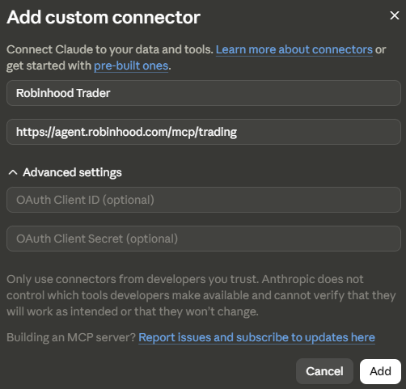

# Robinhood Agentic Momentum Routine

A scan-driven, autonomous equities trading routine for a Robinhood **Agentic** account. It screens for liquid, unusually-active stocks in a set price band, takes profits on winners, buys pullbacks, and sets protective stops — placing orders through the Robinhood agentic-trading MCP tools with per-trade notifications.

> ⚠️ **Automated trading can cause rapid and substantial financial loss. Use only money you can afford to lose.** See the [Disclaimer](#disclaimer).

## New here? Get started with one prompt! 🚀 🌙 ✨

[**Open the one-prompt quick start →**](QUICKSTART.md)<br>
Your AI assistant handles setup and reaches a safe first test, pausing only for sign-in, a required Robinhood UI step, or a real-money-risk decision.

## What it does

Each run, the agent:

1. Manages existing holdings — on a winner up `TAKE_PROFIT_PCT`+ it **cancels the stop first, then sells** (a resting stop reserves the shares, so selling first is rejected); re-places any stop that has silently gone missing; and sweeps the sub-share residue a whole-share stop leaves behind.
2. Decides whether a new entry could be placed at all — after position safety is complete, the run short-circuits entry work outside an eligible exchange session, when regular-hours-only policy blocks the current session, inside the opening blackout, while buying power is too thin, or while SPY is red/unavailable. A definitive skip completes normally instead of looking like a risk halt.
3. For an entry-eligible run, checks the guards — a true Eastern-broker-day equity-loss breaker that blocks entries whenever the configured drawdown is reached, plus a stop-count guard that halts new buys for the rest of the day.
4. Builds a working list — stocks in the `$PRICE_MIN–$PRICE_MAX` band, trading at elevated **relative volume**, that have **moved** at least a minimum % on the day, ranked by relative volume.
5. Screens for exitability — a **median dollar-volume liquidity floor** and a **bid/ask spread ceiling**, dropping names that can't be got out of cleanly.
6. Opens new positions — buys names trading more than `DIP_ENTRY_PCT`% below their recent high **whose RSI was oversold and has just turned back up** (reversal confirmation: depth alone is a falling knife, and a bounce that has already run is not chased), then places a stop `STOP_LOSS_PCT`% below the fill **and verifies it survived with enough whole-share coverage** — placement is not protection.

All trading is scoped to a single account, resolved **by name** at runtime.

## Strategy in one line

*Liquid, in-band, unusually-active movers that have pulled back off their recent high and just begun to turn back up — bought only when they can be exited cleanly, held with a stop, and trimmed for profit.*

## Configuration

**Live trading is off unless you turn it on.** `DRY_RUN` is `true` in the committed `constants.md`, so a fresh clone runs in **dry run** — logging every would-be buy and stop instead of placing it. To trade live, set `DRY_RUN` to `false` as a **local, uncommitted edit**; never commit `false`. After a successful configuration preflight, protection of existing positions — profit-taking, stop repairs, dust sweeps — is always live in both modes. A configuration-read failure is not dry run: it halts the entire run.

All tunable values live in **`constants.md`** next to the routine document — make local runtime configuration edits there, nowhere else. Checked-in changes are maintainer-controlled: pull requests that add, modify, delete, or rename the root `constants.md` are rejected, so contact the maintainer to discuss a repository-level constant change. Before the clock, account lookup, or any broker action, the routine runs `validate_constants.py --json` and uses its 31-value JSON object as the sole configuration authority. The checked-in validator reports the exact constant and reason on failure; the agent never invents a PowerShell/regex substitute or re-parses the table itself. A missing, unreadable, malformed, incomplete, duplicated, or ambiguous value causes a full-run configuration halt: no broker calls or orders, including protective sells/repairs; no defaults, cached values, or guesses. Purpose of each:

| Constant | Purpose |
|---|---|
| `DRY_RUN` | If `true` (the committed default), log would-be entries instead of placing them; set `false` locally (uncommitted) to trade live. |
| `AGENTIC_ACCOUNT_NAME` | Account to trade, matched by name (default `"Agentic"`). |
| `PRICE_MIN` / `PRICE_MAX` | Price band for the screen. See [PriceBandScanner](#tools) for evidence on choosing it. |
| `MIN_REL_VOLUME` | Relative-volume floor (also self-disables the routine when the market is closed). |
| `MIN_ABS_PCT_CHANGE` | Minimum daily move — filters out flat names. |
| `SCAN_TITLE` | Saved Robinhood scan the routine runs, resolved by exact title each run. |
| `MIN_MEDIAN_DOLLAR_VOLUME` | Liquidity floor (median $ volume). |
| `HIGH_LOOKBACK_DAYS` / `VOLUME_LOOKBACK_DAYS` | Lookback windows for the recent high and the liquidity median. |
| `TOP_N` | Max candidate list size. (fewer is better) |
| `DIP_ENTRY_PCT` / `TAKE_PROFIT_PCT` / `STOP_LOSS_PCT` | Entry, profit-take, and stop thresholds. |
| `RSI_PERIOD` / `RSI_INTERVAL` / `RSI_OVERSOLD` / `RSI_LOOKBACK_BARS` / `RSI_CONFIRM_BARS` / `RSI_MAX_ENTRY` | RSI curl-up entry gate: a dip is only buyable once it was oversold and has turned up — and only while it has not already run (`RSI_MAX_ENTRY` caps the current RSI, so a bounce that is already spent is not chased). `RSI_PERIOD` is passed to both the broker indicator request and the local Wilder-closes fallback. |
| `MAX_SPREAD_BUY_PCT` | Max quoted bid/ask spread for an entry — a buy crosses the spread, so a wide book starts the position underwater and can put the stop at the bid on arrival. |
| `REENTRY_COOLDOWN_DAYS` | No re-entry for this many days after a symbol stops out. |
| `BUY_SIZE_PCT` / `MAX_POSITION_PCT` | Position sizing and cap. |
| `MIN_ORDER_DOLLARS` | Smallest allowed buy when downsizing to available buying power; below it, skip. |
| `DAILY_LOSS_HALT_PCT` | True broker-day equity-loss circuit breaker, measured from split-adjusted prior closes and today's executions rather than lifetime cost basis. |
| `STOP_COUNT_HALT` | Halt new buys for the day after this many stop fills. |
| `SKIP_BUY_IF_SPY_RED` | Skip scanning/buying for the current run while SPY trades below its previous close. |
| `NO_BUY_FIRST_MINUTES` | Opening blackout: no buys during the session's first N minutes (selling/protection unaffected). |
| `REGULAR_HOURS_BUY_ONLY` | If `true` (the default), no extended-hours entries; selling and stop protection still run in every session. If `false`, ordinary pre-/after-hours entries remain possible only when the exchange-calendar gate permits them; it never overrides a holiday, an early-close session restriction, or an unknown-calendar block. Raising `MAX_SPREAD_BUY_PCT` is also required because extended-hours spreads are far wider. |
| `EXT_HOURS_LIMIT_BUFFER_PCT` | Limit buffer for extended-hours buys. |

## Requirements

- A Robinhood account with **agentic trading enabled**, connected via the Robinhood MCP server (`https://agent.robinhood.com/mcp/trading`).
- An agent runner/scheduler that loads the routine and honors per-tool approval settings.

## Tested On

The preferred models are **Claude Sonnet 4.6** and **Codex Luna 5.6 (high)**. If neither is available, let the framework select a **medium-strength** general-purpose model.

| Runner | Model / configuration | After-hours timing record | Market-hours timing record | Status |
|---|---|---|---|---|
| Claude Desktop Code tab, Environment Local, native Windows checkout | `claude-sonnet-4-6`; `effort=high` | 4m40 Reference run duration (Claude transcript); 4m05 Routine total (lifecycle); Strategy execution and Routine overhead unavailable before instrumentation | Pending — measure during a market-hours run | Part A native bootstrap/MCP reads/lifecycle+lease/artifacts/dashboard observed 2026-08-11; prescribed per-task `DRY_RUN` acceptance still required before entry-eligible or live use |
| Codex | `gpt-5.6-luna`; `reasoning=high` | 6m03 Reference run duration (Codex app UI); 4m16 Routine total (lifecycle); Strategy execution and Routine overhead unavailable before instrumentation | 17m41 Reference run duration (Codex runner metadata); 14m24 Routine total (lifecycle); Strategy execution and Routine overhead unavailable before instrumentation | Tested |

These are historical wall-clock records from this installation, not controlled benchmarks. The 4m40 Claude and 6m03 Codex values use different reference sources, so they are useful context but not the canonical fair comparison. Their supporting Routine total durations were 4m05 and 4m16. Likewise, Codex's market-hours reference was 17m41, while its representative 2026-08-10 full market-hours Routine total with a 15-candidate scan was 14m24. Market-hours workloads can include the daily-loss snapshot, scan, and candidate/order evaluation; Claude's market-hours timing has not yet been measured. Future Claude-versus-Codex and model-version comparisons use **Comparable run duration**, whose START CLOCK and final-summary boundaries are identical on both runners. Compare only runs with the same session class, workload path, and configuration cohort, and preferably the same rules version; keep runner/model identity explicit as the comparison dimension. Exclude any record with a non-null identity warning, any unknown identity field, or any field whose provenance is `self-reported` from primary cohorts. A later independent source can replace weaker field provenance at projection time. Repeated samples are preferable to a single run.

Use these names consistently in future comparisons:

- **Comparable run duration** is the automatic interval from lifecycle-bound START CLOCK through the single host-clock reading reused by `record-internal` immediately before the final on-screen Run Summary. Those boundaries are identical for Claude and Codex, making this the canonical cross-run comparison metric.
- **Reference run duration** is an optional duration supplied after the run by an explicit external source, such as Codex's displayed **Worked for** value or Claude's recorded run duration. Its source determines its boundaries, so it is context or a fallback when Comparable run duration is unavailable—not the canonical Claude-versus-Codex metric.
- **Routine total** is `lifecycle finished_at_utc - lifecycle started_at_utc`.
- **Strategy execution** is the unique host-stamped lifecycle `report - position-management` interval. Those markers are written immediately after the successful REPORT and FIRST phase-entry renewals; the model never supplies their timestamps.
- **Routine overhead** is `Routine total - Strategy execution`.

Before START CLOCK, the routine performs exactly one structured self-report using only runner/model/configuration identity explicitly exposed by the current framework, then `run_performance.py resolve-identity` maps only exact known aliases and persists the invocation-bound result. Complete direct task metadata is strongest, followed by one valid `TIMING_IDENTITY` declaration. If neither exists, the deterministic Python resolver may combine its own exact reads of the allowlisted `CLAUDECODE` runtime marker and `CLAUDE_EFFORT` setting with the model's framework-explicit self-report. It never enumerates or persists the environment, and the routine/model never reads or relays environment values. Runtime environment is inherited and spoofable corroboration—not authentication—and it does not reveal Claude's exact model; a model obtained from the system prompt therefore remains field-level `self-reported` provenance and makes the combined identity unverified. The projection records provenance separately for runner, model, and configuration plus an aggregate source and warning. The complete synchronized `TIMING_IDENTITY` declaration remains the strongest symmetric comparison source available to both Claude and Codex. The resolver never maps a broad family such as `GPT-5` to a specific model, invents a missing setting, or alters trading, lifecycle, leases, reports, or status.
`Reference run duration - Routine total` is a source-relative delta only when a reference exists; it is not runner overhead. If either strategy boundary is unavailable, Strategy execution and Routine overhead are unavailable rather than zero. New internal measurements are persisted by `run_performance.py`; the local [dashboard](#tools) compares them by market session, runner, model, and configuration. A fair comparison requires the same automatic boundary, session class, workload path, configuration cohort, and preferably rules version; keep runner/model identity explicit as the comparison dimension, exclude non-null identity warnings, unknown identity fields, and any self-reported field from primary cohorts, and keep after-hours and market-hours samples separate because their workloads differ materially.

Every normally finalized run automatically records Comparable run duration with source `final-summary-boundary` and prints its exact Run start, Run end, and helper-formatted duration in the final transcript Run Summary. `record-internal` takes no extra clock reading for this: it reuses its own append timestamp as the end boundary and derives the duration from the lifecycle-bound START CLOCK. The measurement does not alter the saved report, status schema, lease, lifecycle outcome, or trading behavior.

After a run has completed, a later observer can attach a source-specific Reference run duration with `run_performance.py observe-task`, the lifecycle `invocation_id`, duration in milliseconds, the same runner/model/configuration identity, and explicit identity and clock sources. Use `codex-worked-for` only for Codex's displayed Worked for duration, `claude-run-duration` only for Claude's recorded run duration, or the matching manual source for a real stopwatch/observation. The helper rejects a supplied duration shorter than Routine total and preserves the source alongside the value. A reference remains secondary when Comparable run duration exists and supplies a fallback for historical or incomplete runs.

After resolving and binding the checked-in resolver's exact Python path as `PYTHON_EXE`, replace `<INVOCATION_ID>` and `<DURATION_MS>` and copy exactly one matching PowerShell command:

Codex displayed **Worked for** duration:

```powershell
& '<PYTHON_EXE>' run_performance.py observe-task --invocation-id '<INVOCATION_ID>' --task-duration-ms <DURATION_MS> --runner codex --model 'gpt-5.6-luna' --configuration 'reasoning=high' --identity-source manual-ui --clock-source codex-worked-for
```

Claude recorded run duration:

```powershell
& '<PYTHON_EXE>' run_performance.py observe-task --invocation-id '<INVOCATION_ID>' --task-duration-ms <DURATION_MS> --runner claude --model 'claude-sonnet-4-6' --configuration 'effort=high' --identity-source manual-ui --clock-source claude-run-duration
```

These two templates are only for a human reading the named UI/transcript duration and confirming the selected task settings, which is why their identity source is `manual-ui`. An observation supplied by runner metadata must retain `--identity-source run-metadata` and `--clock-source runner-metadata`; never relabel runner metadata as an app-UI observation. In a POSIX-style shell, use the same arguments without PowerShell's leading `&`.

The observed 2026-08-11 Claude Desktop Code Local run was **Part A only**, used `DRY_RUN = false`, and Part B was never tested with **Run now**. It was safe because it ran after hours with a flat account and made no order-mutation tool call. It proved native PowerShell bootstrap with one resolver-bound Windows Python, Robinhood `get_accounts` and account reads, lifecycle and lease handling, report/status publication, lease release, and dashboard health; it did not complete the prescribed `DRY_RUN = true` acceptance test or exercise the entry-eligible scan, daily-loss snapshot, or order path. Every installation and task still requires that supervised proof before entry-eligible or live use; follow the [Claude Desktop Local scheduling guide](CLAUDE-LOCAL-SCHEDULING.md). A **Local** filter in the Code sidebar or the **Local** selector for a new session does not migrate an existing scheduled task; an older Cowork/local-agent task can still own its scheduled firing. The replacement task must use this native Windows main checkout with worktree isolation **off** so it shares the local uncommitted configuration and gitignored runtime state. Do not run the live routine from Cowork/local-agent, a cloud/remote session, or WSL access to the Windows checkout: those paths do not provide the same local SQLite and atomic-replace semantics. Before any write-capable lifecycle mutation opens production state, the helper rejects known shared mounts and probes unknown POSIX filesystems using disposable state.

## Guardrails

- **Execution-substrate preflight**: before a non-Windows runtime opens production lifecycle state for mutation, `run_lifecycle.py` rejects known FUSE/DrvFS/9P shared mounts and probes unknown filesystems with a disposable SQLite commit, cross-process writer-exclusion check, and replacement of an existing file. A Cowork/local-agent Linux VM sharing this Windows checkout fails closed before lifecycle mutation or broker access.

- **Verified Python bootstrap**: before lifecycle startup, Windows scheduled runs use the checked-in resolver to reject Microsoft Store aliases, launch-probe permitted absolute Python 3 runtimes, and bind one executable for the whole invocation. A stalled workspace-runtime lookup or inaccessible `WindowsApps` stub cannot masquerade as "Python missing" while a real interpreter is available.
- **Account scope** resolved by name every run; halts if the name matches zero, multiple, or a non-agentic account — never falls back to another account.
- **Configuration preflight**: an unreadable, malformed, incomplete, duplicated, or ambiguous `constants.md` is a full-run halt, not dry run. It prevents every broker action, including profit-taking, stop repairs, and dust sweeps; the routine never uses a default, cached value, or guess.
- **Daily-loss circuit breaker** reconstructs true Eastern-broker-day equity P&L from complete broker executions, current positions, and split-adjusted prior closes. On an entry-eligible run, it blocks new buys whenever the configured drawdown is reached and fails closed if pagination, prices, quantities, timestamps, or reconciliation are incomplete. Robinhood's lifetime cost-basis realized P&L is telemetry, never the breaker input.
- **Stop-count guard**: on an entry-eligible run, several stop fills in one day halt new buys until the next session — catches the slow bleed the P&L breaker can miss.
- **SPY red-day gate**: no dip-buying while the broad market itself is selling; per-run and self-clearing, so a green afternoon resumes trading the same day.
- **Opening blackout**: no buys in the session's first `NO_BUY_FIRST_MINUTES` — indicators can't see violence inside the first forming bars; profit-taking and stops stay active.
- **Exchange-calendar gate**: no new entries on a full NYSE closure, outside an eligible session window, after a published 1:00 p.m. ET early close, or when the reviewed calendar has no coverage for the date. Existing-position profit-taking, stop audits/repairs, and dust sweeps stay active.
- **Entry-impossibility short-circuit**: after existing-position safety work, the calendar/session, regular-hours policy, buying-power, opening-blackout, and SPY gates run before the entry-only daily-loss and stop-count guards. A definitive skip publishes `entry_phase: "skipped"`, `circuit_breaker: "not-evaluated"`, and `stop_fills_today: null`, completes the lifecycle without a HALT, and still performs the final refresh/report. It never masks a configuration, order-state, lease, protection, or final-refresh failure.
- **Fenced single-run lease**: overlapping scheduled runs cannot both touch the broker. Normal startup follows one strict chain—invocation lifecycle, validated configuration, non-authoritative identity resolution, START CLOCK and lifecycle-bound artifact names, lease acquisition, scratch preflight, order-intent journal checks, then normal account/broker work—and only the token returned by acquisition is authoritative. A journal failure retains only the named read-only diagnostic-report path; it never permits mutation. Atomic SQLite acquisition admits one owner; explicit phase-entry renewals in FIRST, SECOND, THIRD, FOURTH, and REPORT keep a live run current, expired leases let a later schedule recover from a crash, and the fencing token prevents a stalled old owner from cancelling or placing after takeover. Every artifact correction and verification completes before release; release remains the final operational action.
- **Durable order-intent journal**: before any placement, `order_intents.py` stores the exact reviewed payload and one broker idempotency key in a local SQLite journal. A lost response is reconciled against fresh, fully paginated orders and positions before any replay; only a proven same-run no-match may reuse that same key once. Prior-run intents, explicit rejections, ambiguous matches, corrupt state, partial fills, and failed stop replacements all fail closed instead of creating a duplicate order.
- **Immediate pre-buy clock check**: every buy re-runs the deterministic market clock before review and again immediately before placement. A closed/changed session, opening blackout, malformed clock result, or lost lease blocks all remaining entries instead of using the run-start session.
- **RSI reversal gate**: a dip is only buyable once it was oversold, has turned back up for `RSI_CONFIRM_BARS` consecutive bars, and has not already run past `RSI_MAX_ENTRY`. Depth alone is a falling knife; a bounce that already happened is a chase. Both thresholds were tightened after live losses.
- **Liquidity floor** (median $ volume) keeps positions exitable. It requires the complete configured history window; abbreviated histories block instead of becoming smaller substitute samples.
- **Spread gate**: no entry when the quoted bid/ask spread is wider than `MAX_SPREAD_BUY_PCT`. A buy crosses the spread, so a wide book starts the position underwater — and a spread approaching `STOP_LOSS_PCT` puts the protective stop at the bid the moment it is placed, stopping the position out on arrival.
- **Per-position stop-loss** and a **max position cap** — every stop is verified after placement, and broker-cancelled stops are re-placed immediately at a fresh level. A double failure halts new entries for that run and raises a line in the local `ALERTS.md` for human attention.
- **Stop-coverage audit**, run against every held position every run: stops vanish silently — a `gfd` stop expires at that day's close — so a position without enough valid active-stop quantity to cover every whole share gets only the missing quantity placed at a fresh level. Malformed or over-covered stop data halts new entries for the run. This exists because a position once rode to −49% while believed protected.
- **Re-entry cooldown**: a symbol whose stop filled is untouchable for `REENTRY_COOLDOWN_DAYS`, blocking revenge re-entries.
- **Connector-failure discipline**: a failed broker read/review is retried exactly once and is never treated as an empty result; placements and cancellations use their stricter reconciliation protocols instead of blind retries. If positions can't be fetched and the portfolio shows nonzero equity, the run places no orders at all. The final refresh is strictly sequential, and its broker realized-P&L read and identical retry explicitly request the equity asset class for the New York broker day. Every failure is reported even when recovery succeeded.
- **Missing MCP tool surface**: if the task exposes no Robinhood tools at all, it halts before broker access and gives the operator explicit reauthentication/re-creation steps instead of treating the absence as a failed broker request or an empty account.
- **Validated broker-snapshot staging**: each entry-eligible breaker generation first uses `broker_snapshot.py source-preflight` to prove that a fresh external response-source probe is writable, readable, strict JSON, and outside the marked scratch directory. An explicit harness result resource is preferred; otherwise the runner's file-change facility must carry one complete unchanged response. The run never guesses or searches for tool-result paths. Every staged response is envelope-checked, semantically validated, atomically persisted, read back, and hash-checked. Portfolio/quote staging uses exact non-paginated command shapes; position/order page and aggregate staging uses separate cursor-bearing shapes, and a generic stage wrapper may not own cursor flags. A failed generation is discarded wholesale and rebuilt once from fresh broker calls. The probe proves the response-source path, not a later full-response transfer, so the release checklist still requires an end-to-end scheduled-run smoke test on the target runner.
- **Broker compliance check** (`review_equity_order`) before every order.
- **Info notification** on every buy and sell.
- **Append-only invocation lifecycle** (`run_lifecycle.py`, local/gitignored state): every scheduler attempt is recorded before configuration or broker access, including overlap, configuration/coordination halt, snapshot failure, real risk halt, lease loss, and final-status failure. START CLOCK binding deterministically returns the exact run-start timestamp and expected report, gate, and status names. A read-only, invocation-scoped `status` command is the only recovery path if those bindings are lost across context compaction—never a second clock, export, direct database read, or remembered timestamp. Its bounded, validated JSON projection gives the dashboard specific labels without storing account numbers, credentials, lease tokens, or broker responses.
- **Per-run status snapshot** (`run-reports/rhmra-status-*.json`, local/gitignored): raw account state after each successful final refresh — positions with purchase price, current price, and stop coverage; buying power; realized P&L; which gate decided the entry phase. Publication is bound to the still-running lifecycle invocation, its exact seconds-bearing run-start timestamp, and its expected status filename, so a rounded or misnamed snapshot cannot become that run's account state. A definitive pre-SECOND skip records the entry-only breaker as `not-evaluated` and the stop count as `null`, rather than claiming that either guard passed. Raw facts only; consumers (see `dashboard/`) do their own arithmetic. Pre-broker exits, lease loss, and failed final refresh deliberately leave the prior truthful account snapshot untouched; their lifecycle record closes the former telemetry gap.
- **Per-run gate record** (`run-reports/rhmra-gates-*.json`, local/gitignored): every candidate's measured values at every gate — median dollar volume, % below high, quoted spread, RSI verdict — for names that passed as well as names that were blocked, alongside the thresholds in force that run. A blocked name explains itself in the report; this exists so a name that cleared every gate and *then* lost money can still be investigated from the readings it cleared them with.
- **Append-only trade ledger** (`trade-ledger.csv`, local/gitignored): every fill recorded with order id, price, reason, realized P&L, and the deterministic helper's rules version (latest git hash touching the canonical rule set, with a strategy-dirty suffix when applicable) that produced it — the raw data for win-rate and expectancy review per rule era.
- **Cent-exact strategy P&L** (`ledger_pnl.py`): reconstructs the strategy's matched acquisition pool from exact execution prices and quantities, calculates with exact base-10 values, and rounds each realized fill half away from zero at the cent boundary. The dashboard keeps Robinhood's account-wide broker figure authoritative, shows a warning for a real difference or incomplete strategy basis, and never turns missing P&L into zero.

- **Deterministic status publication** (`status_snapshot.py`): the agent writes only a candidate in its marked session scratch directory. The helper requires the active lifecycle invocation, exact unrounded run start, expected output name, and the already-written lifecycle-bound report; rejects duplicate or non-finite JSON values, extra/missing keys, wrong types/enums, inconsistent fields, and a missing/empty/non-UTF-8 report; stages and reads back the accepted bytes; and publishes atomically without overwriting an existing snapshot. A lost publish receipt is reconciled with the invocation- and report-bound read-only verifier before any rewrite. One proven-missing candidate may be rewritten and retried once. A second failure leaves prior truthful snapshots untouched and closes lifecycle as `final-status-unavailable` / `status-write-failed`.

## Why the rules look like this

Nearly every guardrail above was written after something broke in live trading. [**`INCIDENTS.md`**](INCIDENTS.md) is the record: what happened, what it cost, and the rule it produced. A broker cancelling a freshly placed stop **77 ms** after creation and leaving a position naked for 23 minutes. A timezone lookup that returns the wrong hour with **no error at all** on hosts without tzdata. A run that reported ledger rows which never reached disk. A one-bar RSI "curl" that bought three falling knives in 46 minutes. Three recurring lessons ended up as slogans in the code: *placement is not protection*, *issued is not persisted*, *available is not correct*.

It is a separate file for a practical reason. The routine document is executed by an LLM on every run, so its prose is a fixed cost paid ~16 times a day — writing a spec for an agent is closer to API design than to documentation. The rules live in the routine; the history lives in `INCIDENTS.md`, which the runtime never loads.

## Known tradeoffs

- **Opens no positions outside a known entry window** — full NYSE closures, weekends, closed hours, the period after a published early close, and calendar years not covered by the reviewed table skip scanning and entry evaluation outright. With `REGULAR_HOURS_BUY_ONLY` on, ordinary pre-/after-hours do too; turning it off permits them only on an otherwise eligible normal day. Holdings management, stop repairs and dust sweeps run in every session regardless.
- **A relative-volume + movement screen structurally surfaces volatile names** (falling knives, momentum spikes). The RSI reversal gate and the spread ceiling exist specifically to refuse the worst of them, and both were tightened after live losses — but they lower the rate, not to zero. Expect stop-outs; the position cap, daily-loss breaker and stop-count guard are what bound them.
- **Cash-account settlement starves next-day buying power** — sale proceeds settle T+1, so the day after exits, buying power can sit well below `BUY_SIZE_PCT` × total value. The routine downsizes rather than skipping — orders are capped at available buying power and never fall below `MIN_ORDER_DOLLARS` — so starved days typically buy one name instead of several.
- **Extended-hours buys are not immediately stop-protected** (stops only trigger in the regular session), so `REGULAR_HOURS_BUY_ONLY` defaults to `true` and no position is opened outside the session. Selling and protection are never gated by session. Turning extended-hours entries back on also means retuning `MAX_SPREAD_BUY_PCT` — off-session books are several times wider.

## Testing before going live

1. Leave `DRY_RUN = true` and let a few supervised runs log the **new entries** they *would* have placed. Do the same after any strategy-constant change. Important: dry run does not make an account read-only; if the selected account already holds positions, profit-taking, stop repairs, and residue sweeps remain live.
2. Keep both `place_equity_order` and `cancel_equity_order` on **"Needs approval"** (or the platform's equivalent) in the agent's tool permissions. Neither mutation tool may be preapproved. In Claude, where the control may be labeled **Auto**, inspect **Allowed permissions** and require both tools to remain approval-gated; if that cannot be guaranteed, stop before running the routine or enabling live trading.
3. Run for several sessions and confirm: the candidate list looks sane, approvals actually fire on the scheduled runner, notifications land, and fills + stop placement behave.
4. In dry run, confirm the broker accepts the documented order flows. The current connector's canonical stop-market payload uses `type: "stop_market"` plus `stop_price`, with no `trigger` input — so do not rediscover or improvise stop fields during a live run; a review alert is a safety failure to report, not a reason to try another schema.
5. Only after the above look right, consider dropping the approval gate and going live by locally setting `DRY_RUN = false` in `constants.md` (an uncommitted edit).
6. For a release candidate, run one eligible scheduled invocation through the complete daily-loss snapshot path, then run one closed-session invocation and confirm it completes as `market closed` without a false HALT. Unit tests prove the contract; this live smoke test proves the runner's full broker-response handoff.
7. Test View on Phone with a Google account that was never a consent-screen test user: connect without a local OAuth credential file, pair, receive a snapshot, pull-to-refresh, reconnect with the same Google account, and confirm the last verified dashboard remains visible throughout a temporary disconnect.

## Deterministic layer

The routine document is executed by an LLM, so **none of the math lives in it.** Every calculation sits in a small, dependency-free Python script that the agent runs and reads the verdict from — it orchestrates, it never computes. The documents may not re-implement this math, and a script's behavior may not be re-derived at runtime: each one owns its rules, its input schema, and its edge cases, so thirty-minute runs cannot drift from one another.

- **validate_constants.py** — the first-action configuration authority. It strictly parses the single Markdown constants table, requires exactly the known 31 rows, returns typed booleans/integers/text plus exact decimal strings, validates ranges and coupled safety constraints, and identifies the precise line/constant on failure. Both runtime `DRY_RUN` modes are valid. The required `safety/committed-dry-run` pull-request check rejects every PR that adds, modifies, deletes, renames from, or renames to the root `constants.md`, regardless of contents; contributors must contact the maintainer to discuss a checked-in change.
- **market_clock.py** + **market_calendar.py** — the run's clock and reviewed NYSE calendar, first executed as the **first timed operational action after configuration preflight and the one identity-resolution call**. The start reading provides distinct Eastern broker and Pacific report dates, the report header and filename, market session, exchange-calendar verdict, stop-fill windows, re-entry cooldown windows, and opening-blackout verdict. The same script is re-run around the daily-loss snapshot, at the buy boundary, and for fresh order-intent baselines/reconciliation cutoffs so no guard or placement uses a stale timestamp; those later readings never change run filenames or historical windows. `NO_BUY_FIRST_MINUTES` is loaded through the same full constants validator, so the value is never re-typed and malformed sibling settings cannot slip past the clock's second read. Every clock result also carries the constants-file SHA-256, which must match the preflight hash so a mid-run edit cannot mix two configurations. The checked-in calendar covers 2026–2028 full closures and 1:00 p.m. ET early closes; dates outside that coverage fail closed for entries. The clock derives US DST offsets from the rule itself rather than the OS timezone database, because `TZ=`/`zoneinfo` lookups fail *silently* on hosts without tzdata — Windows returns GMT rather than erroring, and a wrong-but-plausible clock is worse than none.
- **run_lock.py** — the broker single-writer guard, run immediately after the start clock. A one-row SQLite transaction makes acquisition/takeover atomic across platforms; acquire/renew/release return machine-readable JSON and a fencing token. The lease is stored under gitignored `run-reports/`, and a malformed database or ownership mismatch fails closed.
- **run_lifecycle.py** — the invocation-history and artifact-binding authority. It journals an attempt before configuration or broker access, binds START CLOCK's exact timestamp to the expected report/gate/status names, and, after lease acquisition, writes a private active-context receipt tied to the exact interpreter, invocation, artifact bindings, and current lease owner. Its read-only recovery commands can restore those values after context compaction without a PATH lookup, guessed UUID, database inspection, or raw-token storage. It also publishes a bounded, validated, privacy-safe projection. Overlap, lease loss, configuration/coordination halt, snapshot failure, risk halt, and final-status failure remain visible even when no account snapshot can be written.
- **run_performance.py** — the non-authoritative performance recorder. Before START CLOCK, its exact-match identity resolver persists field-level direct-metadata, declaration, allowlisted runtime-environment, self-report, composite, or unknown provenance plus any warning without trading authority. It reads only `CLAUDECODE` and `CLAUDE_EFFORT` directly with `os.environ.get`; it never enumerates or persists environment values. Runtime evidence is inherited/spoofable corroboration rather than authentication. Unknown, conflicting, or self-reported fields stay outside primary fair-comparison cohorts unless a later independent source replaces them in the projection. After lifecycle finish it reads the unique helper-stamped `position-management` and `report` lifecycle markers, computes Routine total, Strategy execution, and Routine overhead deterministically, and publishes a bounded projection for the dashboard. It rejects conflicting caller timestamps; a missing, partial, or duplicate marker pair yields `not measured` rather than a model-reconstructed value. The same `record-internal` host-clock reading supplies the final-summary boundary for Comparable run duration; it does not add a second clock call. Missing timing data can make a metric unavailable, but can never change trading, report/status data, lease handling, or lifecycle outcome. A separately sourced post-run Reference run duration remains available as fallback/context with its provenance. The final recorder consumes the persisted invocation identity rather than asking the model to reconstruct it after context compaction.
- **order_intents.py** — the durable placement-lifecycle authority. It creates and persists one immutable `ref_id` plus the exact reviewed payload before submission, records broker acknowledgements/fills, verifies pagination cursor continuity, reconciles lost responses by broker ID or one exact post-baseline fingerprint, and permits at most one same-run same-key retry after a proven no-match. Its local SQLite journal also links the single allowed zero-fill stop retry and blocks corrupt, ambiguous, stale, or cross-run replay state.
- **broker_snapshot.py** — the daily-loss transport and staging authority. It validates the scratch marker and external response-source probe, unwraps only known transport envelopes, enforces kind-specific broker schemas and pagination rules, writes atomically, verifies hashes/read-back, and seals coherent A/B generations so a retry cannot mix old and new pages.
- **daily_loss.py** — the circuit-breaker authority. It consumes raw, fully paginated portfolio/position/order responses and raw quote batches, filters individual executions by Eastern broker date, reconciles them against `intraday_quantity`, and calculates mark-to-market P&L with exact decimal arithmetic. Calculation mode atomically writes the scratch audit document and emits that same complete result as one compact JSON object on stdout, so the runner never needs a second file-read command or a Windows path embedded in Python source. Old GTC orders that fill today, partial fills, same-day round trips, execution fees, and overnight holdings are all included; malformed or incomplete input can only block entries.
- **ledger_pnl.py** — the dashboard's strategy-P&L authority. It rebuilds chronological matched acquisition pools from exact ledger executions, emits integer cents under one explicit rounding policy, and marks unmatched or incomplete basis instead of asserting false precision. It never replaces Robinhood's authoritative account-wide realized P&L.
- **rules_version.py** — the rule-era identity authority. It owns the canonical rule-set file list, obtains the latest touching short commit with read-only Git calls, appends `-dirty` for applicable rule changes, and recognizes only the exact local uncommitted `DRY_RUN = false` exception. It emits one strict JSON receipt and falls back to `unknown` when Git metadata is unavailable, so an LLM never interprets `git describe`, status output, or diffs during a run.
- **filter_scan.py** — turns the raw scan response into the ranked working list: price band, relative-volume floor, and minimum absolute day move (including the `% Change` decimal-fraction → percent conversion), sorted by relative volume and capped at `TOP_N`. Its `--json-out` file is the routine's machine-readable handoff; downstream steps consume that JSON's unrounded values, never the human-formatted stdout table. It also documents the scan response's schema in one place so no run has to rediscover it.
  It accepts the original saved MCP tool result directly, unwrapping the known `structuredContent` envelope without a second scan or corrective copy. When a large scan arrives inline, the routine atomically couples that single MCP call with complete-envelope file persistence before any model-visible output, then passes only the saved path to the filter; this prevents output truncation from turning a successful scan into a false handoff failure.
- **evaluate_candidates.py** — the entry math: median dollar-volume liquidity floor, recent high from real (non-interpolated) bars, % below high, and the **RSI curl-up gate** that requires a dip to have been oversold *and* to be turning up before it can be bought. Consumes raw API responses; never hand-transcribed bars. Its transient pre-RSI JSON selects which indicators to fetch; only a validated final RSI-enabled JSON result can authorize a buy. Formatted stdout and ad-hoc calculations are never entry authorities.
  Historical `--bars` inputs accept the original saved MCP `structuredContent` envelope directly, eliminating corrective copies or broker refetches; the quote and RSI maps remain intentional derived handoffs.
- **tests/** — dependency-free regression tests covering the daily-loss calculator, durable order-intent lifecycle, evaluator, scanner, clock/calendar, concurrent run locking and takeover, dashboard path, the Google Drive phone-share uploader/OAuth flow, phone-share guards, and routine contracts. Run the complete Python suite with `python3 -m unittest discover -s tests` (Windows: `py -3 -m unittest discover -s tests`) before committing any script change; expected market values were verified against live API data. The standalone [RHMRA Phone PWA](https://github.com/abiemann/RobinhoodEquityTradingDashboardViewer) and the OAuth relay under `phone-share-oauth-broker/` each have their own `npm test` command.
- **resolve_python.ps1** — the Windows scheduled-run bootstrap. It emits one strict JSON receipt containing a launch-probed absolute Python 3 path, rejects Microsoft Store aliases, discovers the current Codex-bundled runtime and normal local installations without hardcoding a version, and lets the routine reuse one interpreter instead of trusting whichever `python.exe` appears first on PATH. The receipt's `python` field is immediately authoritative and directly executable; `-PreferredPath` is only a discovery hint, never a value to reconcile after success. Its narrow `-RecoverActiveContext` mode never discovers another interpreter: it validates the private lifecycle receipt, launch-probes only its recorded executable, and requires the same live lease owner before returning the exact invocation/artifact bindings.

- **status_snapshot.py** — the final account-status schema and publication authority. `publish` accepts one direct-child candidate from the marked session scratch directory only for the named active lifecycle invocation, exact bound run-start timestamp, expected output filename, and the already-written lifecycle-bound report. The report must be a nonempty, bounded, strict-UTF-8 regular file before status can publish. The helper enforces the exact version-1 document contract and cross-field semantics, then uses flushed staging, strict read-back, hashing, and atomic no-clobber publication under `run-reports/`. Its invocation- and report-bound `verify` reconciles a lost receipt before any retry, while its read-only document validator is shared by dashboard ingestion so producer and consumer cannot silently drift to different schemas.

## First-time app setup

### Robinhood MCP connector (CHATGPT/CODEX)

> **ChatGPT users:** switch to **Codex mode** before running this project for the best experience with local project files, tool activity, and generated reports.

In ChatGPT/Codex, open **Settings → Plugins → MCPs → Add → Add MCP server** and enter:

| Field | Value |
|---|---|
| Name | `Robinhood Trader` (any descriptive name is fine) |
| Type | `Streamable HTTP` |
| URL | `https://agent.robinhood.com/mcp/trading` |

Save the connector, then:

1. Complete Robinhood's authorization flow.
2. Restart ChatGPT/Codex so the MCP settings take effect.

A successful setup exposes tools such as `get_accounts`.

If a later run reports that the required Robinhood tools are not available in its task tool set,
open **Settings → Plugins → MCPs**, select the Robinhood server, choose **Authenticate**, restart
ChatGPT/Codex, and confirm that a fresh task exposes `get_accounts`. If it is still absent in that
fresh task, remove and re-create the MCP connection, restart ChatGPT/Codex, and test `get_accounts`
again. Do not run scheduled trading until that fresh-task check succeeds.


### Robinhood MCP connector (CLAUDE CODE)

In Claude Desktop, open **Customize → Connectors** (or **Settings → Connectors**, depending on the version), choose **+ → Add custom connector**, and enter:

| Field | Value |
|---|---|
| Name | `Robinhood Trader` (any descriptive name is fine) |
| URL | `https://agent.robinhood.com/mcp/trading` |

Then click **Add**, then:

1. Complete Robinhood's authorization flow.
2. Restart Claude so the MCP settings take effect.

A connector added to the Claude account is available to Claude Code when Claude Code is signed in with that same subscription. For setup or recovery, use Claude Desktop first: open **Customize → Connectors** (or **Settings → Connectors**) and confirm that exactly one Robinhood account connector exists and is authorized. Do not add a duplicate. Then open `/mcp` in a Claude Desktop **Code** tab session with **Environment: Local** on this native Windows main checkout with worktree isolation **off**, select the Robinhood server, and choose **Re-authenticate**. If reauthentication still fails, return to **Customize → Connectors** (or **Settings → Connectors**), remove only that single existing Robinhood connector, add it back once there, complete OAuth, and restart Claude; never leave or create a duplicate. Open a fresh session on that same native Windows main checkout with worktree isolation **off** and verify `get_accounts`. If you use a Desktop local scheduled task, click **Run now** and require `get_accounts` there too; success proves the scheduled context can see the connector. Only if no account connector exists and the standalone `claude` CLI is installed may you optionally add the server once with `claude mcp add --transport http robinhood-trading https://agent.robinhood.com/mcp/trading`, complete OAuth through `/mcp`, and optionally confirm it with `claude mcp list`; never use the CLI to create a duplicate. A successful setup exposes tools such as `get_accounts`.



### Scheduling

For Codex, create a scheduled task with this project folder as its working directory, enable **Act** mode, and select **Codex Luna 5.6** with **reasoning high** (`gpt-5.6-luna`, `reasoning=high`).

For Claude, follow the illustrated [Claude Desktop Local scheduling guide](CLAUDE-LOCAL-SCHEDULING.md). Changing the Code sidebar to **Local**, or selecting **Local** for a new session, does not migrate an existing scheduled task. Return to the original **Cowork/Scheduled** interface, pause the legacy task there, and verify that it no longer fires; the Code **Routines** list does not control it. In Claude Desktop, create **new, uniquely named** Part A and Part B tasks through **Code → Routines → New routine → Local**, select this exact native Windows project folder, choose Sonnet 4.6, keep the isolated-worktree option **off**, and save both with **Schedule: Manual** first. A saved Custom cron becomes active immediately. If a cron task already exists, immediately Pause it in task detail and verify that it is disabled and no run began. With `DRY_RUN = true`, use **Run now** on both Manual tasks and require the Windows PowerShell resolver, `get_accounts`, lifecycle, report/status publication, lease release, dashboard health, and safe Allowed permissions. Only after both proofs pass should you edit each task to its Custom cron and activate the schedules. Delete the legacy task only after both replacement proofs pass and no further legacy firing occurs. The observed Part A live-mode run proved the native platform path only; it was not the prescribed acceptance test, and Part B remains untested.

Use this prompt in Codex:

> TIMING_IDENTITY: runner=codex model=gpt-5.6-luna config=reasoning=high
>
> Treat every run as stateless. Do not read, create, or update `memory.md`, and do not call a framework memory tool; the verified report/status artifacts are the durable record.
>
> Read `./robinhood-momentum-routine-autonomous.md` and execute the trading routine exactly as written, following every instruction in that file from start to finish. Produce the full report as specified in the file. All constants and detailed step-by-step instructions are in the file — follow the file.

Use this prompt in Claude Desktop Code Local:

> TIMING_IDENTITY: runner=claude model=claude-sonnet-4-6 config=effort=high
>
> Treat every run as stateless. Do not read, create, or update `memory.md`, and do not call a framework memory tool; the verified report/status artifacts are the durable record.
>
> Read `./robinhood-momentum-routine-autonomous.md` and execute the trading routine exactly as written, following every instruction in that file from start to finish. Produce the full report as specified in the file. All constants and detailed step-by-step instructions are in the file — follow the file.

Keep exactly one `TIMING_IDENTITY` line in each task. It must stay synchronized with the runner, model, and configuration actually selected in that task's settings; if any selection changes, update the declaration before the next run. The line records the selection for comparison and does not switch the model.

The running model also produces one pre-helper self-report from only framework-explicit identity, and the routine resolves it once before START CLOCK through an exact registry. The Python resolver—not the model or routine—also reads only `CLAUDECODE` and `CLAUDE_EFFORT` as field-level corroboration without enumerating the environment. Direct metadata remains strongest, followed by the complete declaration; runtime evidence plus self-report can produce a `composite` identity but remains unverified whenever any field is self-reported. Any unknown field, self-reported field, or conflict excludes the sample from primary fair comparisons until an independent stronger source replaces it. Keep `TIMING_IDENTITY`: it is the strongest symmetric source across Claude and Codex and records the selected configuration that a model may not know. The resolver never changes the configured model and has no trading authority.
For Codex, choose weekdays at minute `0` and `30`, from `06:00 AM` through `01:30 PM` Pacific time. The Claude Desktop Local form observed on 2026-08-11 rejected a single twice-hourly expression with **“Scheduled tasks must run at most once per hour.”** After both Manual proofs pass, give the same prompt to Part A with `0 6-13 * * 1-5` and Part B with `30 6-13 * * 1-5`. Cron uses the local machine/app timezone: require both previews to show the intended Pacific bounds, and convert the hours if the machine is not on Pacific time. Claude applies randomized start delays. Claude Desktop must remain open, and the computer must remain awake and online. The task-form permission control is currently labeled **Auto**; choose and verify a mode that does not auto-approve `place_equity_order` or `cancel_equity_order`, then inspect each task's Allowed permissions after **Run now**. If both mutation tools cannot remain approval-gated, do not enable live Claude trading.

Only one instance of the trading agent can operate at a time. If another scheduled instance starts while one is already running, the new instance stops before connecting to Robinhood or placing or cancelling any orders. If the first instance crashed, its lock expires automatically so the next scheduled run can take over safely; the old instance can no longer place or cancel orders.

### View on Phone setup (optional)

Phone viewing is **off by default**. **View on Phone** uses the installable [RHMRA Phone PWA](https://abiemann.github.io/RobinhoodEquityTradingDashboardViewer/) and the user's own private Google Drive app-data area. There is no RHMRA account server, shared financial-data backend, public bucket, or internet-facing laptop web server. A narrowly scoped OAuth relay participates only in Google token exchange; it never receives dashboard snapshots.

The phone user needs only a free Google account and an Android phone, iPhone, or iPad with a modern browser. The laptop needs the Agent checkout and an internet connection. End users do **not** download an OAuth JSON file, supply a client secret, deploy Cloudflare, create a bucket, or configure an API key. Start the dashboard normally:

```powershell
py -3 dashboard\serve.py 9000
```

When the user selects **Connect Google Drive**, the Agent opens Google's authorization page with S256 PKCE and a one-time state value. The RHMRA OAuth relay adds the project's protected Desktop client credential only while forwarding the authorization-code exchange or token refresh to Google. The relay implementation stores and logs no authorization codes or tokens, and it never receives encrypted or decrypted dashboard data. Google Drive access and dashboard uploads remain between the Agent and the user's Google account.

#### Recommended: scan the QR code from the laptop dashboard

Normal setup starts on the laptop and requires no public URL, copied link, or manual pasting:

1. Start the local dashboard and select **View on Phone**.
2. Select **Connect Google Drive** and sign in with the Google account that you intend to use on the phone.
3. Choose the share duration, then select **Pair phone and create QR code**.
4. Scan the displayed QR code with the phone's camera.
5. If Messenger, Instagram, or another app opens the link in its built-in browser, use the RHMRA handoff screen to open it in **Chrome** (Android) or **Safari** (iPhone/iPad). Do not pair inside an embedded browser.
6. Install RHMRA from Chrome or Safari if it is not already installed, then open it from the phone's Home Screen.
7. Select **Connect Google Drive** and sign in with the same Google account used on the laptop. The encrypted dashboard appears after the first successful refresh.

On iPhone and iPad, Safari and the installed Home Screen app keep separate private storage. If scanning the QR code opens Safari instead of the installed RHMRA app, use the alternate approach below to paste the private pairing link inside the installed app.

#### Alternate: install first and paste the private link

Use this only when QR scanning is unavailable or does not open the installed RHMRA app. Open and install [RHMRA Phone](https://abiemann.github.io/RobinhoodEquityTradingDashboardViewer/), create the share from laptop **View on Phone**, choose **Copy private link**, transfer it privately, and select **Paste private pairing link** inside the installed app. Then connect Google Drive with the same Google account used on the laptop.

For Google Drive sharing, the duration selector offers **1, 2, 4, 6, or 8
hours**. Two hours remains the preselected choice; eight hours is the hard
maximum.

The laptop-dashboard QR flow is the primary setup path; the public URL and copied private link are alternate recovery options. Never post, email broadly, or otherwise share the QR code or private link: it contains the dashboard decryption key.

Pairing normally survives future dashboard sessions. The next time, click **View on Phone → Start sharing with paired phone**; no new QR code is required. The phone checks for a fresh snapshot every 30 seconds while the app is visible, stops polling while it is in the background, and refreshes immediately when reopened. Pull-to-refresh or a full reload keeps the last verified dashboard and pairing key visible; because the phone's Google access token deliberately remains only in memory, the app may show a disconnected state and ask for the same Google account again, then resumes without a new QR code. On small screens the dashboard header stays visible while the account area scrolls, and expanded run details remain open across polling refreshes until tapped again.

On Windows, the Agent normally protects the laptop's Google refresh credential with the signed-in user's DPAPI storage. If that protected storage is unavailable or a save fails, **View on Phone** displays a prominent **Google sign-in is memory-only** warning. Sharing still works for the current dashboard-server process, but Google Drive must be reconnected after the server stops or restarts.

#### Stop sharing, disconnect Google Drive, or forget the phone

- **Stop sharing** deletes the current encrypted Drive snapshot and stops laptop uploads, but keeps the laptop and phone paired. Use this for normal daily use; a later **Start sharing with paired phone** resumes without a new link or QR code.
- **Disconnect Google Drive** is shown separately when no share is active. After confirmation, it asks Google to revoke the laptop grant and always removes the Agent's in-memory and saved laptop credentials. It does **not** forget the paired phone or automatically delete a separate snapshot; stop sharing first when a snapshot is active. Because the phone and laptop use the same RHMRA Google permission, the phone may ask to reconnect. If RHMRA says Google could not confirm remote revocation, remove RHMRA manually from Google Account permissions for immediate assurance.
- **Forget paired phone** on the laptop deletes the encrypted snapshot when possible and discards that phone's pairing ID and key. Use it if the phone or private link may be compromised, or when permanently replacing the phone. Also choose **Forget this device** in the phone app; pairing again will require a new private link or QR code.
- **Forget this device** on the phone clears only that phone's local pairing and in-memory Google token. By itself it cannot delete the laptop's Drive snapshot or disconnect the laptop. For a complete reset, stop sharing, disconnect Google Drive, and forget the pairing on both devices.

#### Privacy and failure behavior

- The laptop dashboard stays on `127.0.0.1`, opens no inbound port, and sends only outbound HTTPS requests to Google and the OAuth relay.
- The OAuth relay sees an authorization code or refresh token only while forwarding a token request to Google. Its implementation stores and logs no tokens, and it never receives dashboard snapshots, brokerage credentials, or trading data. End users do not need a Cloudflare account or deployment.
- RHMRA encrypts a strict, read-only display allowlist locally with AES-256-GCM. Google Drive stores ciphertext in the hidden `appDataFolder`; the requested `drive.appdata` scope cannot browse the user's ordinary Drive files. The phone decrypts locally.
- Account numbers, broker credentials, connector settings, order IDs, raw ledgers, gate records, reports, constants, and local paths are never shared. When an exact run has validated timing, its encrypted run-detail text may additionally include the session, runner/model/configuration, and the displayed Run duration, Routine total, Strategy execution, and Routine overhead durations. Invocation IDs, timing timestamps and sources, and raw performance records remain local. The phone app never calls Robinhood or an AI model.
- Each snapshot is temporary and expires. If an upload, refresh, or deletion fails, trading and the local dashboard continue normally, and the phone view shows the last successful update rather than silently presenting new data as current.

#### Project maintainers only: one-time Google OAuth setup

The maintainer of the public PWA must enable the Google Drive API, configure and publish the consent/branding screen, request only the `https://www.googleapis.com/auth/drive.appdata` scope, and create a **Web application** OAuth client for the hosted PWA plus a **Desktop app** OAuth client for the laptop uploader in the **same Google Cloud project**. Moving the audience to **In production** removes the test-user allowlist; it does not by itself complete any separate Google branding/scope verification needed to remove an unverified-app warning. The maintainer deploys the project's stateless OAuth relay once and stores the Desktop client secret only as an encrypted deployment secret. Client secrets, downloaded OAuth JSON, authorization codes, access tokens, refresh tokens, and pairing keys must never be committed or logged. Follow the local [OAuth relay deployment guide](phone-share-oauth-broker/README.md) and the [RHMRA Phone maintainer guide](https://github.com/abiemann/RobinhoodEquityTradingDashboardViewer#maintainer-setup-one-time-not-for-end-users) for the exact deployment, hosting, authorized-origin, consent, verification, and release steps.

#### Developers only: direct OAuth override / relay rollback

The built-in relay is the normal end-user path. For local protocol debugging or an emergency maintainer rollback, a developer may instead download the matching Desktop app OAuth JSON, keep it outside this repository, and set its absolute path before starting the dashboard:

```powershell
$env:RHMRA_PHONE_SHARE_GOOGLE_CREDENTIALS_FILE = 'C:\private\rhmra-google-desktop.json'
py -3 dashboard\serve.py 9000
```

This override sends token requests directly to Google's HTTPS endpoint and deliberately bypasses the built-in relay. Never paste the JSON's `client_secret` into the dashboard, a task prompt, `constants.md`, a report, or source control. It is a developer recovery tool, not an installation step for users.

## Tools

- **PriceBandScanner** (`tools/PriceBandScanner.md` + `tools/price_band_scanner.py`) — a read-only companion agent, scheduled once daily after market close. It runs the same saved scan, buckets the day's most-active stocks into price bands, and reports each band's median/mean % change, breadth, and best/worst names — evidence for choosing the `PRICE_MIN`/`PRICE_MAX` band. It never touches accounts or orders. Logs to `tools/logs/PriceBandScanner-log-YYYY_MM_DD.md` plus a same-named `.png` chart of the band medians (local only, gitignored). **Schedule it after the US close but before Asia starts trading — i.e., before 5:00 PM PT, when Robinhood's overnight (24/5) session opens and its prints would contaminate the day's data; ~1:05 PM PT is ideal.**

  

- **Dashboard** (`dashboard/serve.py` + `dashboard/index.html`) — a local web view of the day's trading. Run `python3 dashboard/serve.py` (Windows: `py -3 dashboard\serve.py`) and open `http://127.0.0.1:8765/`. Stop it with **Ctrl+C** in its terminal; if it was started detached, kill it by port — Windows PowerShell: `Stop-Process -Id (Get-NetTCPConnection -LocalPort 8765 -State Listen).OwningProcess -Force`, or macOS/Linux: `lsof -ti:8765 | xargs kill`. Pass a different port as the first argument (`py -3 dashboard\serve.py 9000`) if 8765 is taken. Shows account value, cash, and buying power; open positions with purchase price, current price, unrealized P&L, **stop coverage** (a position without an active stop is flagged UNPROTECTED), and distance to stop; a timeline of today's runs with the reason each one skipped or traded; and per-rules-era strategy ledger totals, newest era first. Robinhood's account-wide realized P&L remains the headline authority; exact integer-cent strategy totals are shown separately, with a visible warning when basis is incomplete or the figures genuinely differ. Completed closed/unknown-calendar skips use neutral `market closed` / `calendar unavailable` labels, while real lifecycle failures remain distinct red outcomes. Standard library only — no install, no build step. It is a pure viewer: it reads the per-run status snapshots, gate records, and ledger that the routine already writes, holds **no broker credentials**, places no orders, and binds to localhost only (the data includes account activity and must never be exposed off-machine). Optional phone viewing remains off until configured and explicitly started. Its Google Drive/PWA path uploads only an encrypted display snapshot to the user's hidden Drive app-data area and cannot place orders. Data freshness matches the run cadence — a snapshot up to ~30 minutes old is normal and the page says how old it is. If the snapshot format ever changes (`schema_version`), the dashboard refuses to render rather than misreading it.

  Its run timeline also reads the helper-validated lifecycle projection, so invocations that have no account status file still appear as `snapshot failure`, `overlap skipped`, `lease lost`, `configuration halt`, or `coordination halt`. The private SQLite lifecycle journal and projection file are not served as static files. If SQLite reports an interrupted rollback journal, the dashboard remains read-only and tells the operator to pause runners, run the checked-in Windows resolver, bind its exact returned `PYTHON_EXE`, and execute that interpreter with `run_lifecycle.py export`; it never attempts recovery itself, a bare `py`/`python`/`python3` is not a supported substitute, and the `.sqlite3-journal` sidecar must never be deleted manually.

  On a genuinely native Linux/macOS checkout, use the already-bound absolute host `python3` executable with `run_lifecycle.py export`.

  The entire **Run details** panel is initially collapsed and absent from the layout. A small `*` in the top-right corner of a **Runs today** chip means that exact lifecycle invocation has a validated readable report: green means the run completed with a valid linked status, orange means a report-backed warning or degraded/nonfatal outcome, and red means a report-backed technical, safety, or coordination error. The text alternative on every marked chip states the same severity, so color is never the only signal. Select a marked chip with a mouse, touch, Enter, or Space to expand the panel, scroll it into view, and show that run's structured diagnostic together with its timing row when timing exists. Selecting a different marked chip replaces the diagnostic/timing content while the panel stays open; selecting the same chip again clears the content, marks the region hidden and inert, and animates the whole panel closed until it disappears. Keyboard selection behaves the same as mouse or touch selection, and reduced-motion preferences replace the animated expansion, collapse, and scrolling with immediate state changes. Matching is by exact lifecycle `invocation_id` plus the helper-validated report inventory, never by a nearby timestamp or free-form report-text search; the selection clears when the report/run is no longer in today's timeline.

  Timing remains optional inside Run details. Missing durations display as `not measured`, not zero. A schema-v2-or-newer `final-summary-boundary` value is labeled **Comparable run duration** because it uses the same in-routine boundaries on Claude and Codex. Legacy schema-v1 files are reference-only and cannot claim that boundary. An external/manual value is labeled **Reference run duration** and is used only as fallback/context when the comparable value is unavailable. Tooltips preserve the selected source and underlying timing boundaries. Compare only the same automatic boundary, session class, workload path, configuration cohort, and preferably rules version; keep runner/model identity explicit as the comparison dimension. Schema v4 preserves runner, model, and configuration provenance separately. Any unknown field, conflict, or self-reported field is shown in the existing orange identity diagnostic inside Run details and excludes the record from primary fair-comparison cohorts; it never changes the chip's independent run-health color. A later independent source can replace weaker provenance in the projected record. Closing Run details clears timing and every identity/run diagnostic. Performance data is a separate local-only projection: an unavailable or invalid performance file produces a nonfatal notice only inside an already-selected Run details panel and cannot open the panel, remove report diagnostics, change the run timeline, trading data, or profit display. While phone sharing is active, the same exact-match timing summary—including only bounded enum provenance, never raw environment data—is appended as bounded plain text to that run's encrypted detail window; the phone payload schema stays unchanged, and missing or invalid timing is simply omitted.

  Status ingestion uses the same strict validator as publication and cross-checks filenames against the validated lifecycle projection. `/api/latest` scans newest to oldest and returns the newest valid lifecycle-linked snapshot; a newer structurally valid but unlinked/misnamed snapshot is quarantined as orphaned rather than displacing the truthful linked run. A rejected or orphaned snapshot that is exactly associated with a lifecycle run having a validated readable report becomes that chip's orange diagnostic instead of a page-wide warning. Truly global failures that cannot be assigned to a report—such as lifecycle authority being unavailable—remain page-level warnings. Rejected/orphaned files remain local and auditable, but never supply account, guard, or phone-share data. If no valid linked snapshot exists, or browser-side validation rejects the server response, the dashboard clears account, positions, freshness, rules, P&L, and the local pending phone-share view instead of leaving stale values in the DOM. An already-uploaded strictly valid encrypted snapshot remains truthful, ages visibly, and expires normally; ignored data never replaces it. A lifecycle run with a rejected linked status remains visible with a neutral `status rejected` / `status unavailable` label rather than an invented risk halt.

  

## Troubleshooting

For Windows Python 3 installation and Codex-shell troubleshooting, including the checked-in scheduled-run resolver, see [Python 3 install (Windows)](PY3-INSTALL-WIN.md).

## Disclaimer

**Automated trading can cause rapid and substantial financial loss. Use this project entirely at your own financial risk and only with money you can afford to lose.** It is a personal execution framework for a self-specified strategy, hardened through live iteration but never formally validated: there is no backtesting, and the strategy parameters are untested against historical data (the regression tests in `tests/` cover the deterministic script math, not the strategy). It is **not financial advice** and not a recommendation of any screen, ticker, or parameter. Automated trading of volatile, unusually-active stocks carries real risk of loss, and an autonomous agent acts on your account without asking first. Understand the code and start with the order-approval gate on.
