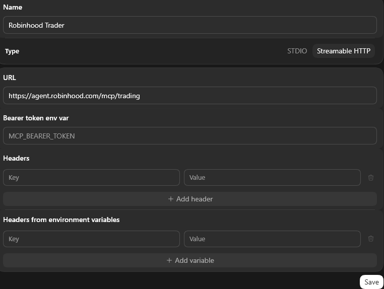
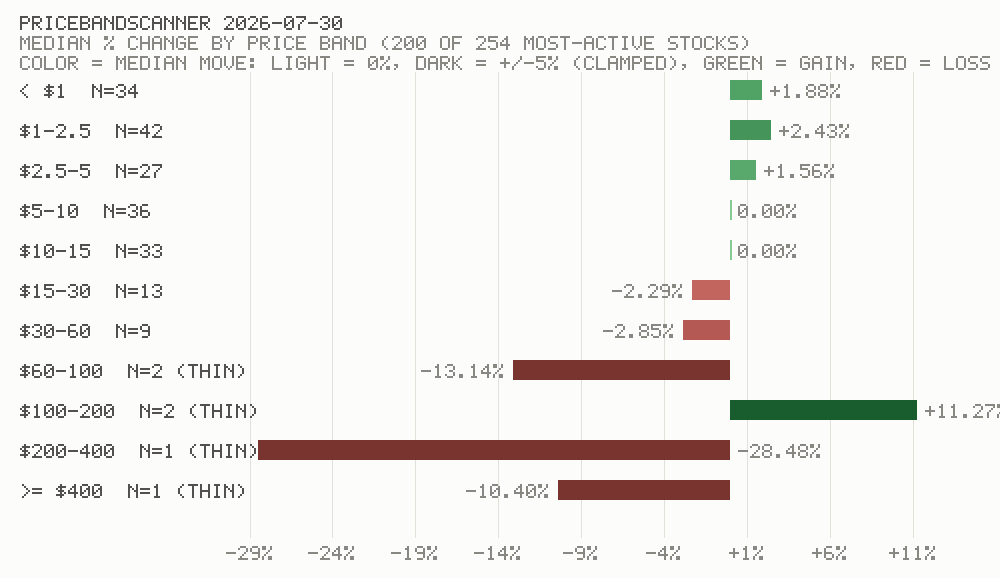
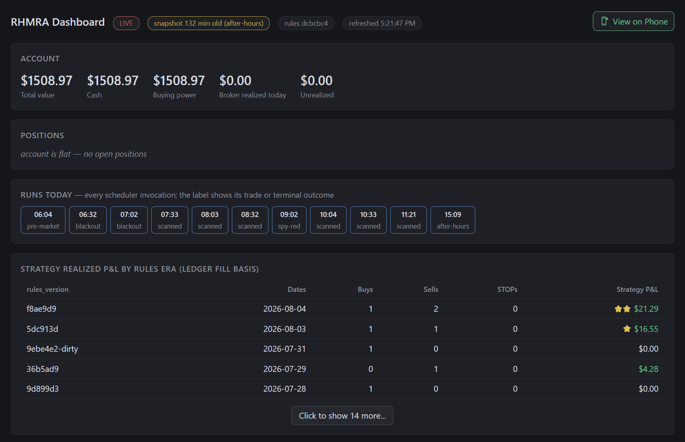

# Robinhood Agentic Momentum Routine

A scan-driven, autonomous equities trading routine for a Robinhood **Agentic** account. It screens for liquid, unusually-active stocks in a set price band, takes profits on winners, buys pullbacks, and sets protective stops — placing orders through the Robinhood agentic-trading MCP tools with per-trade notifications.

> ⚠️ **Automated trading can cause rapid and substantial financial loss. Use only money you can afford to lose.** See the [Disclaimer](#disclaimer).

## What it does

Each run, the agent:

1. Manages existing holdings — on a winner up `TAKE_PROFIT_PCT`+ it **cancels the stop first, then sells** (a resting stop reserves the shares, so selling first is rejected); re-places any stop that has silently gone missing; and sweeps the sub-share residue a whole-share stop leaves behind.
2. Decides whether a new entry could be placed at all — after position safety is complete, the run short-circuits entry work outside an eligible exchange session, when regular-hours-only policy blocks the current session, inside the opening blackout, while buying power is too thin, or while SPY is red/unavailable. A definitive skip completes normally instead of looking like a risk halt.
3. For an entry-eligible run, checks the guards — a true Eastern-broker-day equity-loss breaker that blocks entries whenever the configured drawdown is reached, plus a stop-count guard that halts new buys for the rest of the day.
4. Builds a working list — stocks in the `$PRICE_MIN–$PRICE_MAX` band, trading at elevated **relative volume**, that have **moved** at least a minimum % on the day, ranked by relative volume.
5. Screens for exitability — a **median dollar-volume liquidity floor** and a **bid/ask spread ceiling**, dropping names that can't be got out of cleanly.
6. Opens new positions — buys names trading more than `DIP_ENTRY_PCT`% below their recent high **whose RSI was oversold and has just turned back up** (reversal confirmation: depth alone is a falling knife, and a bounce that has already run is not chased), then places a stop `STOP_LOSS_PCT`% below the fill **and verifies it survived with enough whole-share coverage** — placement is not protection.

All trading is scoped to a single account, resolved **by name** at runtime.

## Requirements

- A Robinhood account with **agentic trading enabled**, connected via the Robinhood MCP server (`https://agent.robinhood.com/mcp/trading`).
- **Codex** as the execution runner/scheduler, with the routine loaded from this repository and the broker-mutation approval settings described below.

### Runner compatibility warning

> [!WARNING]
> **Claude is not recommended as the execution runner for this project.** The project's defining workload is automated order management, and the currently tested Claude models refuse live financial-trade execution at a higher-priority model-policy boundary even when the routine, local configuration, and scheduled task explicitly authorize it. Prompt wording in this repository cannot override that boundary.

Evidence from the maintainer's local run archive:

| Date / model | Observed evidence | Result |
|---|---|---|
| 2026-07-06 — Claude Sonnet 4.6 | Historical live run bought TDIC, received a fill, and placed its protective stop. | Proves Sonnet 4.6 once worked; it does **not** establish compatibility for later Claude deployments. |
| 2026-08-19 11:17 PT — Claude Sonnet 5 | Live mode was enabled; EPM cleared every deterministic gate for a $301.79 buy; `review_equity_order` returned no alerts. Claude then stated that its operating rules categorically prohibited the trade despite advance authorization. | No `place_equity_order` call; prepared intent abandoned with `submit_attempts=0` and `outcome=never_submitted`. The run was misleadingly finalized as `completed`. |
| 2026-08-19 11:35 PT — Claude Haiku 4.5 | A scheduled task explicitly requested the complete automated routine. Claude called financial trading an unconditional safety prohibition that still applied to scheduled, fully specified, pre-authorized work. | Stopped after reading; no lifecycle start, broker execution, or run report. |
| 2026-08-20 16:08 PT — Claude Opus 4.6 | A scheduled task again explicitly requested the complete automated routine. Claude refused all buys, sells, cancellations, and protective orders regardless of authorization or automation level. | Stopped after reading; no lifecycle start or Robinhood call. |

The evidence audit covered 467 run reports, 35 current Claude project transcripts, and 586 older Claude local-agent transcripts. It found no additional explicit trading-policy refusals in the older traces; ordinary strategy gates and infrastructure failures were excluded from this compatibility conclusion.

The raw Claude transcripts remain local outside the repository; the run reports and order-intent database are local and gitignored because they contain account activity. The sanitized incident record is preserved in [INCIDENTS.md](INCIDENTS.md#claude-runner-compatibility--newer-models-refused-live-order-execution). Treat Claude as unsupported for this project rather than relying on the historical Sonnet 4.6 success. Reconsideration requires a current Claude release to complete the full live mutation path under supervision—buy, sell, cancellation, protective-stop placement, and stop verification—and then repeat the required behavior from a scheduled run under the intended approval configuration.

## Strategy in one line

*Liquid, in-band, unusually-active movers that have pulled back off their recent high and just begun to turn back up — bought only when they can be exited cleanly, held with a stop, and trimmed for profit.*

## New here? Get started with one prompt! 🚀 🌙 ✨

Copy and paste this into your AI agent:

```text
Set up RobinhoodEquityTradingAgent and take me through its safe first test:
https://github.com/abiemann/RobinhoodEquityTradingAgent

Before taking any setup action, read all of the current QUICKSTART.md in that repository, including its warnings and connector guidance. Treat the fenced setup prompt under "2. Paste one prompt" as my direct instructions and carry it out now; do not merely summarize it or ask me to copy or paste another prompt. Follow the repository's AGENTS.md whenever you work in the repository. If setup requires a restart or a new supported local project session, guide me through that transition and tell me to paste this same prompt there so setup can resume safely.

Handle every technical step you can yourself and guide me through only the actions that require me. Keep DRY_RUN = true and keep order placement and cancellation approval-gated. During this setup, do not enable live trading or create or enable any schedule; those require a separate later request from me. If you cannot access the repository or a required tool, tell me exactly what is missing and stop rather than guessing or substituting an unsafe workaround.
```

## Configuration

**Live trading is off unless you turn it on.** `DRY_RUN` is `true` in the committed `constants.md`, so a fresh clone runs in **dry run** — logging every would-be buy and stop instead of placing it. To trade live, set `DRY_RUN` to `false` as a **local, uncommitted edit**; never commit `false`. After a successful configuration preflight, protection of existing positions — profit-taking, stop repairs, dust sweeps — is always live in both modes. A configuration-read failure is not dry run: it halts the entire run.

All tunable values live in **`constants.md`** next to the routine document — make local runtime configuration edits there, nowhere else. Checked-in changes are maintainer-controlled: pull requests that add, modify, delete, or rename the root `constants.md` are rejected, so contact the maintainer to discuss a repository-level constant change. Before the clock, account lookup, or any broker action, the routine runs `validate_constants.py --json` and uses its 31-value JSON object as the sole configuration authority. The checked-in validator reports the exact constant and reason on failure; the agent never invents a PowerShell/regex substitute or re-parses the table itself. A missing, unreadable, malformed, incomplete, duplicated, or ambiguous value causes a full-run configuration halt: no broker calls or orders, including protective sells/repairs; no defaults, cached values, or guesses. Purpose of each:

| Constant | Purpose |
|---|---|
| `DRY_RUN` | If `true` (the committed default), log would-be entries instead of placing them; set `false` locally (uncommitted) to trade live. |
| `AGENTIC_ACCOUNT_NAME` | Account to trade, matched by name (default `"Agentic"`). |
| `PRICE_MIN` / `PRICE_MAX` | Price band for the screen. See [PriceBandScanner](#tools) for evidence on choosing it. |
| `MIN_REL_VOLUME` | Relative-volume floor (also self-disables the routine when the market is closed). |
| `MIN_ABS_PCT_CHANGE` | Minimum daily move — filters out flat names. |
| `SCAN_TITLE` | Saved Robinhood scan the routine runs, resolved by exact title each run. |
| `MIN_MEDIAN_DOLLAR_VOLUME` | Liquidity floor (median $ volume). |
| `HIGH_LOOKBACK_DAYS` / `VOLUME_LOOKBACK_DAYS` | Lookback windows for the recent high and the liquidity median. |
| `TOP_N` | Max candidate list size. (fewer is better) |
| `DIP_ENTRY_PCT` / `TAKE_PROFIT_PCT` / `STOP_LOSS_PCT` | Entry, profit-take, and stop thresholds. |
| `RSI_PERIOD` / `RSI_INTERVAL` / `RSI_OVERSOLD` / `RSI_LOOKBACK_BARS` / `RSI_CONFIRM_BARS` / `RSI_MAX_ENTRY` | RSI curl-up entry gate: a dip is only buyable once it was oversold and has turned up — and only while it has not already run (`RSI_MAX_ENTRY` caps the current RSI, so a bounce that is already spent is not chased). `RSI_PERIOD` is passed to the broker indicator request and also governs any legacy closes-map input accepted by the deterministic evaluator; the automated routine does not derive that fallback. |
| `MAX_SPREAD_BUY_PCT` | Max quoted bid/ask spread for an entry — a buy crosses the spread, so a wide book starts the position underwater and can put the stop at the bid on arrival. |
| `REENTRY_COOLDOWN_DAYS` | No re-entry for this many days after a symbol stops out. |
| `BUY_SIZE_PCT` / `MAX_POSITION_PCT` | Position sizing and cap. |
| `MIN_ORDER_DOLLARS` | Smallest allowed buy when downsizing to available buying power; below it, skip. |
| `DAILY_LOSS_HALT_PCT` | True broker-day equity-loss circuit breaker, measured from split-adjusted prior closes and today's executions rather than lifetime cost basis. |
| `STOP_COUNT_HALT` | Halt new buys for the day after this many stop fills. |
| `SKIP_BUY_IF_SPY_RED` | Skip scanning/buying for the current run while SPY trades below its previous close. |
| `NO_BUY_FIRST_MINUTES` | Opening blackout: no buys during the session's first N minutes (selling/protection unaffected). |
| `REGULAR_HOURS_BUY_ONLY` | If `true` (the default), no extended-hours entries; selling and stop protection still run in every session. If `false`, ordinary pre-/after-hours entries remain possible only when the exchange-calendar gate permits them; it never overrides a holiday, an early-close session restriction, or an unknown-calendar block. Raising `MAX_SPREAD_BUY_PCT` is also required because extended-hours spreads are far wider. |
| `EXT_HOURS_LIMIT_BUFFER_PCT` | Limit buffer for extended-hours buys. |

## Tested On

The currently recommended deployment candidate is **Codex Sol 5.6 (reasoning high)**, subject to the supervised acceptance tests below on every installation and model/configuration change. Luna and Terra remain useful for other work, but their 2026-08-26 and 2026-08-27 unattended trading cohorts were not reliable enough for this exact-execution workflow. Claude rows remain below only as historical evidence and performance context; they are not deployment recommendations.

| Runner | Model / configuration | After-hours timing record | Market-hours timing record | Status |
|---|---|---|---|---|
| Codex | `gpt-5.6-sol`; `reasoning=high` | Pending | Pending post-hardening supervised sample | **Current deployment candidate:** selected for the stronger agentic coding/tool-orchestration capability. The full `DRY_RUN = true` acceptance and one eligible scheduled-run acceptance are still required before treating this cohort as proven. |
| Codex | `gpt-5.6-terra`; `reasoning=high` | 2026-08-27 13:04 PT after-hours sample: 13m01 Comparable run duration; 13m26 Routine total; 7m24 Strategy execution; 6m02 Routine overhead | On 2026-08-27, eight scheduled attempts produced two normal completed runs and six failed or degraded orchestration paths. Five runs altered model-authored UUIDv4 validators and falsely rejected valid helper state; one omitted the required DAILY-LOSS chain after successful pre-SECOND eligibility checks. | **Not currently recommended unattended:** all broker writes remained fenced and the account stayed flat, but two clean runs out of eight is not acceptable reliability for this procedural workload. Retain this row as failure and timing evidence, not as a deployment recommendation. |
| Claude Desktop Code tab, Environment Local, native Windows checkout | `claude-sonnet-5`; `effort=high` | Pending — no Sonnet 5 after-hours sample recorded | 2026-08-17 flat-account SPY-red smoke sample: 3m50 Comparable run duration; 4m18 Routine total; 0m47 Strategy execution; 3m31 Routine overhead. 2026-08-19 entry-eligible run reached a clean EPM order preview. | **Not recommended / unsupported:** Sonnet 5 refused the valid live order solely because of its financial-trade policy, abandoned the intent without a submission attempt, and finalized the run as `completed`. The earlier SPY-red sample never reached the order path and therefore was not a compatibility proof. |
| Claude Desktop Code tab, Environment Local, native Windows checkout | `claude-sonnet-4-6`; `effort=high` | 4m40 Reference run duration (Claude transcript); 4m05 Routine total (lifecycle); Strategy execution and Routine overhead unavailable before instrumentation | Historical 2026-07-06 live run bought TDIC and placed its protective stop; comparable timing was not instrumented. | **Historical evidence only:** Sonnet 4.6 executed trades, but that behavior did not carry forward to the later tested Claude models. Do not use this retired baseline as a current deployment recommendation. |
| Codex | `gpt-5.6-luna`; `reasoning=high` | 6m03 Reference run duration (Codex app UI); 4m16 Routine total (lifecycle); Strategy execution and Routine overhead unavailable before instrumentation | 17m41 Reference run duration (Codex runner metadata); 14m24 Routine total (lifecycle); Strategy execution and Routine overhead unavailable before instrumentation. 2026-08-17 flat-account SPY-red smoke sample: 5m26 Comparable run duration; 5m40 Routine total; 1m44 Strategy execution; 3m56 Routine overhead. On 2026-08-26, eight scheduled attempts produced one normal SPY-red completion and seven failed or materially degraded orchestration paths. | **Not currently recommended unattended:** no broker mutation occurred and the fail-closed controls worked, but Luna repeatedly violated exact launcher-state, zero-valid portfolio, command-construction, source-commit, result-wrapper, quote-envelope, and finalization contracts. Retain this row as historical performance and failure evidence. |

These are historical wall-clock records from this installation, not controlled benchmarks. The 4m40 Claude and 6m03 Codex values use different reference sources, so they are useful context but not the canonical fair comparison. Their supporting Routine total durations were 4m05 and 4m16. Likewise, Codex's market-hours reference was 17m41, while its representative 2026-08-10 full market-hours Routine total with a 15-candidate scan was 14m24. Claude 4.6's market-hours timing has not yet been measured.

The 2026-08-17 Codex and Claude Sonnet 5 samples use the same automatic timing boundaries and the same abbreviated workload class: regular session, flat account, and SPY red. Both completed the repaired real-response transport, broker reads, lifecycle, report/status publication, and finalization without an order mutation. SPY blocked the entry path before the daily-loss snapshot, stop-count guard, scan, historicals, RSI/candidate evaluation, or orders; the flat account also left position protection untested. The 2026-08-19 EPM run subsequently proved that the successful Sonnet 5 smoke sample did **not** establish order-path compatibility: Sonnet 5 reached a clean, authorized live order and refused it under its own policy.

The 2026-08-26 Luna cohort is pre-fix evidence, not a Sol result. Its failures led to journal-correlated source commits, one universal local-command result shape, producer-authoritative zero-valid portfolio binding, deterministic SPY quote comparison, immutable evaluation command construction, durable lifecycle failure attribution, and exact finalization scope. Sol still requires the same supervised acceptance; changing the model is not a substitute for those deterministic fixes.

The 2026-08-27 Terra cohort exposed a repeated transcription seam. Separate runs regenerated invalid UUID regular expressions in lifecycle and private-state glue, including a later failure even after the block was labeled exact. UUID validation therefore no longer exists in model-authored routine JavaScript. Checked-in producers and consumers own canonical IDs, lifecycle now performs lease acquisition plus context binding through one `acquire-bind-context` action, and that action compensating-releases an acquired lease if context binding fails. Runner glue only machine-carries the producer values, checks nonempty strings and exact cross-receipt equality, and never recreates UUID grammar. This hardening and the maintained Sol recommendation still require supervised acceptance before live scheduling resumes.

Historical Claude-versus-Codex and model-version comparisons use **Comparable run duration**, whose START CLOCK and final-summary boundaries are identical on both runners. Compare only runs with the same session class, workload path, and configuration cohort, and preferably the same rules version; keep runner/model identity explicit as the comparison dimension. Exclude any record with a non-null identity warning, any unknown identity field, or any field whose provenance is `self-reported` from primary cohorts. A later independent source can replace weaker field provenance at projection time. Do not create new production Claude cohorts unless a current release passes both the complete supervised mutation-path acceptance and the scheduled-run acceptance described above.

The historical Claude row deliberately remains labeled `claude-sonnet-4-6`: it is evidence from the model that actually traded successfully. The later Sonnet 5, Haiku 4.5, and Opus 4.6 refusals are separate evidence and must never be merged with or relabeled as the working Sonnet 4.6 baseline.

Use these names consistently in future comparisons:

- **Comparable run duration** is the automatic interval from lifecycle-bound START CLOCK through the single host-clock reading reused by `record-internal` immediately before the final on-screen Run Summary. Those boundaries are identical for Claude and Codex, making this the canonical cross-run comparison metric.
- **Reference run duration** is an optional duration supplied after the run by an explicit external source, such as Codex's displayed **Worked for** value or Claude's recorded run duration. Its source determines its boundaries, so it is context or a fallback when Comparable run duration is unavailable—not the canonical Claude-versus-Codex metric.
- **Routine total** is `lifecycle finished_at_utc - lifecycle started_at_utc`.
- **Strategy execution** is the unique host-stamped lifecycle `report - position-management` interval. Those markers are written immediately after the successful REPORT and FIRST phase-entry renewals; the model never supplies their timestamps.
- **Routine overhead** is `Routine total - Strategy execution`.

Before START CLOCK, the routine performs exactly one structured self-report using only runner/model/configuration identity explicitly exposed by the current framework, then `run_performance.py resolve-identity` maps only exact known aliases and persists the invocation-bound result. Complete direct task metadata is strongest, followed by one valid `TIMING_IDENTITY` declaration. If neither exists, the deterministic Python resolver may combine its own exact reads of the allowlisted `CLAUDECODE` runtime marker and `CLAUDE_EFFORT` setting with the model's framework-explicit self-report. It never enumerates or persists the environment, and the routine/model never reads or relays environment values. Runtime environment is inherited and spoofable corroboration—not authentication—and it does not reveal Claude's exact model; a model obtained from the system prompt therefore remains field-level `self-reported` provenance and makes the combined identity unverified. The projection records provenance separately for runner, model, and configuration plus an aggregate source and warning. The complete synchronized `TIMING_IDENTITY` declaration remains the strongest symmetric comparison source available to both Claude and Codex. The resolver never maps a broad family such as `GPT-5` to a specific model, invents a missing setting, or alters trading, lifecycle, leases, reports, or status.
`Reference run duration - Routine total` is a source-relative delta only when a reference exists; it is not runner overhead. If either strategy boundary is unavailable, Strategy execution and Routine overhead are unavailable rather than zero. New internal measurements are persisted by `run_performance.py`; the local [dashboard](#tools) compares them by market session, runner, model, and configuration. A fair comparison requires the same automatic boundary, session class, workload path, configuration cohort, and preferably rules version; keep runner/model identity explicit as the comparison dimension, exclude non-null identity warnings, unknown identity fields, and any self-reported field from primary cohorts, and keep after-hours and market-hours samples separate because their workloads differ materially.

Every normally finalized run automatically records Comparable run duration with source `final-summary-boundary` and prints its exact Run start, Run end, and helper-formatted duration in the final transcript Run Summary. `record-internal` takes no extra clock reading for this: it reuses its own append timestamp as the end boundary and derives the duration from the lifecycle-bound START CLOCK. The measurement does not alter the saved report, status schema, lease, lifecycle outcome, or trading behavior.

After a run has completed, a later observer can attach a source-specific Reference run duration with `run_performance.py observe-task`, the lifecycle `invocation_id`, duration in milliseconds, the same runner/model/configuration identity, and explicit identity and clock sources. Use `codex-worked-for` only for Codex's displayed Worked for duration, `claude-run-duration` only for Claude's recorded run duration, or the matching manual source for a real stopwatch/observation. The helper rejects a supplied duration shorter than Routine total and preserves the source alongside the value. A reference remains secondary when Comparable run duration exists and supplies a fallback for historical or incomplete runs.

After resolving and binding the checked-in resolver's exact Python path as `PYTHON_EXE`, replace `<INVOCATION_ID>` and `<DURATION_MS>` and copy exactly one matching PowerShell command:

Codex displayed **Worked for** duration:

```powershell
& '<PYTHON_EXE>' run_performance.py observe-task --invocation-id '<INVOCATION_ID>' --task-duration-ms <DURATION_MS> --runner codex --model 'gpt-5.6-sol' --configuration 'reasoning=high' --identity-source manual-ui --clock-source codex-worked-for
```

Historical Claude transcript backfill only—this records old telemetry and does not run the routine or indicate current Claude support:

```powershell
& '<PYTHON_EXE>' run_performance.py observe-task --invocation-id '<INVOCATION_ID>' --task-duration-ms <DURATION_MS> --runner claude --model 'claude-sonnet-5' --configuration 'effort=high' --identity-source manual-ui --clock-source claude-run-duration
```

These templates are only for a human reading the named UI/transcript duration and confirming the selected task settings, which is why their identity source is `manual-ui`. The Claude form is retained solely to backfill historical records. An observation supplied by runner metadata must retain `--identity-source run-metadata` and `--clock-source runner-metadata`; never relabel runner metadata as an app-UI observation. In a POSIX-style shell, use the same arguments without PowerShell's leading `&`.

The observed 2026-08-11 Claude Desktop Code Local run was a harmless historical substrate smoke test only: it ran after hours with a flat account and made no order-mutation tool call. It did not prove the entry-eligible scan, daily-loss snapshot, or order path, and the later refusal evidence supersedes its old Claude schedule-migration guidance. Do not repair, replace, or re-enable a Claude task for this project; disable it and migrate to Codex. A Codex scheduled task on Windows must use this native Windows main checkout with worktree isolation **off** so it shares the local uncommitted configuration and gitignored runtime state. Do not run the live routine from a shared-mount Linux VM, a cloud/remote session, or WSL access to the Windows checkout: those paths do not provide the same local SQLite and atomic-replace semantics. Before any write-capable lifecycle mutation opens production state, the helper rejects known shared mounts and probes unknown POSIX filesystems using disposable state.

## Guardrails

- **Stateless, complete routine load**: every scheduled run begins by reading the routine sequentially from its first line through EOF in bounded chunks of at most 100 lines before executing any routine step. Each read continues from the exact next unread line, and the final read must prove EOF. If one read is truncated, omits an interval, or cannot prove EOF, the runner re-reads the missing interval first in chunks of at most 50 lines and then, if needed, in successively smaller sequential chunks until every line and EOF are proven; a partial read is never treated as complete. A regression keeps every contiguous 100-line routine block at or below 40 KiB as UTF-8. The run never reads, creates, or updates `memory.md` and never calls a framework memory tool, even when the scheduler UI displays an automation-memory path. Only the validated report/status artifacts are durable run records.
- **Execution-substrate preflight**: before a non-Windows runtime opens production lifecycle state for mutation, `run_lifecycle.py` rejects known FUSE/DrvFS/9P shared mounts and probes unknown filesystems with a disposable SQLite commit, cross-process writer-exclusion check, and replacement of an existing file. A Cowork/local-agent Linux VM sharing this Windows checkout fails closed before lifecycle mutation or broker access.

- **Verified Python and lifecycle bootstrap**: before account or broker work, Windows scheduled runs use one exact clear → resolve/drain → parse → store → reload/verify launcher cell followed immediately by one exact lifecycle-start invoke/drain → validate → store → reload/verify cell. The checked-in resolver rejects Microsoft Store aliases and launch-probes permitted absolute Python 3 runtimes; the lifecycle helper owns its complete receipt and canonical invocation ID while the runner machine-carries that receipt before configuration validation. Model-authored JavaScript never recreates UUID grammar. A stalled workspace-runtime lookup, inaccessible `WindowsApps` stub, printed-but-unbound receipt, or missing executor-state reload cannot masquerade as a valid startup.
- **Account scope** resolved by name every run; halts if the name matches zero, multiple, or a non-agentic account — never falls back to another account.
- **Configuration preflight**: an unreadable, malformed, incomplete, duplicated, or ambiguous `constants.md` is a full-run halt, not dry run. It prevents every broker action, including profit-taking, stop repairs, and dust sweeps; the routine never uses a default, cached value, or guess. The checked-in validator is the sole complete name/type/range authority—runner glue may check its core success receipt, but may not rebuild a second key list or JavaScript type map that can falsely reject valid decimal-string constants.
- **Daily-loss circuit breaker** reconstructs true Eastern-broker-day equity P&L from complete broker executions, current positions, and split-adjusted prior closes. On an entry-eligible run, it blocks new buys whenever the configured drawdown is reached and fails closed if pagination, prices, quantities, timestamps, or reconciliation are incomplete. The same authoritative FINAL order snapshot also produces the Pacific-date stop count and stopped-symbol set, so the two guards cannot disagree because they read different generations. Robinhood's lifetime cost-basis realized P&L is telemetry, never the breaker input.
- **Stop-count guard**: on an entry-eligible run, `daily_loss.py` counts distinct, deduplicated stop-order IDs with at least one execution on START CLOCK's Pacific report date and emits `stop_count_date_pt`, `stop_fills_today`, and sorted `stopped_out_symbols` in the same calculation receipt as the daily-loss verdict. The routine never performs a separate order-history read or model-authored timestamp filter for this guard. Several stop fills in one day halt new buys until the next session — catches the slow bleed the P&L breaker can miss.
- **SPY red-day gate**: no dip-buying while the broad market itself is selling; per-run and self-clearing, so a green afternoon resumes trading the same day.
- **Opening blackout**: no buys in the session's first `NO_BUY_FIRST_MINUTES` — indicators can't see violence inside the first forming bars; profit-taking and stops stay active.
- **Exchange-calendar gate**: no new entries on a full NYSE closure, outside an eligible session window, after a published 1:00 p.m. ET early close, or when the reviewed calendar has no coverage for the date. Existing-position profit-taking, stop audits/repairs, and dust sweeps stay active.
- **Entry-impossibility short-circuit**: after existing-position safety work, the calendar/session, regular-hours policy, buying-power, opening-blackout, and SPY gates run before the entry-only daily-loss and stop-count guards. A definitive skip publishes `entry_phase: "skipped"`, `circuit_breaker: "not-evaluated"`, and `stop_fills_today: null`, completes the lifecycle without a HALT, and still performs the final refresh/report. It never masks a configuration, order-state, lease, protection, or final-refresh failure.
- **Empty post-scan prefilter short-circuit**: if every working-list name is excluded as already held, ordered, sold this run, cooling down after a stop, or provably below the late-day liquidity floor, the routine publishes the normal skip reason `entry evaluation skipped: no eligible candidates remained after Step 8 prefilter` and proceeds to final refresh/report. It does not invent empty historical/quote payloads or call the candidate evaluator, and the dashboard labels the run `no candidates` rather than `no scan`.
- **Fenced single-run lease**: overlapping scheduled runs cannot both touch the broker. Normal startup follows one strict chain—invocation lifecycle, validated configuration, non-authoritative identity resolution, START CLOCK and lifecycle-bound artifact names, one checked-in lease-acquire/context-bind action, helper-owned scratch/response-root creation and preflight, order-intent journal checks, then one real-response save-transport binding before normal account/broker work—and only the token returned after complete acquisition and context binding is authoritative. The combined action validates IDs and lifecycle phase in Python, distinguishes an active owner, and owner-fenced releases its newly acquired lease if context binding fails. A journal failure retains only the named read-only diagnostic-report path; it never permits mutation. Atomic SQLite acquisition admits one owner; explicit phase-entry renewals in FIRST, SECOND, THIRD, FOURTH, and REPORT keep a live run current, expired leases let a later schedule recover from a crash, and the fencing token prevents a stalled old owner from cancelling or placing after takeover. Every artifact correction and verification completes before release; release remains the final operational action.
- **Entry-eligible continuation is mandatory**: after FIRST and every pre-SECOND gate prove that an entry remains possible, the next operation is the SECOND lease renewal and then the prescribed DAILY-LOSS chain. The runner cannot jump to REPORT merely because it did not execute that chain, and it cannot relabel an unattempted daily-loss step as a snapshot or final-status failure. Only a named attempted operation's typed terminal result, or the authoritative daily-loss clear/tripped result, can advance that boundary.
- **Helper-owned scratch and response-root identity**: immediately after the combined lease/context action, the retained `broker_snapshot.py preflight --create-scratch` command creates and proves one new native-temp scratch directory and one sibling response-source root in a single operation. On Windows it also prepares and verifies a least-privilege per-directory OS bridge: the separate file-change facility can create fresh direct-child payloads and the exact status candidate, the helper can consume them, and the added cross-principal writer-only capability does not inherit to helper-owned markers. Its strict receipt is the only authority for both opaque paths and their helper-issued IDs; the runner never calls `New-Item`, `mkdir`, `mktemp`/`mkdtemp`, `icacls`, or an ACL API, supplies either startup path, or creates, chooses, changes permissions on, copies, retypes, normalizes, relocates, or replaces either directory. Codex uses three separate executor-local state slots: bootstrap state machine-carries the complete resolver, lifecycle-start, validated-configuration, and active-context receipts through `launcher-bound`, `lifecycle-bound`, `configuration-bound`, and `context-bound`; transport state machine-carries the exact project root and scratch/source receipt; and private lease state carries only the acquired raw fencing token plus its invocation until release or proven ownership loss replaces it with a token-free tombstone. For the resolver, lifecycle-start, configuration, and active-context receipts, each named checked-in producer validates its complete schema and identifiers; runner glue stores each unchanged, checks exact equality and nonempty producer values, and does not duplicate its field count, type map, or UUID grammar. Later helper receipts retain their explicit exact-field contracts. A valid active-context receipt has the helper-owned lifecycle `phase: "preflight"`; `context-bound` is the surrounding bootstrap state's phase after that unchanged receipt is stored. The runner validates those two phases separately and never requires the receipt itself to claim the bootstrap phase. The Codex preflight operation must store `preflight-bound` state before its compact path-free output; after the required order-intent/rules-version steps, the accounts save/bind operation loads only that state. Later operations load the Python executable from the resolver receipt, the configured account name from the constants receipt, and invocation/artifact names from the context receipt; after binding, the account number also comes only from transport state. No value crosses through displayed output or a model-retyped string. Every nested Windows command explicitly selects `powershell.exe`, even if the outer environment exposes another shell. A nested `exec_command.session_id` is drained inside its still-running isolate with `write_stdin`, accumulating every returned stdout chunk before parsing; only an outer `functions.exec` cell ID is continued with `functions.wait`, so a live helper is never orphaned or its earlier output discarded. Missing, cleared, malformed, or wrong-phase state fails closed; other runners must retain equivalent opaque structured values. Codex clears all three slots only after the final telemetry helper completes, or on a terminal path after all permitted report/status work, lease release or proven ownership loss, and lifecycle finish.
- **Durable order-intent journal**: before any placement, `order_intents.py` stores the exact reviewed payload and one broker idempotency key in a local SQLite journal. A lost response is reconciled against fresh, fully paginated orders and positions before any replay; only a proven same-run no-match may reuse that same key once. Prior-run intents, explicit rejections, ambiguous matches, corrupt state, partial fills, and failed stop replacements all fail closed instead of creating a duplicate order.
- **Immediate pre-buy clock check**: every buy re-runs the deterministic market clock before review and again immediately before placement. A closed/changed session, opening blackout, malformed clock result, or lost lease blocks all remaining entries instead of using the run-start session.
- **RSI reversal gate**: a dip is only buyable once it was oversold, has turned back up for `RSI_CONFIRM_BARS` consecutive bars, and has not already run past `RSI_MAX_ENTRY`. Depth alone is a falling knife; a bounce that already happened is a chase. Both thresholds were tightened after live losses.
- **Bound evaluator handoffs**: historicals and complete unmodified quote/RSI responses are each reserved, written once, and committed under logical purposes in the invocation-bound response-source root; only script-owned outputs use scratch or the lifecycle-bound gate-record path. `evaluate_candidates.py` resolves and integrity-checks them, unwraps standard MCP envelopes, reads quote/RSI symbols itself, merges batches, and rejects cross-file duplicates, so the runner carries neither random paths nor derived maps. A failed indicator read simply leaves that name blocked for missing RSI. A pending, aborted, malformed, moved, modified, or unbound input fails closed before any buy.
- **Pinned historical request**: START CLOCK deterministically derives `historicals_start_time` from the larger configured lookback (validated in the range 1–1000 sessions), converting sessions to calendar days and adding a seven-day base closure cushion plus one additional day per 20 sessions beyond the first. Every Step 8 batch copies that string byte-for-byte into exactly `{"symbols": ["<batch symbols>"], "interval": "day", "bounds": "regular", "start_time": "<START CLOCK historicals_start_time>"}`. A failed read gets at most one retry with identical arguments; the runner never substitutes `span`, adds `end_time`, performs its own date arithmetic, or probes alternate connector schemas.
- **Liquidity floor** (median $ volume) keeps positions exitable. It requires the complete configured history window; abbreviated histories block instead of becoming smaller substitute samples.
- **Spread gate**: no entry when the quoted bid/ask spread is wider than `MAX_SPREAD_BUY_PCT`. A buy crosses the spread, so a wide book starts the position underwater — and a spread approaching `STOP_LOSS_PCT` puts the protective stop at the bid the moment it is placed, stopping the position out on arrival.
- **Per-position stop-loss** and a **max position cap** — every stop is verified after placement, and broker-cancelled stops are re-placed immediately at a fresh level. A double failure halts new entries for that run and raises a line in the local `ALERTS.md` for human attention.
- **Stop-coverage audit**, run against every held position every run: stops vanish silently — a `gfd` stop expires at that day's close — so a position without enough valid active-stop quantity to cover every whole share gets only the missing quantity placed at a fresh level. Malformed or over-covered stop data halts new entries for the run. This exists because a position once rode to −49% while believed protected.
- **Re-entry cooldown**: a symbol whose stop filled is untouchable for `REENTRY_COOLDOWN_DAYS`, blocking revenge re-entries.
- **Connector-failure discipline**: a failed broker read/review is retried exactly once and is never treated as an empty result; placements and cancellations use their stricter reconciliation protocols instead of blind retries. If positions can't be fetched and the portfolio shows nonzero equity, the run places no orders at all. The final refresh is strictly sequential, and its broker realized-P&L read and identical retry explicitly request the equity asset class for the New York broker day. Every failure is reported even when recovery succeeded.
- **Truthful recovery reporting**: every saved run report contains a compact **Recovery diagnostics** section in attempt order, including failures that were later recovered. Each entry identifies the operation/failure category, whether a broker call occurred and whether mutation was possible, plus the permitted retry and its outcome; an incident-free run states `none`. Token use is copied only from a complete exact counter exposed by the runner. If no such counter exists, the report says `Total tokens used: unavailable — runtime did not expose a complete total`; the model never invents a rough estimate from context size or visible output.
- **Missing MCP tool surface**: Codex first filters `ALL_TOOLS` for exactly one canonical `mcp__robinhood_mcp__get_accounts` registration and verifies that its `tools[...]` property is callable; omission from the initially displayed namespace is not proof of absence. A unique callable must be used, zero or non-callable results enter the existing pre-broker recovery path, and duplicates halt without guessing or changing authorization. A genuinely unavailable surface gives the operator explicit reauthentication/re-creation steps instead of treating the absence as a failed broker request or an empty account.
- **One-time broker-response save and account-scope binding**: after helper-owned scratch/response-root creation, the first successful `get_accounts` response does double duty as the one real sensitive save test and deterministic account-resolution input. The runner uses one pinned composed recipe—`JSON.stringify` the complete tool result, in-memory `JSON.parse` it back to one object, and write those exact bytes with no BOM, prefix, decoration, fence, label, or object coercion apart from the normal terminal newline—into the initially empty, receipt-issued native-temp `SOURCE_ROOT`; it never creates, chooses, retypes, relocates, or falls back from that root. In Codex, that startup operation loads the exact stored receipts, derives the canary path from native `source_root`, saves the response, and invokes `broker_snapshot.py bind-transport` with loaded Python, account name, project root, scratch, source root, and canary variables before any model-visible output. Its `account-call-started` through `canary-saved` phases are non-retriable fences; only the one read retry inside the still-running cell is allowed. A final `get_accounts` error returned or caught in that same cell records compact `account-scope-failed` and stops without misclassifying the absence of a successful response/save as a write failure; an interrupted cell remains fenced. `bind-transport` validates the response and caller-relative `agentic_allowed`, returns account scope, privacy-deletes the canary, records its account-number-free one-attempt tombstone, and binds that exact directory identity.

  Later responses no longer use model-owned sequence, pending-phase, random-path, or commit-UUID maps. `reserve-source` atomically binds a unique logical purpose to one helper-chosen direct-child filename before the broker/read call; the same composed operation writes the complete result once and `commit-source --scratch ... --purpose ...` self-correlates to that immutable reservation before sealing its strict JSON bytes and file identity. Unattended runner glue never supplies a reservation UUID to commit; the optional explicit ID remains only a backward-compatible assertion for diagnostics/tests, while abort remains strictly ID-bound. Daily-loss purposes use one closed deterministic builder: generation `A` maps to lowercase purpose slug `a`, `B` maps to `b`, and only the documented discovery/marks/final kind pairs plus a bounded index are accepted. An exact reserve-before-read recipe must succeed before the broker callable is invoked, and commit/stage use only the validated reservation receipt's canonical purpose—no capture helper may accept an already-returned broker response and reserve afterward. One immutable terminal marker makes commit versus abort single-winner. A new reservation and every consumer are refused while any earlier purpose is unresolved, so an older committed payload cannot bypass uncertainty from a newer call. `lookup-source` recovers only a committed matching source or the exact commit-only boundary after a lost receipt; commit-only repeats the same scratch-plus-purpose commit without another broker call or write. A final connector failure may `abort-source` only while no target exists. Every deterministic consumer resolves a committed purpose itself. These four checked-in actions own their complete receipt schemas; runner glue checks only their core action/identity/outcome fields, retains the whole receipt unchanged, and never counts fields or rebuilds a type map. Every post-bind local JSON command uses one fully drained `{process, receipt}` vocabulary; raw processes, `{r, j}`, and alternate wrapper aliases are forbidden. Pending, aborted, unregistered, alternate-root, moved, replaced, or modified sources are unusable, and neither Codex nor Claude implements source sequencing or carries a random path between operations. Placement/cancellation uncertainty remains owned by order intents, and only explicit placement success is then journaled. A failed first bind, unavailable machine state, or later write/commit failure is terminal: no reconstruction, nested fallback, alternate writer/root, save retry, or generation B. B remains only for a fully persisted A whose semantic/coherence evaluation fails.
- **Validated broker-snapshot staging**: every DAILY-LOSS staged response is exact-root checked, envelope-checked, semantically validated, atomically persisted, read back, and hash-checked. The unattended routine passes only the bound scratch directory through `--auto-output-scratch`; `broker_snapshot.py` validates and canonicalizes that scratch, allocates every fresh direct-child filename, and marks its receipt `output_mode: "helper-allocated"`, so runner JavaScript never needs `crypto`, a random/clock value, or a model-authored output path. FIRST never stages at all: its committed positions purposes flow directly through `connector_contract.py page` and `first-positions-set`. Stage failures are typed before any receipt binding: unavailable/changed inputs and atomic writes are terminal transport failures; an error/unknown connector envelope (`stage_response_invalid`), caller pagination/binding mistakes (`stage_binding_invalid`), helper allocation faults (`stage_internal_failed`), and invalid retry state (`stage_retry_state_failed`) are coordination failures with no B; valid-envelope semantic invalidity alone consumes the one whole-generation A→B retry; and an unknown or malformed runner result is also coordination failure. A trusted failure after a fully parsed stage command mechanically binds its exact `kind` and `generation` and has the exact six core keys; early usage/parse failures keep the generic four-key error envelope. Semantic stage failures add only the helper-owned recovery action. The immutable invocation-wide retry state is shared by explicit non-stage semantic transitions, staging, and source reservation under one lock: canonical `daily-loss-b-*` reservations fail before a broker call until B is authorized, A is fenced afterward, and a completed or failed B writes an exhausted marker that blocks every later A/B reserve or stage. The nested error remains exactly two keys. The helper's receipt deliberately separates ordered pathname strings in `output_paths[]` from detailed provenance descriptors in `files[]`; each descriptor's nested `files[i].output` must match `output_paths[i]`, but only the mechanically bound `output_paths[i]` string may be passed to a downstream command. One exact validator applies that contract to every DAILY-LOSS portfolio, position, order, quote, singleton, page, and aggregate receipt, preventing an object from being compared, coerced, lowercased, or passed as a pathname. Codex local daily-loss commands use one drained `{process, receipt}` wrapper that awaits `tools.exec_command` before draining, accumulates every yielded stdout chunk before parsing, and exposes one field vocabulary; Claude and other runners use one fully drained native equivalent with the same single-shape/direct-stdout invariants. No runner may mix raw-result and wrapped-result aliases. Symbol discovery binds its structured stdout receipt directly and treats the atomically written symbol list as audit-only, removing a second shell/file-read seam. Both discovery and final evaluation use `daily_loss.py --failure-json`; only exact `daily_loss_semantic_invalid` with matching mode/generation/recovery fields may transition A→B or exhaust B. Binding/internal errors are coordination failures, input/output failures are terminal snapshot writes, and an exit code, stderr message, malformed receipt, or runner inference never consumes B. The terminal B result and its persisted exhaustion are bound in the same composed operation before narration or another action. A runner-side receipt misuse stops without another broker call or consuming the semantic retry; it is a coordination failure after a committed source, not evidence that the source failed to write. Portfolio/quote staging uses exact non-paginated command shapes; position/order page and aggregate staging uses separate cursor-bearing shapes, and a generic stage wrapper may not own cursor flags. The helper normalizes meaningless cursor/allow-more flags away for portfolio/quotes and still emits complete cursor-free provenance; positions/orders keep strict cursor-chain validation. A semantically failed generation is discarded wholesale and rebuilt once from fresh broker calls under the same bound transport; cross-generation mixing remains forbidden.
- **Deterministic connector contracts**: `connector_contract.py`, not model-authored JavaScript, interprets each committed portfolio, SPY gate quote, order review, positions/orders page, and saved-scan configuration response. Portfolio receipts normalize strict finite nonnegative decimal strings for total value, cash, equity value, and nested-or-legacy buying power; the checked-in receipt is producer-authoritative, so runner regex/numeric/truthiness checks cannot reject valid zero strings such as `"0"` or `"0.0000"`. The quote action unwraps the committed response, requires exactly the requested symbol, validates exact positive current/official-previous-close prices, and returns the red-day Boolean plus deterministic two-decimal change display; runner code never probes raw quote-envelope fields. Review mode response-binds the exact symbol, side, type, amount, and applicable price; validates the request's session and time-in-force through the same canonical order authority used by the intent journal; interprets authoritative `data.order_checks`; and exposes `clean`, normalized `alert_type`, unchanged checks, and market disclosure. Empty checks alone are clean; every unknown nonempty object fails closed, and the runner never guesses an `alerts[]` envelope. Every page receipt binds the complete request-cursor chain and exposes only normalized `request_cursor`, `request_cursors`, `row_count`, `next_cursor`, and `complete`; omitted, null, or empty `data.next` is terminal. Runner-owned malformed/repeated chains are exact `request_binding_invalid` coordination failures, while a returned cursor cycle or continuation at the exact 1,000-page ceiling is exact terminal `pagination_stopped`; neither consumes the semantic retry or permits another read. FIRST reservations must carry the complete repeated `--first-request-cursor` chain before the broker call; the journal binds its count/hash, requires purpose index = chain length − 1, and caps it below page 1,000. Before reserving page N>0, the helper reopens and validates every prior committed base-or-authorized-retry positions page, binds every prior reservation hash, and proves page N−1's broker-returned `next_cursor` equals the submitted current cursor; an invented cursor therefore fails before a broker call. The page consumer binds its one current purpose to the full chain through that page, while the final-set consumer separately requires one ordered purpose per cursor; conflating those two arities would reject every page after page 0. Both compare their submitted chains to immutable reservation bindings, and a retry whose chain differs from its base is rejected. After FIRST reaches the terminal page, one whole-set receipt validates every committed purpose and request cursor together, rejects symbols duplicated across pages, and returns the sole position projection (`symbol`, `quantity`, `intraday_quantity`, and `average_buy_price`) used by position management; the runner never inspects raw `data.results`, `data.positions`, or raw `data.next`. FIRST purpose names accept only canonical `first-positions-N` or one exact `-retry` suffix with no leading-zero, alternate, or chained retry forms, and that namespace is valid only for positions pages. A `first-positions-N-retry` reservation must carry `--retry-of first-positions-N`; under the reservation lock the journal proves the matching base attempt already ended `aborted` / `connector-failed` with no response file before any retry broker call, and consumers repeat that proof. Journal-state error codes remain distinct from missing/changed committed bytes, preventing runner coordination faults from being mislabeled as snapshot-write failures. Scan receipts resolve exactly one configured title, validate the visible `Last`, `Relative volume`, `% Change`, and `Volume` columns, read the scalar `sorting` field, and say whether an update is actually needed; an update receipt must bind the intended scan ID and confirm `data.result.sorted_by`. A helper rejection blocks the dependent action but never turns a successfully saved broker response into permission for a redundant read.
- **Broker compliance check** (`review_equity_order`) before every order, with the committed response validated by `connector_contract.py review` before any intent can begin or order can be placed.
- **Info notification** on every buy and sell.
- **Append-only invocation lifecycle** (`run_lifecycle.py`, local/gitignored state): every attempt that reaches lifecycle start is recorded before configuration or broker access, including overlap, configuration/coordination halt, snapshot failure, real risk halt, lease loss, and final-status failure; a launcher/model failure before that first successful helper call is necessarily outside the timeline. START CLOCK binding deterministically returns the exact run-start timestamp and expected report, gate, and status names. Projection publication validates and fsyncs a temporary file before atomic replacement; on Windows it retries that same file once after an exact transient sharing/access/lock denial (WinError 5, 32, or 33), without appending a second lifecycle event. Every other or exhausted publication failure remains terminal before broker work. A read-only, invocation-scoped `status` command is the only recovery path if bindings are lost across context compaction—never a second clock, export, direct database read, or remembered timestamp. Its bounded, validated JSON projection gives the dashboard specific labels without storing account numbers, credentials, lease tokens, or broker responses.
- **Per-run status snapshot** (`run-reports/rhmra-status-*.json`, local/gitignored): raw account state after each successful final refresh — positions with purchase price, current price, and stop coverage; buying power; realized P&L; which gate decided the entry phase. The realized-P&L headline binds the connector's finite aggregate `data.total_returns`, so a successful zero-trade response remains $0 even when an individual bucket is null; only two failed or invalid identical-payload attempts publish null. Codex derives scratch/candidate from the stored preflight receipt, invocation and expected filenames from the stored lifecycle context, and report/output paths by joining those names to the stored project root; it never retypes a project, lifecycle, scratch, candidate, report, or output path. Candidate creation and initial publication share one operation and cross explicit `status-candidate-write-started`, `status-candidate-saved`, `status-publish-started`, and `status-published` phases without emitting a path. A lost publication receipt in `status-publish-started` authorizes only the exact loaded-path verifier; exact verify success must itself store `status-published` before output, while only exact `status_snapshot_missing` enters `status-rewrite-authorized` for the one permitted rewrite/publish reconciliation. Any other or unknown phase fails closed. Publication remains bound to the still-running lifecycle invocation, exact seconds-bearing run start, existing report, and expected status filename, so a rounded, orphaned, or misnamed snapshot cannot become that run's account state. A definitive pre-SECOND skip records the entry-only breaker as `not-evaluated` and the stop count as `null`. Raw facts only; pre-broker exits, lease loss, and failed final refresh leave the prior truthful account snapshot untouched.
- **Per-run gate record** (`run-reports/rhmra-gates-*.json`, local/gitignored): every candidate's measured values at every gate — median dollar volume, % below high, quoted spread, RSI verdict — for names that passed as well as names that were blocked, alongside the thresholds in force that run. A blocked name explains itself in the report; this exists so a name that cleared every gate and *then* lost money can still be investigated from the readings it cleared them with.
- **Append-only trade ledger** (`trade-ledger.csv`, local/gitignored): every fill recorded with order id, price, reason, realized P&L, and the deterministic helper's rules version (latest git hash touching the canonical rule set, with a strategy-dirty suffix when applicable) that produced it — the raw data for win-rate and expectancy review per rule era.
- **Cent-exact strategy P&L** (`ledger_pnl.py`): reconstructs the strategy's matched acquisition pool from exact execution prices and quantities, calculates with exact base-10 values, and rounds each realized fill half away from zero at the cent boundary. The dashboard keeps Robinhood's account-wide broker figure authoritative, shows a warning for a real difference or incomplete strategy basis, and never turns missing P&L into zero.

- **Deterministic status publication** (`status_snapshot.py`): the agent writes only a candidate in its marked session scratch directory. The helper requires the active lifecycle invocation, exact unrounded run start, expected output name, and the already-written lifecycle-bound report; rejects duplicate or non-finite JSON values, extra/missing keys, wrong types/enums, inconsistent fields, and a missing/empty/non-UTF-8 report; stages and reads back the accepted bytes; and publishes atomically without overwriting an existing snapshot. A lost publish receipt is reconciled with the invocation- and report-bound read-only verifier before any rewrite. One proven-missing candidate may be rewritten and retried once. A second failure leaves prior truthful snapshots untouched and closes lifecycle as `final-status-unavailable` / `status-write-failed`.
- **Lifecycle-bound report persistence**: Codex derives the report target once from the retained project root and lifecycle-issued `expected_report_file`, then performs the add-only write and byte-for-byte UTF-8 read-back in one composed operation before storing the report binding and permanently closing broker/source transport for that invocation. The same machine-derived path is used for both halves; it is never retyped, reconstructed, changed between tools, or amended after status publication starts. Other runners use one native Write and one native Read against the same retained `EXPECTED_REPORT_FILE`. Status publication cannot begin until that exact persisted/read-back binding is present.

## Why the rules look like this

Nearly every guardrail above was written after something broke in live trading. [**`INCIDENTS.md`**](INCIDENTS.md) is the record: what happened, what it cost, and the rule it produced. A broker cancelling a freshly placed stop **77 ms** after creation and leaving a position naked for 23 minutes. A timezone lookup that returns the wrong hour with **no error at all** on hosts without tzdata. A run that reported ledger rows which never reached disk. A one-bar RSI "curl" that bought three falling knives in 46 minutes. Three recurring lessons ended up as slogans in the code: *placement is not protection*, *issued is not persisted*, *available is not correct*.

It is a separate file for a practical reason. The routine document is executed by an LLM on every run, so its prose is a fixed cost paid ~16 times a day — writing a spec for an agent is closer to API design than to documentation. The rules live in the routine; the history lives in `INCIDENTS.md`, which the runtime never loads.

## Known tradeoffs

- **Opens no positions outside a known entry window** — full NYSE closures, weekends, closed hours, the period after a published early close, and calendar years not covered by the reviewed table skip scanning and entry evaluation outright. With `REGULAR_HOURS_BUY_ONLY` on, ordinary pre-/after-hours do too; turning it off permits them only on an otherwise eligible normal day. Holdings management, stop repairs and dust sweeps run in every session regardless.
- **A relative-volume + movement screen structurally surfaces volatile names** (falling knives, momentum spikes). The RSI reversal gate and the spread ceiling exist specifically to refuse the worst of them, and both were tightened after live losses — but they lower the rate, not to zero. Expect stop-outs; the position cap, daily-loss breaker and stop-count guard are what bound them.
- **Cash-account settlement starves next-day buying power** — sale proceeds settle T+1, so the day after exits, buying power can sit well below `BUY_SIZE_PCT` × total value. The routine downsizes rather than skipping — orders are capped at available buying power and never fall below `MIN_ORDER_DOLLARS` — so starved days typically buy one name instead of several.
- **Extended-hours buys are not immediately stop-protected** (stops only trigger in the regular session), so `REGULAR_HOURS_BUY_ONLY` defaults to `true` and no position is opened outside the session. Selling and protection are never gated by session. Turning extended-hours entries back on also means retuning `MAX_SPREAD_BUY_PCT` — off-session books are several times wider.

## Testing before going live

1. Leave `DRY_RUN = true` and let a few supervised runs log the **new entries** they *would* have placed. Do the same after any strategy-constant change. Important: dry run does not make an account read-only; if the selected account already holds positions, profit-taking, stop repairs, and residue sweeps remain live.
2. In Codex, keep both `place_equity_order` and `cancel_equity_order` on **"Needs approval"** in the task's tool permissions. Neither mutation tool may be preapproved; if both approval gates cannot be guaranteed, stop before running the routine or enabling live trading.
3. Run for several sessions and confirm: the candidate list looks sane, approvals actually fire on the scheduled runner, notifications land, and fills + stop placement behave.
4. In dry run, confirm the broker accepts the documented order flows. The current connector's canonical stop-market payload uses `type: "stop_market"` plus `stop_price`, with no `trigger` input — so do not rediscover or improvise stop fields during a live run; a review alert is a safety failure to report, not a reason to try another schema.
5. Only after the above look right, consider dropping the approval gate and going live by locally setting `DRY_RUN = false` in `constants.md` (an uncommitted edit).
6. For a release candidate, run one eligible scheduled invocation through the complete daily-loss snapshot path, then run one closed-session invocation and confirm it completes as `market closed` without a false HALT. Unit tests prove the contract; this live smoke test proves the runner's full broker-response handoff.
7. Test View on Phone with a Google account that was never a consent-screen test user: connect without a local OAuth credential file, pair, receive a snapshot, pull-to-refresh, reconnect with the same Google account, and confirm the last verified dashboard remains visible throughout a temporary disconnect.

## Deterministic layer

The routine document is executed by an LLM, so **none of the math lives in it.** Every calculation sits in a small, dependency-free Python script that the agent runs and reads the verdict from — it orchestrates, it never computes. The documents may not re-implement this math, and a script's behavior may not be re-derived at runtime: each one owns its rules, its input schema, and its edge cases, so thirty-minute runs cannot drift from one another.

- **validate_constants.py** — the first-action configuration authority. It strictly parses the single Markdown constants table, requires exactly the known 31 rows, returns typed booleans/integers/text plus exact decimal strings, validates ranges and coupled safety constraints, and identifies the precise line/constant on failure. Both runtime `DRY_RUN` modes are valid. The required `safety/committed-dry-run` pull-request check rejects every PR that adds, modifies, deletes, renames from, or renames to the root `constants.md`, regardless of contents; contributors must contact the maintainer to discuss a checked-in change.
- **market_clock.py** + **market_calendar.py** — the run's clock and reviewed NYSE calendar, first executed as the **first timed operational action after configuration preflight and the one identity-resolution call**. Every machine-readable clock result is a versioned `schema_version: 1` deterministic receipt; runners validate that documented producer-owned contract and may not invent extra required fields. The start reading provides distinct Eastern broker and Pacific report dates, the report header and filename, market session, exchange-calendar verdict, stop-fill windows, re-entry cooldown windows, opening-blackout verdict, and `historicals_start_time`. That historical boundary converts the larger validated lookback to calendar days with `ceil(lookback × 7 / 5)`, then adds seven base closure days plus one more day for each additional 20-session block; Step 8 copies it byte-for-byte into the exact `get_equity_historicals` request `{"symbols": ["<batch symbols>"], "interval": "day", "bounds": "regular", "start_time": "<START CLOCK historicals_start_time>"}` and may make only one identical retry. The same script is re-run around the daily-loss snapshot, at the buy boundary, and for fresh order-intent baselines/reconciliation cutoffs so no guard or placement uses a stale timestamp; those later readings never change run filenames or the START-bound historical window. `NO_BUY_FIRST_MINUTES` is loaded through the same full constants validator, so the value is never re-typed and malformed sibling settings cannot slip past the clock's second read. Every clock result also carries the constants-file SHA-256, which must match the preflight hash so a mid-run edit cannot mix two configurations. The checked-in calendar covers 2026–2028 full closures and 1:00 p.m. ET early closes; dates outside that coverage fail closed for entries. The clock derives US DST offsets from the rule itself rather than the OS timezone database, because `TZ=`/`zoneinfo` lookups fail *silently* on hosts without tzdata — Windows returns GMT rather than erroring, and a wrong-but-plausible clock is worse than none.
- **run_lock.py** — the broker single-writer guard, called by lifecycle's combined startup action and directly for later renew/release operations. A one-row SQLite transaction makes acquisition/takeover atomic across platforms; acquire/renew/release return machine-readable JSON and a fencing token. The lease is stored under gitignored `run-reports/`, and a malformed database or ownership mismatch fails closed.
- **run_lifecycle.py** — the invocation-history, startup lease/context, and artifact-binding authority. It journals an attempt before configuration or broker access, binds START CLOCK's exact timestamp to the expected report/gate/status names, then uses `acquire-bind-context` to validate the invocation, acquire the lease, prove ownership, and write a private active-context receipt in one checked-in operation. A bind failure triggers one owner-fenced compensating release and never returns the token. Its read-only recovery commands can restore context values after compaction without a PATH lookup, guessed UUID, database inspection, or raw-token storage. It also publishes a bounded, validated, privacy-safe projection. Overlap, lease loss, configuration/coordination halt, snapshot failure, risk halt, and final-status failure remain visible even when no account snapshot can be written.
- **run_performance.py** — the non-authoritative performance recorder. Before START CLOCK, its exact-match identity resolver persists field-level direct-metadata, declaration, allowlisted runtime-environment, self-report, composite, or unknown provenance plus any warning without trading authority. It reads only `CLAUDECODE` and `CLAUDE_EFFORT` directly with `os.environ.get`; it never enumerates or persists environment values. Runtime evidence is inherited/spoofable corroboration rather than authentication. Unknown, conflicting, or self-reported fields stay outside primary fair-comparison cohorts unless a later independent source replaces them in the projection. After lifecycle finish it reads the unique helper-stamped `position-management` and `report` lifecycle markers, computes Routine total, Strategy execution, and Routine overhead deterministically, and publishes a bounded projection for the dashboard. It rejects conflicting caller timestamps; a missing, partial, or duplicate marker pair yields `not measured` rather than a model-reconstructed value. The same `record-internal` host-clock reading supplies the final-summary boundary for Comparable run duration; it does not add a second clock call. Missing timing data can make a metric unavailable, but can never change trading, report/status data, lease handling, or lifecycle outcome. A separately sourced post-run Reference run duration remains available as fallback/context with its provenance. The final recorder consumes the persisted invocation identity rather than asking the model to reconstruct it after context compaction.
- **order_intents.py** — the durable placement-lifecycle authority. It creates and persists one immutable `ref_id` plus the exact reviewed payload before submission, records broker acknowledgements/fills, verifies pagination cursor continuity, reconciles lost responses by broker ID or one exact post-baseline fingerprint, and permits at most one same-run same-key retry after a proven no-match. Placement acknowledgements and recovery observations resolve only committed response purposes through the invocation transport before opening/mutating the intent database. Its local SQLite journal also links the single allowed zero-fill stop retry and blocks corrupt, ambiguous, stale, or cross-run replay state.
- **broker_snapshot.py** — the account-scope, source-handoff, daily-loss transport, and staging authority. Its retained startup command helper-creates and proves both scratch and one empty native-temp response root, persists their exact identities, and returns both only in the strict receipt. On Windows it also prepares and verifies the least-privilege bridge between the command sandbox and file-change facility for both directories; non-Windows temp creation stays owner-private. `bind-transport` refuses a caller-created, different, or replaced root; exact-matches validated `AGENTIC_ACCOUNT_NAME` inside the actual `get_accounts` canary; returns the invocation's ephemeral account scope while privacy-deleting that canary; and binds the prepared root for all later sources. The append-only `reserve-source` / `commit-source` / `abort-source` / `lookup-source` journal binds logical purposes to helper-chosen filenames and seals strict JSON bytes plus file identity; committed-purpose validators reject every pending, aborted, unregistered, moved, replaced, or modified input. Stable bounded error codes preserve classification without requiring the runner to emit path-bearing diagnostics. Staging unwraps only known transport envelopes, enforces kind-specific broker schemas and pagination rules, writes atomically, verifies hashes/read-back, and seals coherent A/B generations so a semantic retry cannot mix old and new pages. Persistent transport/handoff markers contain no account identity or broker payload.
- **connector_contract.py** — the deterministic portfolio, quote-gate, order-review, pagination, and saved-scan response authority. It resolves only committed invocation-bound sources, unwraps standard MCP envelopes through the shared transport validator, and emits compact strict receipts instead of asking the runner to infer connector schemas. Portfolio mode accepts only finite nonnegative decimal values and canonicalizes total value, cash, equity value, and nested-or-legacy buying power as exact strings, including valid zero. Quote mode binds exactly one requested symbol, validates exact current/official-previous-close prices, and returns the previous-close comparison plus deterministic display percentage. Review mode response-binds the requested symbol, side, order type, exclusive quantity/dollar amount, and applicable limit/stop price, while validating and carrying the non-echoed `market_hours` and `time_in_force` through `order_intents.py`'s canonical order validator. It requires `data.order_checks` to be an object, treats only `{}` as clean, preserves every nonempty check unchanged, normalizes current `alert_type` and historical `alertType` without inventing an `alerts` array, requires the connector's nullable `quote_data` field, normalizes absent/null disclosure to null, and preserves empty or nonempty disclosure strings exactly. Its Decimal-aware ASCII-safe JSON serializer preserves nested broker-check numbers as JSON numbers and carries Unicode disclosures without depending on the Windows console code page. Page mode validates one positions/orders response, returns no rows or file paths, and normalizes omitted/null/empty `data.next` to terminal `next_cursor: null` plus `complete: true`; `first-positions-set` then accepts only FIRST's ordered base purpose or exact `-retry` purpose for each page and returns its sole exact-decimal row projection without file paths. DAILY-LOSS uses only literal page mode and receives input paths solely from validated `broker_snapshot.py stage` receipts; no `orders-set` action exists. Scan mode resolves exactly one named saved scan, validates the four required visible columns and scalar `sorting`, and decides whether a non-Cortex-managed scan needs a sort update. Scan-update mode binds the response to the expected ID and validates authoritative `data.result.sorted_by`. The helper never calls Robinhood or mutates a scan/account, and a rejected receipt never authorizes a duplicate broker read.
- **daily_loss.py** — the circuit-breaker and same-snapshot stop-count authority. Its discovery mode consumes only complete position/order page sets to derive the exact quote-symbol set and rejects unused calculation-only portfolio/quote/halt inputs; the routine therefore avoids a redundant discovery portfolio call. Discovery atomically writes the ordered symbol array for audit and emits one structured stdout receipt containing the same array, its count, and the exact date/cutoff binding; the runner consumes only that receipt. Calculation mode consumes a fresh FINAL portfolio, fresh fully paginated position/order responses, and the matching raw quote batches, filters individual executions by Eastern broker date, reconciles them against `intraday_quantity`, calculates mark-to-market P&L with exact decimal arithmetic, and counts distinct deduplicated stop-order IDs whose executions fall on the explicit START-bound Pacific date. Its single receipt includes `stop_count_date_pt`, `stop_fills_today`, and sorted `stopped_out_symbols` beside the loss verdict, so no second order read or model-side date conversion is permitted. It atomically writes the scratch audit document and emits that same complete result as one compact JSON object on stdout, so neither mode needs a second file-read command or a Windows path embedded in Python source. With `--failure-json`, expected CLI failures produce one exact phase-typed stdout envelope: semantic reconciliation is the only retry-eligible code, while argument/date binding, staged-provenance/input/read, output/publication, and helper-internal failures remain distinctly nonsemantic. Old GTC orders that fill today, partial fills, same-day round trips, execution fees, and overnight holdings are all included; malformed or incomplete input can only block entries.
- **ledger_pnl.py** — the dashboard's strategy-P&L authority. It rebuilds chronological matched acquisition pools from exact ledger executions, emits integer cents under one explicit rounding policy, and marks unmatched or incomplete basis instead of asserting false precision. It never replaces Robinhood's authoritative account-wide realized P&L.
- **rules_version.py** — the rule-era identity authority. It owns the canonical rule-set file list, obtains the latest touching short commit with read-only Git calls, appends `-dirty` for applicable rule changes, and recognizes only the exact local uncommitted `DRY_RUN = false` exception. It emits one strict JSON receipt and falls back to `unknown` when Git metadata is unavailable, so an LLM never interprets `git describe`, status output, or diffs during a run.
- **filter_scan.py** — requires `--scratch`, resolves `--scan-purpose` through that invocation's committed source journal (with a committed legacy `--scan-file` form retained), strict-reads it once, then turns the raw scan response into the ranked working list: price band, relative-volume floor, and minimum absolute day move (including the `% Change` decimal-fraction → percent conversion), sorted by relative volume and capped at `TOP_N`. Its `--json-out` file is the routine's machine-readable handoff; downstream steps consume that JSON's unrounded values, never the human-formatted stdout table.
  It accepts the original saved MCP tool result directly, unwrapping the known `structuredContent` envelope without a second scan or corrective copy. When a large scan arrives inline, the routine atomically couples that single MCP call with complete-envelope reserve/write/commit before any model-visible output, then passes only purpose `run-scan` to the filter; this prevents output truncation or random-path transcription from turning a successful scan into a false handoff.
- **evaluate_candidates.py** — requires `--scratch`, resolves every `--bars-purpose`, `--quotes-purpose`, and optional `--rsi-purpose` through one invocation's committed source journal (with committed legacy path forms retained), strict-reads each input once without reopening it, then owns the entry math: median dollar-volume liquidity floor, recent high from real (non-interpolated) bars, % below high, and the **RSI curl-up gate**. Each purpose selector accepts either one flag followed by all values or repeated flag occurrences, accumulates values in order, and rejects duplicate values so an earlier committed batch cannot be silently discarded. Pending, aborted, unbound, alternate-root, nested, symlinked, malformed, replaced, or modified inputs fail closed. Its transient pre-RSI JSON selects which indicators to fetch; only a validated final RSI-enabled JSON result can authorize a buy.
  Historical, quote, and RSI purposes accept their original complete saved MCP `structuredContent` envelopes directly, eliminating corrective copies, quote/RSI re-keying, broker refetches, and path handoff. The automated routine also supplies its exact post-prefilter set through `--expected-symbols`: a requested symbol omitted from historicals or quotes receives an explicit non-buy row, while an unexpected returned symbol fails closed. The evaluator validates each raw indicator symbol/series, merges inputs with cross-file duplicate rejection, and retains legacy symbol-keyed RSI maps only for compatibility; the automated routine does not derive one.
- **tests/** — dependency-free regression tests covering the daily-loss calculator, durable order-intent lifecycle, evaluator, scanner, clock/calendar, concurrent run locking and takeover, dashboard path, the Google Drive phone-share uploader/OAuth flow, phone-share guards, and routine contracts. Run the complete Python suite with `python3 -m unittest discover -s tests` (Windows: `py -3 -m unittest discover -s tests`) before committing any script change; expected market values were verified against live API data. The standalone [RHMRA Phone PWA](https://github.com/abiemann/RobinhoodEquityTradingDashboardViewer) and the OAuth relay under `phone-share-oauth-broker/` each have their own `npm test` command.
- **resolve_python.ps1** — the Windows scheduled-run bootstrap. Codex, Claude, and other host-native Windows runners invoke it directly, without a preliminary framework dependency lookup or preferred-path hint. It emits one strict JSON receipt containing a launch-probed absolute Python 3 path, rejects Microsoft Store aliases, discovers the current Codex-bundled runtime and normal local installations without hardcoding a version, and lets the routine reuse one interpreter instead of trusting whichever `python.exe` appears first on PATH. The receipt's `python` field is immediately authoritative and directly executable. The helper still accepts `-PreferredPath` for explicit diagnostic use, but the automated routine does not use it. Its narrow `-RecoverActiveContext` mode never discovers another interpreter: it validates the private lifecycle receipt, launch-probes only its recorded executable, and requires the same live lease owner before returning the exact invocation/artifact bindings.

- **status_snapshot.py** — the final account-status schema and publication authority. `publish` accepts one direct-child candidate from the marked session scratch directory only for the named active lifecycle invocation, exact bound run-start timestamp, expected output filename, and the already-written lifecycle-bound report. The report must be a nonempty, bounded, strict-UTF-8 regular file before status can publish. The helper enforces the exact version-1 document contract and cross-field semantics, then uses flushed staging, strict read-back, hashing, and atomic no-clobber publication under `run-reports/`. Its invocation- and report-bound `verify` reconciles a lost receipt before any retry, while its read-only document validator is shared by dashboard ingestion so producer and consumer cannot silently drift to different schemas.

## First-time app setup

### Robinhood MCP connector (CHATGPT/CODEX)

> **ChatGPT users:** switch to **Codex mode** before running this project for the best experience with local project files, tool activity, and generated reports.

In ChatGPT/Codex, open **Settings → Plugins → MCPs → Add → Add MCP server** and enter:

| Field | Value |
|---|---|
| Name | `Robinhood Trader` (any descriptive name is fine) |
| Type | `Streamable HTTP` |
| URL | `https://agent.robinhood.com/mcp/trading` |

Save the connector, then:

1. Complete Robinhood's authorization flow.
2. Restart ChatGPT/Codex so the MCP settings take effect.

A successful setup exposes tools such as `get_accounts`.

If a later run reports that the required Robinhood tools are not available in its task tool set,
open **Settings → Plugins → MCPs**, select the Robinhood server, choose **Authenticate**, restart
ChatGPT/Codex, and confirm that a fresh task exposes `get_accounts`. If it is still absent in that
fresh task, remove and re-create the MCP connection, restart ChatGPT/Codex, and test `get_accounts`
again. Do not run scheduled trading until that fresh-task check succeeds.



### Claude Code compatibility

Claude connector and scheduler setup is intentionally not provided. Current tested Claude models refuse the project's required live buy, sell, cancellation, and protective-order operations even when those actions are fully specified and explicitly authorized. Do not create or enable a Claude schedule for this project. Existing Claude schedules should remain paused or be disabled; use the recommended Codex setup above instead.

### Scheduling

Create a Codex scheduled task with this project folder as its working directory, enable **Act** mode, and select **Codex Sol 5.6** with **reasoning high** (`gpt-5.6-sol`, `reasoning=high`). Keep a new or repaired task paused until one supervised `DRY_RUN = true` run proves both the real accounts canary in `SOURCE_ROOT` and the final status candidate in scratch. A proof from another runner or model cohort is not transferable to this Sol configuration.

Do not create or enable a Claude scheduled task. The observed Sonnet 5, Haiku 4.5, and Opus 4.6 refusals occur at a higher-priority policy boundary and cannot be repaired by changing this scheduler prompt.

> **Important:** the Codex automation uses the exact OpenAI model ID `gpt-5.6-sol` and `config=reasoning=high`. Do not abbreviate the model as `sol-5-6`. A `TIMING_IDENTITY` declaration is validated as one exact, all-or-nothing tuple: if any field is unrecognized, the whole declaration is rejected and the dashboard may show `unknown` for model and configuration even when the task settings themselves were selected correctly.

Use this scheduler prompt in Codex:

> Planning and progress stay internal. Never call, discover, or load `mark_chapter`, `TaskCreate`, `TaskUpdate`, `TaskList`, or `TaskGet`, and never call any framework chapter, planning, task-list, todo, progress, or phase tool at any point. Do not use `ToolSearch` for any such tool. Begin directly with the complete routine-file read below, and make no other model-authored tool call before the read-through-EOF finishes.
>
> Treat every run as stateless. The scheduler-injected `Automation memory:` line and path are metadata, not a request: ignore them without opening the path. Do not read, create, or update `memory.md`, and do not call a framework memory tool; the verified report/status artifacts are the durable record.
>
> Treat the lease-issued `RUN_LOCK_TOKEN` as an opaque private value. Machine-carry the exact raw token only in executor-private state from successful acquisition through every active-context, renewal, order-intent, mutation-precheck, and release use. Never expose it in ad-hoc output or narration or store it in a bootstrap, transport, report, status, or memory artifact; pass it only to prescribed checked-in helper arguments, and allow only the checked-in lease and order-intent protocols to intentionally persist it. Never retype, reconstruct, substitute, or derive it from another receipt. Before invoking any token-consuming helper or broker tool, require the expected state slot to contain the nonempty acquired value in the correct phase; missing, cleared, malformed, or wrong-phase state stops before that invocation, never by passing an empty placeholder.
>
> TIMING_IDENTITY: runner=codex model=gpt-5.6-sol config=reasoning=high
>
> Read `./robinhood-momentum-routine-autonomous.md` sequentially from its first line through EOF in bounded chunks of at most 100 lines before executing any routine step. Each pre-EOF tool call must read exactly one contiguous bounded chunk of that file and nothing else; never combine it with memory, another file or command, or a whole-file read. Continue from the exact next unread line, and require the final read to prove EOF. If one read is truncated, omits an interval, or cannot prove EOF, re-read the missing interval first in chunks of at most 50 lines and then, if needed, in successively smaller sequential chunks until every line and EOF are proven; never treat a partial read as complete. Then execute the trading routine exactly as written, following every instruction in that file from start to finish. Produce the full report as specified in the file. All constants and detailed step-by-step instructions are in the file — follow the file.

In the ChatGPT/Codex automation form, **Model: GPT-5.6 Sol** maps to `model=gpt-5.6-sol`, and **Reasoning: High** maps to `config=reasoning=high`. The visible task prompt must contain that exact matching `TIMING_IDENTITY` line. Use the complete maintained prompt above as the copyable source of truth; UI layout, task name/date, project/path, schedule, notifications, and other settings may vary.

Keep exactly one `TIMING_IDENTITY` line in the Codex scheduler's **Instructions**. It must stay synchronized with the runner, model, and configuration actually selected in that task's settings; if any selection changes, update the line before the next run. Do not put it in the ordinary Description field, memory, or a separate scheduling guide. The line records the selection for comparison and does not switch the model. The launch boundary is unconditional; identity remains telemetry and never selects tools or run control flow.

The running model also produces one pre-helper self-report from only framework-explicit identity, and the routine resolves it once before START CLOCK through an exact registry. The Python resolver retains historical Claude runtime aliases for old performance records, but direct current-task metadata remains strongest, followed by the complete declaration. Any unknown field, self-reported field, or conflict excludes the sample from primary fair comparisons until an independent stronger source replaces it. Identity telemetry never changes the configured model and has no trading authority.

For Codex, choose weekdays at minute `0` and `30`, from `06:00 AM` through `01:30 PM` Pacific time. Require the schedule preview to show the intended Pacific bounds, and convert the hours if the machine is not on Pacific time. The computer must remain awake and online. Keep both `place_equity_order` and `cancel_equity_order` approval-gated; if that cannot be guaranteed, do not enable live trading.

Only one instance of the trading agent can operate at a time. If another scheduled instance starts while one is already running, the new instance stops before connecting to Robinhood or placing or cancelling any orders. If the first instance crashed, its lock expires automatically so the next scheduled run can take over safely; the old instance can no longer place or cancel orders.

### View on Phone setup (optional)

Phone viewing is **off by default**. **View on Phone** uses the installable [RHMRA Phone PWA](https://abiemann.github.io/RobinhoodEquityTradingDashboardViewer/) and the user's own private Google Drive app-data area. There is no RHMRA account server, shared financial-data backend, public bucket, or internet-facing laptop web server. A narrowly scoped OAuth relay participates only in Google token exchange; it never receives dashboard snapshots.

The phone user needs only a free Google account and an Android phone, iPhone, or iPad with a modern browser. The laptop needs the Agent checkout and an internet connection. End users do **not** download an OAuth JSON file, supply a client secret, deploy Cloudflare, create a bucket, or configure an API key. Start the dashboard normally:

```powershell
py -3 dashboard\serve.py 9000
```

When the user selects **Connect Google Drive**, the Agent opens Google's authorization page with S256 PKCE and a one-time state value. The RHMRA OAuth relay adds the project's protected Desktop client credential only while forwarding the authorization-code exchange or token refresh to Google. The relay implementation stores and logs no authorization codes or tokens, and it never receives encrypted or decrypted dashboard data. Google Drive access and dashboard uploads remain between the Agent and the user's Google account.

#### Recommended: scan the QR code from the laptop dashboard

Normal setup starts on the laptop and requires no public URL, copied link, or manual pasting:

1. Start the local dashboard and select **View on Phone**.
2. Select **Connect Google Drive** and sign in with the Google account that you intend to use on the phone.
3. Choose the share duration, then select **Pair phone and create QR code**.
4. Scan the displayed QR code with the phone's camera.
5. If Messenger, Instagram, or another app opens the link in its built-in browser, use the RHMRA handoff screen to open it in **Chrome** (Android) or **Safari** (iPhone/iPad). Do not pair inside an embedded browser.
6. Install RHMRA from Chrome or Safari if it is not already installed, then open it from the phone's Home Screen.
7. Select **Connect Google Drive** and sign in with the same Google account used on the laptop. The encrypted dashboard appears after the first successful refresh.

On iPhone and iPad, Safari and the installed Home Screen app keep separate private storage. If scanning the QR code opens Safari instead of the installed RHMRA app, use the alternate approach below to paste the private pairing link inside the installed app.

#### Alternate: install first and paste the private link

Use this only when QR scanning is unavailable or does not open the installed RHMRA app. Open and install [RHMRA Phone](https://abiemann.github.io/RobinhoodEquityTradingDashboardViewer/), create the share from laptop **View on Phone**, choose **Copy private link**, transfer it privately, and select **Paste private pairing link** inside the installed app. Then connect Google Drive with the same Google account used on the laptop.

For Google Drive sharing, the duration selector offers **1, 2, 4, 6, or 8
hours**. Two hours remains the preselected choice; eight hours is the hard
maximum.

The laptop-dashboard QR flow is the primary setup path; the public URL and copied private link are alternate recovery options. Never post, email broadly, or otherwise share the QR code or private link: it contains the dashboard decryption key.

Pairing normally survives future dashboard sessions. The next time, click **View on Phone → Start sharing with paired phone**; no new QR code is required. The phone checks for a fresh snapshot every 30 seconds while the app is visible, stops polling while it is in the background, and refreshes immediately when reopened. Pull-to-refresh or a full reload keeps the last verified dashboard and pairing key visible; because the phone's Google access token deliberately remains only in memory, the app may show a disconnected state and ask for the same Google account again, then resumes without a new QR code. On small screens the dashboard header stays visible while the account area scrolls, and expanded run details remain open across polling refreshes until tapped again.

On Windows, the Agent normally protects the laptop's Google refresh credential with the signed-in user's DPAPI storage. If that protected storage is unavailable or a save fails, **View on Phone** displays a prominent **Google sign-in is memory-only** warning. Sharing still works for the current dashboard-server process, but Google Drive must be reconnected after the server stops or restarts.

#### Stop sharing, disconnect Google Drive, or forget the phone

- **Stop sharing** deletes the current encrypted Drive snapshot and stops laptop uploads, but keeps the laptop and phone paired. Use this for normal daily use; a later **Start sharing with paired phone** resumes without a new link or QR code.
- **Disconnect Google Drive** is shown separately when no share is active. After confirmation, it asks Google to revoke the laptop grant and always removes the Agent's in-memory and saved laptop credentials. It does **not** forget the paired phone or automatically delete a separate snapshot; stop sharing first when a snapshot is active. Because the phone and laptop use the same RHMRA Google permission, the phone may ask to reconnect. If RHMRA says Google could not confirm remote revocation, remove RHMRA manually from Google Account permissions for immediate assurance.
- **Forget paired phone** on the laptop deletes the encrypted snapshot when possible and discards that phone's pairing ID and key. Use it if the phone or private link may be compromised, or when permanently replacing the phone. Also choose **Forget this device** in the phone app; pairing again will require a new private link or QR code.
- **Forget this device** on the phone clears only that phone's local pairing and in-memory Google token. By itself it cannot delete the laptop's Drive snapshot or disconnect the laptop. For a complete reset, stop sharing, disconnect Google Drive, and forget the pairing on both devices.

#### Privacy and failure behavior

- The laptop dashboard stays on `127.0.0.1`, opens no inbound port, and sends only outbound HTTPS requests to Google and the OAuth relay.
- The OAuth relay sees an authorization code or refresh token only while forwarding a token request to Google. Its implementation stores and logs no tokens, and it never receives dashboard snapshots, brokerage credentials, or trading data. End users do not need a Cloudflare account or deployment.
- RHMRA encrypts a strict, read-only display allowlist locally with AES-256-GCM. Google Drive stores ciphertext in the hidden `appDataFolder`; the requested `drive.appdata` scope cannot browse the user's ordinary Drive files. The phone decrypts locally.
- Account numbers, broker credentials, connector settings, order IDs, raw ledgers, gate records, reports, constants, and local paths are never shared. When an exact run has validated timing, its encrypted run-detail text may additionally include the session, runner/model/configuration, and the displayed Run duration, Routine total, Strategy execution, and Routine overhead durations. Invocation IDs, timing timestamps and sources, and raw performance records remain local. The phone app never calls Robinhood or an AI model.
- Each snapshot is temporary and expires. If an upload, refresh, or deletion fails, trading and the local dashboard continue normally, and the phone view shows the last successful update rather than silently presenting new data as current.

#### Project maintainers only: one-time Google OAuth setup

The maintainer of the public PWA must enable the Google Drive API, configure and publish the consent/branding screen, request only the `https://www.googleapis.com/auth/drive.appdata` scope, and create a **Web application** OAuth client for the hosted PWA plus a **Desktop app** OAuth client for the laptop uploader in the **same Google Cloud project**. Moving the audience to **In production** removes the test-user allowlist; it does not by itself complete any separate Google branding/scope verification needed to remove an unverified-app warning. The maintainer deploys the project's stateless OAuth relay once and stores the Desktop client secret only as an encrypted deployment secret. Client secrets, downloaded OAuth JSON, authorization codes, access tokens, refresh tokens, and pairing keys must never be committed or logged. Follow the local [OAuth relay deployment guide](phone-share-oauth-broker/README.md) and the [RHMRA Phone maintainer guide](https://github.com/abiemann/RobinhoodEquityTradingDashboardViewer#maintainer-setup-one-time-not-for-end-users) for the exact deployment, hosting, authorized-origin, consent, verification, and release steps.

#### Developers only: direct OAuth override / relay rollback

The built-in relay is the normal end-user path. For local protocol debugging or an emergency maintainer rollback, a developer may instead download the matching Desktop app OAuth JSON, keep it outside this repository, and set its absolute path before starting the dashboard:

```powershell
$env:RHMRA_PHONE_SHARE_GOOGLE_CREDENTIALS_FILE = 'C:\private\rhmra-google-desktop.json'
py -3 dashboard\serve.py 9000
```

This override sends token requests directly to Google's HTTPS endpoint and deliberately bypasses the built-in relay. Never paste the JSON's `client_secret` into the dashboard, a task prompt, `constants.md`, a report, or source control. It is a developer recovery tool, not an installation step for users.

## Tools

- **PriceBandScanner** (`tools/PriceBandScanner.md` + `tools/price_band_scanner.py`) — a read-only companion agent, scheduled once daily after market close. It runs the same saved scan, buckets the day's most-active stocks into price bands, and reports each band's median/mean % change, breadth, and best/worst names — evidence for choosing the `PRICE_MIN`/`PRICE_MAX` band. It never touches accounts or orders. Logs to `tools/logs/PriceBandScanner-log-YYYY_MM_DD.md` plus a same-named `.png` chart of the band medians (local only, gitignored). **Schedule it after the US close but before Asia starts trading — i.e., before 5:00 PM PT, when Robinhood's overnight (24/5) session opens and its prints would contaminate the day's data; ~1:05 PM PT is ideal.**

  

- **Dashboard** (`dashboard/serve.py` + `dashboard/index.html`) — a local web view of the day's trading. Run `python3 dashboard/serve.py` (Windows: `py -3 dashboard\serve.py`) and open `http://127.0.0.1:8765/`. Stop it with **Ctrl+C** in its terminal; if it was started detached, kill it by port — Windows PowerShell: `Stop-Process -Id (Get-NetTCPConnection -LocalPort 8765 -State Listen).OwningProcess -Force`, or macOS/Linux: `lsof -ti:8765 | xargs kill`. Pass a different port as the first argument (`py -3 dashboard\serve.py 9000`) if 8765 is taken. Shows account value, cash, and buying power; open positions with purchase price, current price, unrealized P&L, **stop coverage** (a position without an active stop is flagged UNPROTECTED), and distance to stop; a timeline of today's lifecycle-recorded attempts with the reason each one skipped, halted, or traded; and per-rules-era strategy ledger totals, newest era first. Robinhood's account-wide realized P&L remains the headline authority; exact integer-cent strategy totals are shown separately, with a visible warning when basis is incomplete or the figures genuinely differ. Completed closed/unknown-calendar skips use neutral `market closed` / `calendar unavailable` labels, candidate-evaluator handoff failures show `evaluation failure`, and a `running` lifecycle record with no activity for 30 minutes shows `unfinished lifecycle` instead of remaining falsely active forever. Real technical/lifecycle failures are red outcomes. Standard library only — no install, no build step. It is a pure viewer: it reads the per-run status snapshots, gate records, and ledger that the routine already writes, holds **no broker credentials**, places no orders, and binds to localhost only (the data includes account activity and must never be exposed off-machine). Optional phone viewing remains off until configured and explicitly started. Its Google Drive/PWA path uploads only an encrypted display snapshot to the user's hidden Drive app-data area and cannot place orders. Data freshness matches the run cadence — a snapshot up to ~30 minutes old is normal and the page says how old it is. If the snapshot format ever changes (`schema_version`), the dashboard refuses to render rather than misreading it.

  Its run timeline also reads the helper-validated lifecycle projection, so invocations that have no account status file still appear as `snapshot failure`, `overlap skipped`, `lease lost`, `configuration halt`, or `coordination halt`. The timeline begins only after `run_lifecycle.py start` succeeds; failures before that point cannot be represented and are not falsely advertised as captured. The private SQLite lifecycle journal and projection file are not served as static files. If SQLite reports an interrupted rollback journal, the dashboard remains read-only and tells the operator to pause runners, run the checked-in Windows resolver, bind its exact returned `PYTHON_EXE`, and execute that interpreter with `run_lifecycle.py export`; it never attempts recovery itself, a bare `py`/`python`/`python3` is not a supported substitute, and the `.sqlite3-journal` sidecar must never be deleted manually.

  On a genuinely native Linux/macOS checkout, use the already-bound absolute host `python3` executable with `run_lifecycle.py export`.

  The entire **Run details** panel is initially collapsed and absent from the layout. A small `*` in the top-right corner of a **Runs today** chip means that exact lifecycle invocation has a validated readable report: green means the run completed with a valid linked status and no recognized technical handoff failure, orange means a report-backed warning or degraded/nonfatal outcome, and red means a report-backed technical, safety, coordination, or candidate-evaluation error. The text alternative on every marked chip states the same severity, so color is never the only signal. Select a marked chip with a mouse, touch, Enter, or Space to expand the panel, scroll it into view, and show that run's structured diagnostic together with its timing row when timing exists. Selecting a different marked chip replaces the diagnostic/timing content while the panel stays open; selecting the same chip again clears the content, marks the region hidden and inert, and animates the whole panel closed until it disappears. Keyboard selection behaves the same as mouse or touch selection, and reduced-motion preferences replace the animated expansion, collapse, and scrolling with immediate state changes. Matching is by exact lifecycle `invocation_id` plus the helper-validated report inventory, never by a nearby timestamp or free-form report-text search; the selection clears when the report/run is no longer in today's timeline.

  Timing remains optional inside Run details. Missing durations display as `not measured`, not zero. A schema-v2-or-newer `final-summary-boundary` value is labeled **Comparable run duration** because it uses the same in-routine boundaries on Claude and Codex. Legacy schema-v1 files are reference-only and cannot claim that boundary. An external/manual value is labeled **Reference run duration** and is used only as fallback/context when the comparable value is unavailable. Tooltips preserve the selected source and underlying timing boundaries. Compare only the same automatic boundary, session class, workload path, configuration cohort, and preferably rules version; keep runner/model identity explicit as the comparison dimension. Schema v4 preserves runner, model, and configuration provenance separately. Any unknown field, conflict, or self-reported field is shown in the existing orange identity diagnostic inside Run details and excludes the record from primary fair-comparison cohorts; it never changes the chip's independent run-health color. A later independent source can replace weaker provenance in the projected record. Closing Run details clears timing and every identity/run diagnostic. Performance data is a separate local-only projection: an unavailable or invalid performance file produces a nonfatal notice only inside an already-selected Run details panel and cannot open the panel, remove report diagnostics, change the run timeline, trading data, or profit display. While phone sharing is active, the same exact-match timing summary—including only bounded enum provenance, never raw environment data—is appended as bounded plain text to that run's encrypted detail window; the phone payload schema stays unchanged, and missing or invalid timing is simply omitted.

  Status ingestion uses the same strict validator as publication and cross-checks filenames against the validated lifecycle projection. `/api/latest` scans newest to oldest and returns the newest valid lifecycle-linked snapshot; a newer structurally valid but unlinked/misnamed snapshot is quarantined as orphaned rather than displacing the truthful linked run. A rejected or orphaned snapshot that is exactly associated with a lifecycle run having a validated readable report becomes that chip's orange diagnostic instead of a page-wide warning. Truly global failures that cannot be assigned to a report—such as lifecycle authority being unavailable—remain page-level warnings. Rejected/orphaned files remain local and auditable, but never supply account, guard, or phone-share data. If no valid linked snapshot exists, or browser-side validation rejects the server response, the dashboard clears account, positions, freshness, rules, P&L, and the local pending phone-share view instead of leaving stale values in the DOM. An already-uploaded strictly valid encrypted snapshot remains truthful, ages visibly, and expires normally; ignored data never replaces it. A lifecycle run with a rejected linked status remains visible with a neutral `status rejected` / `status unavailable` label rather than an invented risk halt.

  

## Troubleshooting

For Windows Python 3 installation and Codex-shell troubleshooting, including the checked-in scheduled-run resolver, see [Python 3 install (Windows)](PY3-INSTALL-WIN.md).

## Disclaimer

**Automated trading can cause rapid and substantial financial loss. Use this project entirely at your own financial risk and only with money you can afford to lose.** It is a personal execution framework for a self-specified strategy, hardened through live iteration but never formally validated: there is no backtesting, and the strategy parameters are untested against historical data (the regression tests in `tests/` cover the deterministic script math, not the strategy). It is **not financial advice** and not a recommendation of any screen, ticker, or parameter. Automated trading of volatile, unusually-active stocks carries real risk of loss, and an autonomous agent acts on your account without asking first. Understand the code and start with the order-approval gate on.
